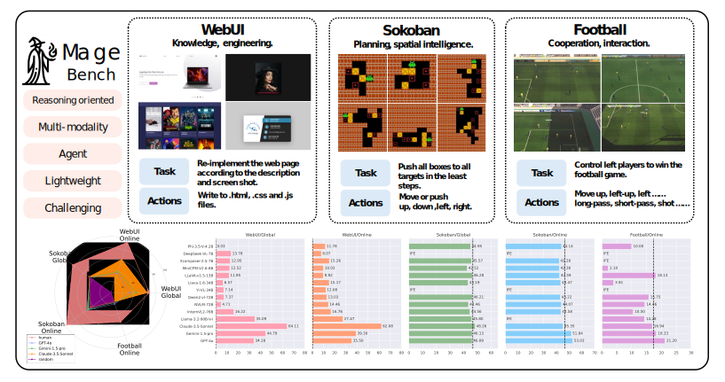
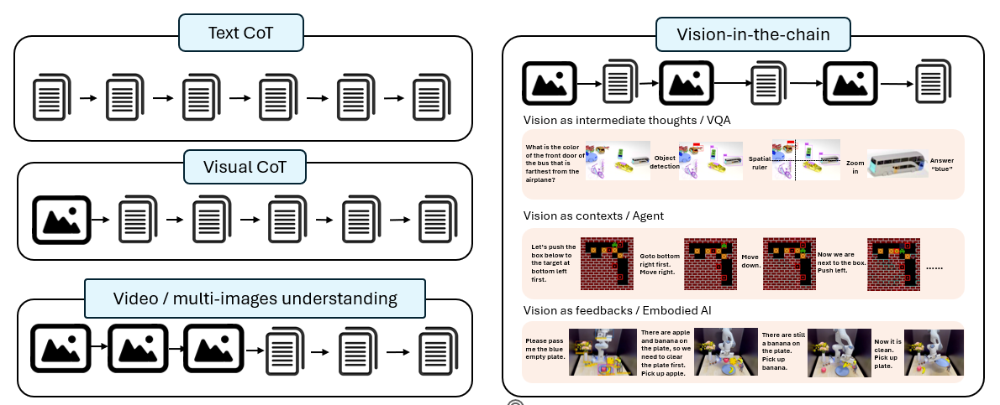
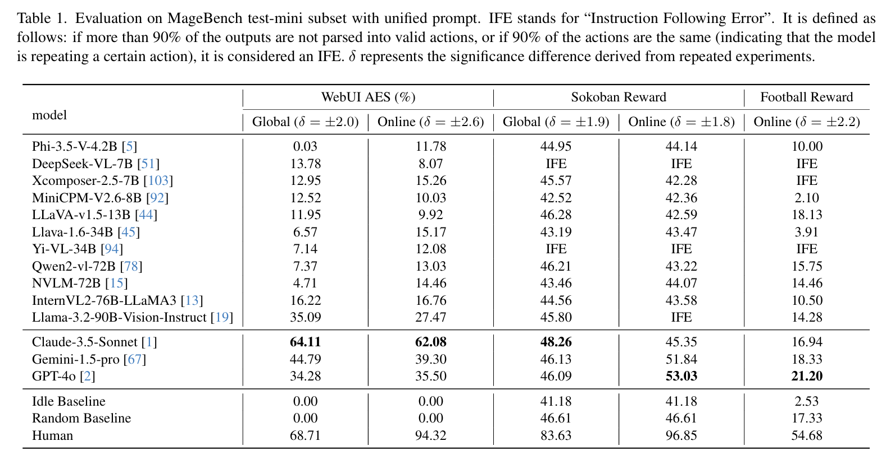
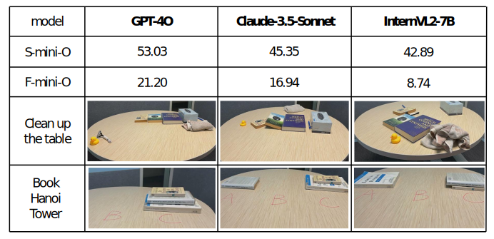

# MageBench: Bridging LMMs to Agents





<p align="center">
   <a href="" target="_blank">🤖 GitHub</a> | <a href="" target="_blank">📄 Paper </a> | <a href="https://huggingface.co/spaces/microsoft/MageBench-Leaderboard" target="_blank"> 🥇 Leader Board </a> 
</p>

## Table of Contents
- [Introduction](#introduction)
- [Quick Start](#quick-start)
- [Result Overview](#result-overview)
- [Advanced Usage](#advanced-usage)
- [Citation](#citation)
- [How to Contribute](#how-to-contribute)
- [Acknowledgments](#acknowledgments)

## Introduction


> In this work, we introduce **MageBench**, a reasoning capability oriented multimodal agent benchmark that, while having light-weight environments, poses significant reasoning challenges and holds substantial practical value. This benchmark currently includes three types of environments: WebUI, Sokoban, and Football, comprising a total of 483 different scenarios. 
It thoroughly validates the agent's knowledge and engineering capabilities, visual intelligence, and interaction skills. 
### Motivations


- In existing LMM benchmarks and Visual Chain-of-Thought works, reasoning only happened in text part. (Left)
- **Real world agents, robotics are actually Vision-in-the-Chain (ViC) type reasoning.**(Right)


## Quick Start

### Step 1. Install environments
First, install the environment dependencies. We ensure that the environment can run on Linux. There should be no issues on other systems in principle, but we haven't tried them. We strongly recommend that you start with a docker configured with PyTorch and CUDA drivers. For example, we use the docker `superbench/dev:cuda11.8` on an A100 VM.

In your docker, cd to the project dir and run:
```sh
bash scripts/install/env.sh
```

We will update known installing issues in [here](docs/installation/known_issues.md).

### Step 2. Setup LMM service
The implementation logic of our code repository is that we standardize the input format of all models (including models supported by vllm, models supported by lmdeploy, models deployed by OpenAI, models on the AzureOpenAI platform, Gemini, Claude, and others) into OpenAI's input format. If using local models, we first deploy the local models as a local service. This way, we can call the models using a unified interface across different simulation environments and agent settings.

Follow **[this instruction](docs/installation/Setup_service.md)** to setup the model you want, and (optional) run:
```bash
python ./test_api.py --API-type <type> --port <port> --model <model>
```
to check if it works (please check the comments in the python file). 


### Step 3. Try an environment

Check scripts in `scripts/experiments`, find environment you want and the models you just setup in step 2, e.g., if you just setup phi-3-v and you want to run Sokoban enviroment with Global setting, run:

```sh
bash scripts/experiments/Sokoban/Global/open-source-models.sh
```

This will run and save the trajactories and overall results in the `output` dir. For more details of args and advanced usages, check out [Advanced Usage](#advanced-usage).

## Result Overview

### Standard settings



Key messages:
- In the Sokoban and Football, only GPT-4o and Gemini performed better than the random baseline under the online setting. Open-source models still fall significantly short of the requirements for AI agents.
- Claude demonstrated performance close to that of computer science PhD candidates in the WebUI-Global results.
- Humans can modify webpage code based on rendered screen to make it almost identical to the target webpage, current models fail to achieve this.

### Benchmark Generalization Ability

> Human as robot, LMM as planner. Results show that our benchmarks align with the real world planning. For more details please refer to the appendix part of our paper.
<div align=center></div>

> Structured visual generation tasks, results show that our WebUI generalize better than existing works. For more details please refer to the appendix part of our paper.


## Advanced Usage

### Args details
The detailed introduction for important args of `main.py` are shown as follows:
- `--API-type`: Choose from ["HuggingFace", "OpenAI", "AzureOpenAI", "Local", "Gemini", "Claude"]. The provider of the API, if you are using models from OAI, AzureOAI, Gemini, Claude, set the corresponding value. For models deployed using vllm and lmdeploy, choose "HuggingFace". For model deployed by our fastapi endpoint, choose "Local".
- `--flow-type`: The agent setting to call the models and run the environment. See `Flow/__init__.py`, currently support: "Online" and "Global".
- `--env`: Choose from ["WebUI", "Sokoban", "Football"]
- `--output-dir`: A output dir to put all output into.
- `--task-path`: It can be a json file that store all scenario files or a path of one scenario file rooting from `./resources`. For example, `resources/Football_all.json` or `Football/R6_P_4.py`. The model will run all scenarios in the json file, or the chosen scenario if input one file path.
- `--override`: Whether to skip results that already in the output-dir. By default it is False, i.e., if your code shut down for some reasons, run the code again will resume the run.
- `--model-no-system`: some of the models do not support system input, we add the system prompt to the user input.
- `--repeat`: Repeat all the scenarios and averaged the result.
- `--model`: Only need to set if your API-type is one of "OpenAI", "AzureOpenAI", "Gemini" and "Claude". The model name for the coresponding endpoints (e.g., "GPT-4o")
- `--port`: Only need to set if your API-type is one of "Huggingface" and "Local". The model will be the one you have deployed locally.
- `--temperature`, `--top_p`, `--max_tokens`, `--frequency_penalty`: standard gpt generation configures.
- `--resolution`: The longer edge of the image, we will reshape the image to this resolution.
- `--n_workers`: The number of multi-processes, which will speed up the run, but do not set number > 8, which may cause issues for env renderer.
- `--max_image`: Only work for Online setting, the number of maximum images in the memory (OM in the paper).
- `--max_actions`: Only work for Online setting, the number of maximum history actions in the memory (AM in the paper).
- `--max_loop`: Only work for Online setting, the number of maximum actions model can generate.

### Use the env. for other purposes

We will introduce how to use our environment directly for other purposes (e.g., human testing, running random baselines and etc.). In the main root dir, run the code:
```python
env_name = "Sokoban"  # replace with envrionment name
from env import get_env
env_cls, act_cls = get_env(env_name)
```
This will return the enviroment class `env` and corresponding action class `act`. Then instantiate the environment:
```python
scenario_path = "./resources/Sokoban/0-Sokoban-huge-v0.pkl"  # replace with scenario file path 
env = env_cls(scenario_path)
```
Check the usage of action class to instantiate the action class:
```python
env.available_actions()
```
For example, in Sokoban, run:
```python
act = act_cls("Left")
observation, task_done = env.take_action(act)
```
to perform an action "Left" to the enviroment.
observation is an interleaved image-text document in OpenAI chat template format (the "content" part, except that the image is PIL.image), you can print it to see. 
After permorming several actions as above, evaluate the trajactory by:
```python
result, details= env.Evaluator()
print(result, details)
```

For better understanding, checkout and run `./tools&tests/baselines.py` and `./tools&tests/human_try.py`.


### How to implement your new Agent
Please check out code in `Flow/Online_HL_FBandSB.py` and `Flow/GlobalPlanning.py` (Other files are for WebUI-Online, which use another main file.). In details, you will need the following steps:
- Inherit the base class in the `Flow/planbase.py`
- Implement a `run` function.
- probably a `special_prompt_for_task` to define a enviroment-wise prompt, mainly used for IO prompt.


## Citation
```

```

## Contributing

This project welcomes contributions and suggestions. We are very much looking forward to you integrating more environments that meet our requirements into our repository. The requirements for the environments can be found in our paper, mainly they should be representative at the reasoning, and the environments should be simple and easy to install. Some possible options include: endgames of board games (different endgame states as different scenarios), Sudoku, King of Fighters, etc. If you are willing to contribute to our repository, we strongly encourage you to get in touch with us. We can exchange information and avoid concurrent duplicate work by multiple contributors.

## Acknowledgments

- The rendering and evaluation enviroment of Sokoban is provided by [gym-sokoban](https://github.com/mpSchrader/gym-sokoban).
- The rendering enviroment of Football is provided by [Google Research Football](https://github.com/google-research/football). The evaluation metric is implemented upon the state by ourselves.
- The enviroment and evaluation are built by ourselves using [Selenium](https://github.com/SeleniumHQ/Selenium). The webpage resources are adapted from several open-source repositories, mostly from [html-css-javascript-projects](https://github.com/solygambas/html-css-javascript-projects), [HTML-CSS-JavaScript-100-Projects
](https://github.com/HuXn-WebDev/HTML-CSS-JavaScript-100-Projects), [HTML-CSS-JavaScript-projects-for-beginners](https://github.com/sahandghavidel/HTML-CSS-JavaScript-projects-for-beginners/tree/main) and [50-Projects-In-50-Days-](https://github.com/JuliaMendes/50-Projects-In-50-Days-). We express our gratitude for their work. Additionally, if you wish to train LMM to achieve better results, please do not include the aforementioned repositories in the training set.
