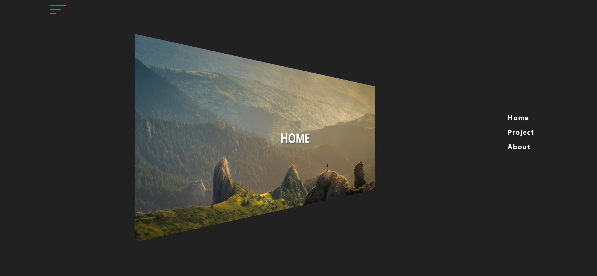
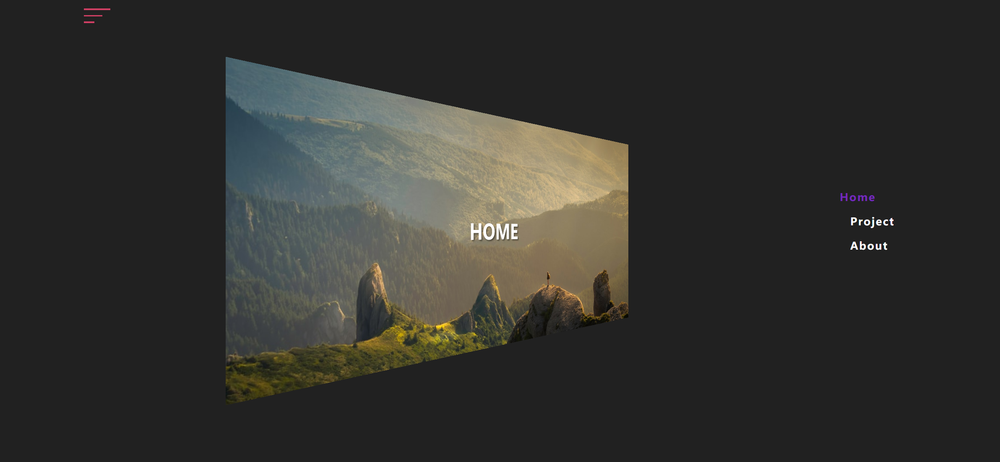
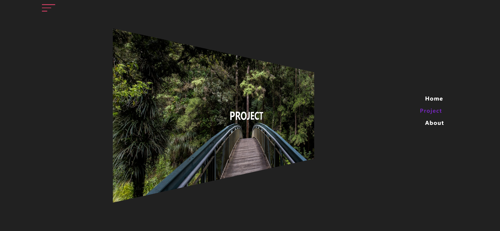
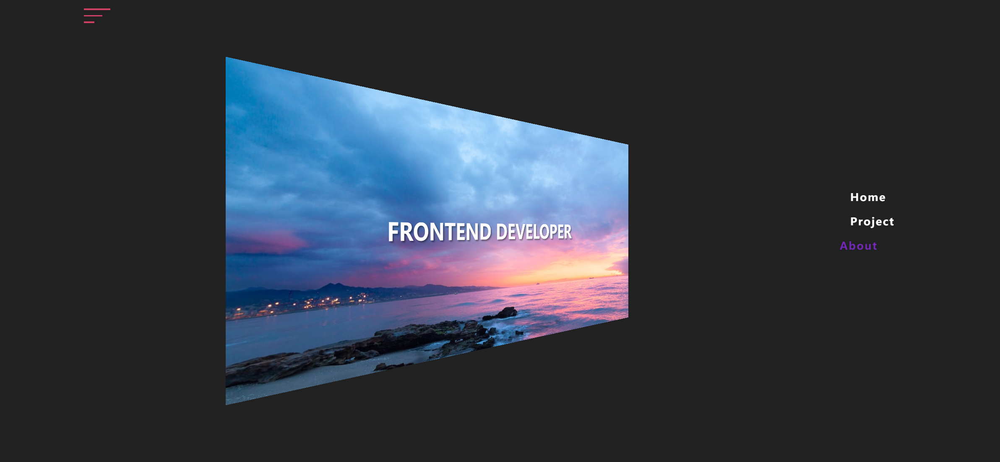

# Task Description: Re-implement a 3D Navigation Webpage

Your job is to design a webpage that features a 3D navigation menu with animated transitions between different sections. The webpage should have a toggle button to show/hide the navigation menu and three sections: Home, Project, and About. The initial webpage should look like this:

## Requirements

### HTML Structure

1. **Navbar**: 
   - A navigation bar with a toggle button.
   - Use class name `navbar` for the navigation bar.
   - Use class name `toggle-btn` for the toggle button.
   - The toggle button should contain three `span` elements.

2. **Navigation List**:
   - An unordered list containing three list items: Home, Project, and About.
   - Use class name `nav-list` for the unordered list.
   - Use class name `link` for each list item.

3. **Page Container**:
   - A container for the different sections of the webpage.
   - Use class name `page-container` for the container.
   - Each section should have a class name `page` and an additional class for identification (`home`, `project`, `about`).
   - Each section should contain a `p` element with class name `title`.

### CSS Styling

1. **General Styling**:
   - Use a perspective effect for the body.

2. **Navbar Styling**:
   - The navbar should be fixed at the top and span the full width of the viewport.
   - The toggle button should have three horizontal lines that transform into a cross when active.

3. **Page Container Styling**:
   - The container should have a transition effect and a background gradient.
   - Each section should have a background image (`img1.png`, `img2.png`, `img3.png` for Home, Project, and About respectively).

4. **Overlay Styling**:
   - An overlay element should be positioned fixed and cover the entire viewport.

5. **Navigation List Styling**:
   - The list should be positioned absolutely and become visible when the toggle button is active.
   - Each list item should have hover effects.

### JavaScript Functionality

1. **Toggle Button**:
   - Clicking the toggle button should add/remove the `active` class to/from the button, the container, and the navigation list.

2. **Navigation Links**:
   - Clicking a navigation link should trigger a transition to the corresponding section.
   - Use an overlay animation to create a sliding effect during the transition.

### Interaction Details

- **Toggle Button**: Clicking the toggle button should show/hide the navigation menu.
  - Use class name `toggle-btn` for the button.
  - The state after clicking the toggle button should look like this:
    

- **Home Link**: Clicking the Home link should navigate to the Home section.
  - Use class name `link` for the Home link.
  - The state after clicking the Home link should look like this:
    

- **Project Link**: Clicking the Project link should navigate to the Project section.
  - Use class name `link` for the Project link.
  - The state after clicking the Project link should look like this:
    

- **About Link**: Clicking the About link should navigate to the About section.
  - Use class name `link` for the About link.
  - The state after clicking the About link should look like this:
    

### Resources

- **Images**:
  - `img1.png` for the background of the Home section.
  - `img2.png` for the background of the Project section.
  - `img3.png` for the background of the About section.

### Notes

- The provided screenshots are rendered under a resolution of 1920x1080.
- Ensure that all animations and transitions are smooth and visually appealing.
- Use the specified class names and IDs for elements to ensure proper functionality and styling.
