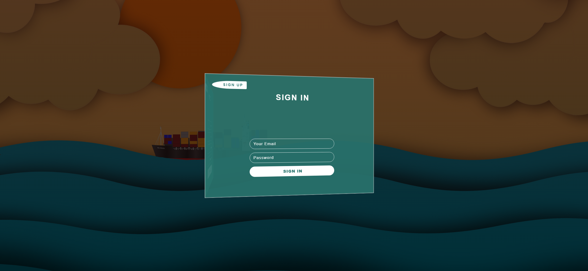
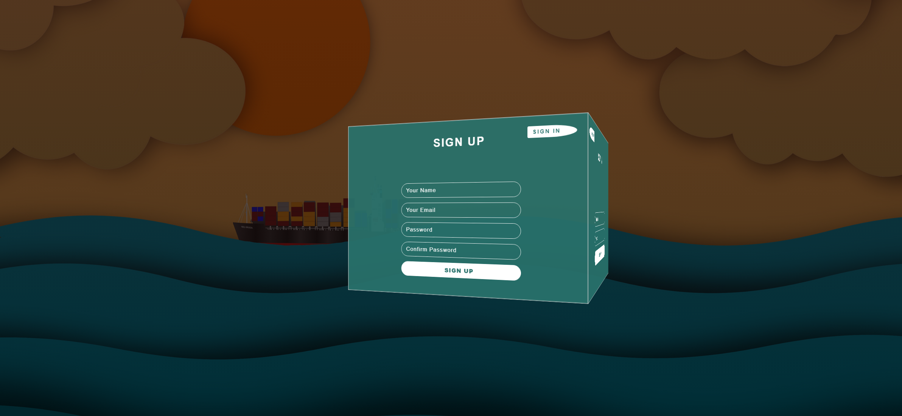

# Task Description: Re-implement a 3D Forms Webpage

Your job is to design a webpage that features a 3D rotating form interface for signing in and signing up. The webpage should have a visually appealing background and smooth animations for transitioning between the sign-in and sign-up forms. The provided screenshots are rendered under a resolution of 1920x1080.

## Initial Webpage

The initial webpage should look like this:

### Background

- Use the image `images/bg.png` as the background of the entire webpage.
- Apply a linear gradient overlay with the colors.

### Container

- Create a container that covers the entire viewport (`100vh` height and `100%` width).
- Apply a perspective of `100rem` to the container.

### Forms Wrapper

- Create a `div` with class `forms-wrapper` that will contain both forms.
- Initially, the `forms-wrapper` should be rotated on the Y-axis and positioned at the center of the viewport.
- Add a transition effect for the `transform` and `left` properties with a duration of `0.5s`.

### Sign-In Form

- Create a form with class `signin-form`.
- Include a link with class `signup-btn` that says "Sign Up".
- Add a heading with the text "Sign In".
- Include input fields for "Your Email" and "Password", and a submit button with the text "Sign In".

### Sign-Up Form

- Create a form with class `signup-form`.
- Include a link with class `signin-btn` that says "Sign In".
- Add a heading with the text "Sign Up".
- Include input fields for "Your Name", "Your Email", "Password", "Confirm Password", and a submit button with the text "Sign Up".

### Form Styling

- Add a box-shadow effect to the forms.

## Interactions

### Sign-Up Button

- When the "Sign Up" button is clicked, the `forms-wrapper` should rotate to `70deg` on the Y-axis and move to the right.
- Use class name `signup-btn` for the "Sign Up" button.

### Sign-In Button

- When the "Sign In" button is clicked, the `forms-wrapper` should rotate back to `10deg` on the Y-axis and move to the center.
- Use class name `signin-btn` for the "Sign In" button.

## Screenshots After Interactions

### After Clicking "Sign Up"

The webpage should look like this after clicking the "Sign Up" button:

### After Clicking "Sign In"

The webpage should look like this after clicking the "Sign In" button:

## Resources

- Background image: `images/bg.png`
- Text content for headings and buttons:
  - "Sign In"
  - "Sign Up"
  - "Your Email"
  - "Password"
  - "Your Name"
  - "Confirm Password"
  - "Sign In"
  - "Sign Up"

## Animations

- The rotation and position change of the `forms-wrapper` should be animated with a duration of `0.5s`.

By following this description, you should be able to re-implement the 3D forms webpage with the same functionality and appearance as shown in the provided screenshots.
