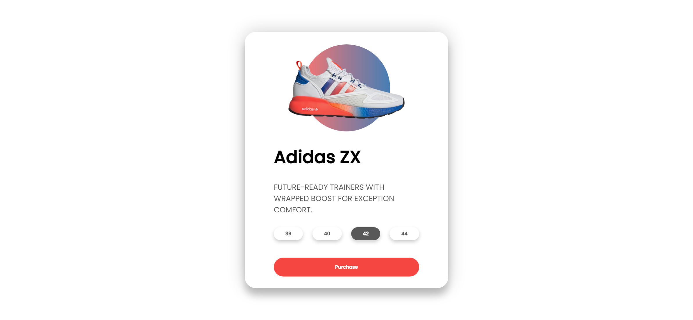

# Task Description: 3D Product Card Webpage

Your job is to design a webpage that showcases a 3D product card with interactive animations. The webpage should look and behave as described below. The provided screenshots are rendered under a resolution of 1920x1080.

## Initial Webpage
The initial webpage should be as shown below:

### Resources
- **Font**: Use the "Poppins" font from Google Fonts.
- **Image**: `images/adidas.png` is used for the sneaker image.
- **Text Content**:
  - Title: "Adidas ZX"
  - Description: "FUTURE-READY TRAINERS WITH WRAPPED BOOST FOR EXCEPTION COMFORT."
  - Size Buttons: "39", "40", "42", "44"
  - Purchase Button: "Purchase"

### Layout and Styling
- The webpage should have a container that centers the card both vertically and horizontally.
- The card should have a 3D effect and should be styled with shadows and rounded corners.
- The sneaker image should be placed inside a circle with a gradient background.
- The title, description, size buttons, and purchase button should be styled with appropriate fonts, sizes, and colors.

### Animations
- **Mouse Move Animation**: When the mouse moves over the container, the card should rotate based on the mouse position.
- **Mouse Enter Animation**: When the mouse enters the container, the elements inside the card should pop out.
- **Mouse Leave Animation**: When the mouse leaves the container, the elements should return to their original positions.

### Element Identifiers
- Use class name `container` for the container div.
- Use class name `card` for the card div.
- Use class name `sneaker` for the sneaker div.
- Use class name `circle` for the circle div.
- Use class name `title` for the title h1 element.
- Use class name `info` for the info div.
- Use class name `sizes` for the sizes div.
- Use class name `purchase` for the purchase div.
- Use class name `active` for the active size button.

### Additional Notes
- Ensure that all animations are smooth and have appropriate easing.
- The layout should be responsive and look good on different screen sizes.

By following the above description, you should be able to re-implement the 3D product card webpage with the specified interactions and animations.
