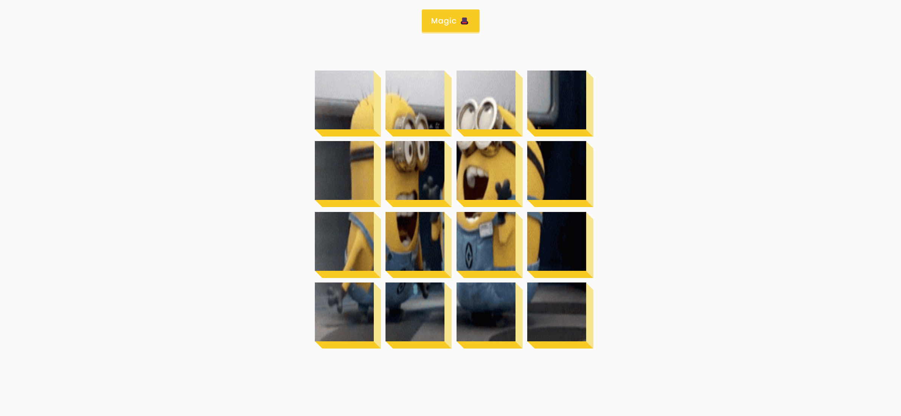

# Task Description: Re-implement the 3D Boxes Background Webpage

Your job is to design a webpage that mimics the functionality and appearance of the provided example. The webpage consists of a button that, when clicked, triggers an animation on a grid of boxes. Below are the detailed instructions and resources you will need to complete this task.

## Initial Webpage

The initial webpage should look like this:

This screenshot was rendered under a resolution of 1920x1080.

## Elements and Layout

1. **Button**
   - Use ID `btn` for the button element.
   - Use class name `magic` for the button element.
   - The button should have the text content: `Magic 🎩`.

2. **Boxes Container**
   - Use ID `boxes` for the container of the boxes.
   - Use class name `boxes` for the container of the boxes.
   - Initially, the container should also have the class `big`.

3. **Individual Boxes**
   - Each box inside the container should use the class name `box`.

## Styles and Animations

1. **Fonts**
   - Import the fonts 'Roboto' and 'Poppins' from Google Fonts.

2. **Button Styles**
   - The button should have rounded corners, a shadow effect, and a slight transformation when clicked.

3. **Boxes Container Styles**
   - The container should be a flex container with wrapping enabled and centered content.
   - The container should have a transition effect for resizing.

4. **Individual Box Styles**
   - Each box should have a background image (`resource.gif`), and specific dimensions (125px by 125px).
   - Each box should have pseudo-elements for additional styling effects.

## Interactions

1. **Button Click**
   - When the button with ID `btn` is clicked, toggle the class `big` on the container with ID `boxes`.

## Resources

1. **Background Image for Boxes**
   - Use `resource.gif` as the background image for the boxes.

## Final Webpage After Interaction

After clicking the "Magic 🎩" button, the webpage should look like this:

This screenshot was rendered under a resolution of 1920x1080.

## Additional Notes

- Ensure that the boxes rotate 360 degrees when the class `big` is toggled on the container.
- The initial size of the container should be 600px by 600px, and it should resize to 500px by 500px when the class `big` is toggled off.
- The background image for each box should be positioned correctly to form a larger image when all boxes are placed together.

By following these instructions, you should be able to re-implement the webpage with the same functionality and appearance as the provided example.
