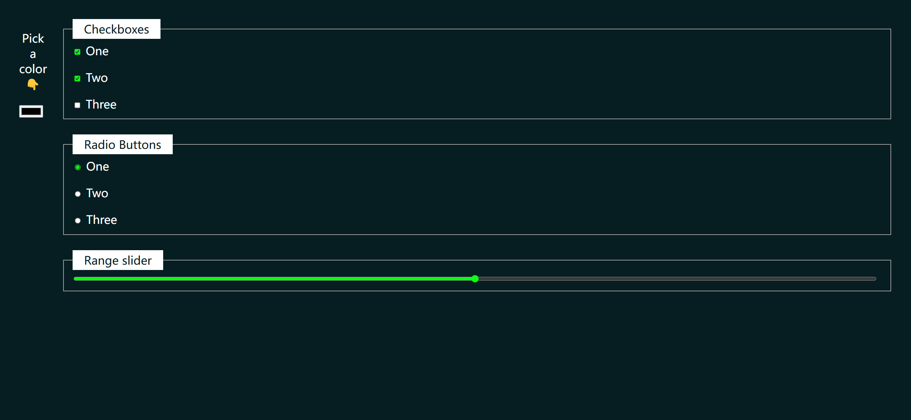
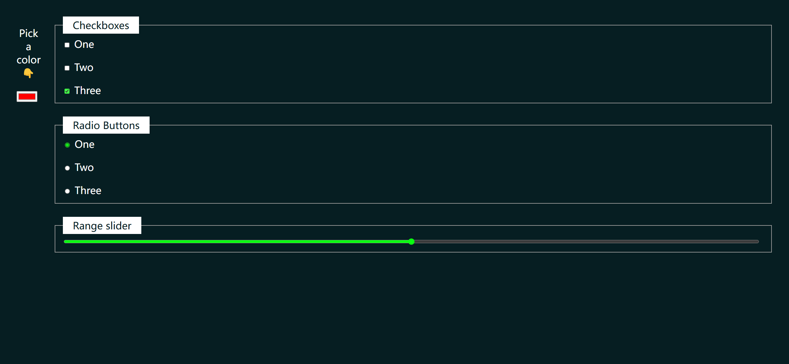
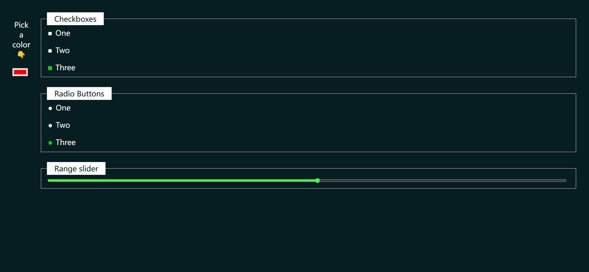

Your job is to design a webpage that allows users to interact with various form elements such as color pickers, checkboxes, radio buttons, and range sliders. The webpage should dynamically update the accent color of these elements based on the user's selection. Below are the detailed instructions to re-implement the webpage.

### Initial Webpage
The initial webpage should look like this:

### Layout and Styling
- The color picker should be centered and occupy the first column.
- All other elements should occupy the second column.

### Elements
1. **Color Picker**
    - Use a `
` with class `color-picker`.
    - Inside the `
`, include a `
` tag with the text "Pick a color 👇".
    - Add an `<input>` element of type `color`.

2. **Checkboxes**
    - Use a `<fieldset>` with class `checkboxes`.
    - Include a `<legend>` with the text "Checkboxes".
    - Add three `<label>` elements, each containing an `<input>` of type `checkbox` and text "One", "Two", and "Three" respectively.
    - The first two checkboxes should be checked by default.

3. **Radio Buttons**
    - Use a `<fieldset>` with class `radio-buttons`.
    - Include a `<legend>` with the text "Radio Buttons".
    - Add three `<label>` elements, each containing an `<input>` of type `radio` with the name `color-example` and text "One", "Two", and "Three" respectively.
    - The first radio button should be checked by default.

4. **Range Slider**
    - Use a `<fieldset>` with class `range`.
    - Include a `<legend>` with the text "Range slider".
    - Add an `<input>` element of type `range`.

### Dynamic Accent Color
- When the user selects a color using the color picker, update the `--clr-accent` variable to the selected color.

### JavaScript
- Add an event listener to the color picker to update the `--clr-accent` variable when the color changes.

### Screenshots
The provided screenshots are rendered under a resolution of 1920x1080.

1. **After Changing Color**
    - The accent color changes to red.
    - 

2. **After Toggling Checkboxes**
    - All checkboxes are toggled.
    - 

3. **After Toggling Radio Buttons**
    - All radio buttons are toggled.
    - 

4. **After Adjusting Range Slider**
    - The range slider is adjusted.
    - 

### Element Identifiers
- Use class name `color-picker` for the color picker container.
- Use class name `checkboxes` for the checkboxes container.
- Use class name `radio-buttons` for the radio buttons container.
- Use class name `range` for the range slider container.

By following these instructions, you are required to re-implement the webpage with the same functionality and appearance.
