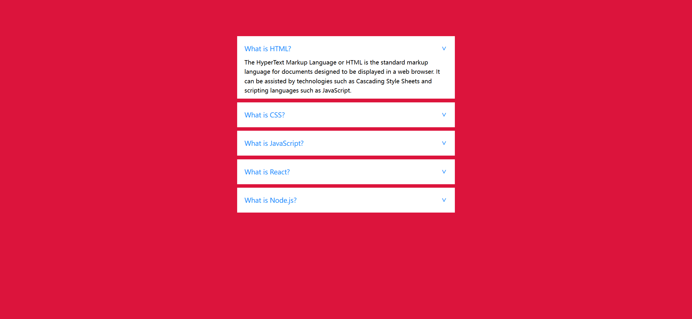
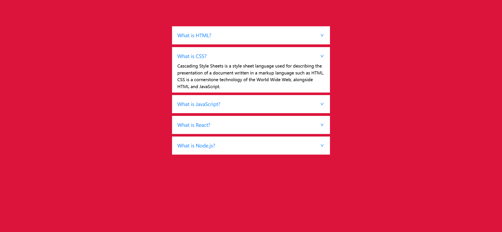
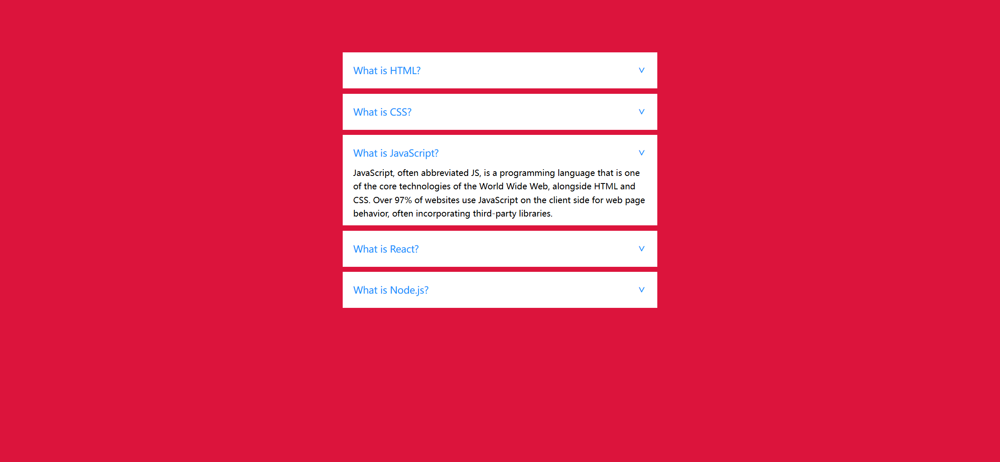
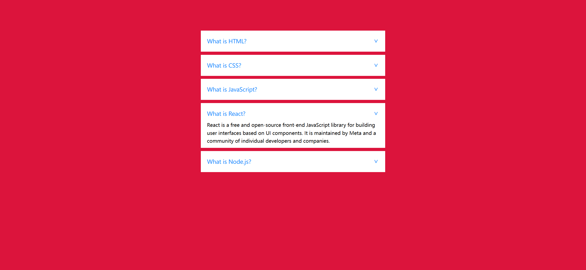
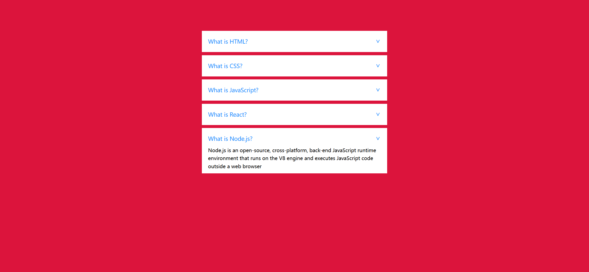

# Task Description: Implement an Accordion Webpage

Your job is to design a webpage that features an accordion component. The accordion will contain five questions, each with a corresponding answer that expands when the question is clicked. The initial webpage should look like this:

## Requirements

1. **HTML Structure**:
    - Create an unordered list with the ID `accordion`.
    - Each list item (`<li>`) will contain:
        - A `<label>` element with a `for` attribute corresponding to the ID of an `<input>` element.
        - An `<input>` element of type `radio` with a `name` attribute set to "accordion".
        - A `
` element with the class `content` that contains a `
` element with the answer text.

2. **CSS Styling**:
    - The font family should be sans-serif.

3. **Text Content**:
    - The text content for each question and answer is as follows:
        - **Question 1**: "What is HTML?"
            - **Answer**: "The HyperText Markup Language or HTML is the standard markup language for documents designed to be displayed in a web browser. It can be assisted by technologies such as Cascading Style Sheets and scripting languages such as JavaScript."
        - **Question 2**: "What is CSS?"
            - **Answer**: "Cascading Style Sheets is a style sheet language used for describing the presentation of a document written in a markup language such as HTML. CSS is a cornerstone technology of the World Wide Web, alongside HTML and JavaScript."
        - **Question 3**: "What is JavaScript?"
            - **Answer**: "JavaScript, often abbreviated JS, is a programming language that is one of the core technologies of the World Wide Web, alongside HTML and CSS. Over 97% of websites use JavaScript on the client side for web page behavior, often incorporating third-party libraries."
        - **Question 4**: "What is React?"
            - **Answer**: "React is a free and open-source front-end JavaScript library for building user interfaces based on UI components. It is maintained by Meta and a community of individual developers and companies."
        - **Question 5**: "What is Node.js?"
            - **Answer**: "Node.js is an open-source, cross-platform, back-end JavaScript runtime environment that runs on the V8 engine and executes JavaScript code outside a web browser."

4. **Interactions**:
    - Clicking on a question should expand the corresponding answer and collapse any previously expanded answer.
    - The provided screenshots are rendered under a resolution of 1920x1080.

## Screenshots of Interactions

- After clicking on the second question:
  

- After clicking on the third question:
  

- After clicking on the fourth question:
  

- After clicking on the fifth question:
  

## Element Identifiers

- Use ID `accordion` for the unordered list.
- Use class name `content` for the div containing the answer text.
- Use the following IDs for the input elements:
  - `first` for the first question.
  - `second` for the second question.
  - `third` for the third question.
  - `fourth` for the fourth question.
  - `fifth` for the fifth question.
