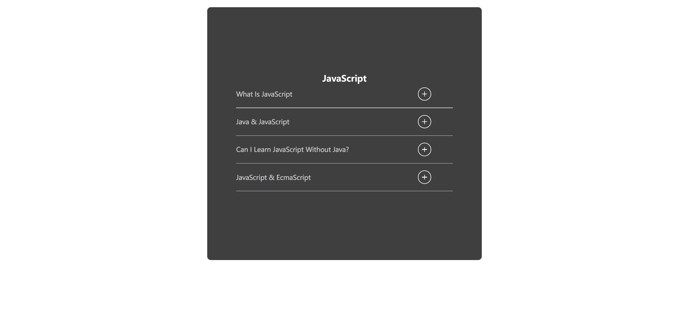
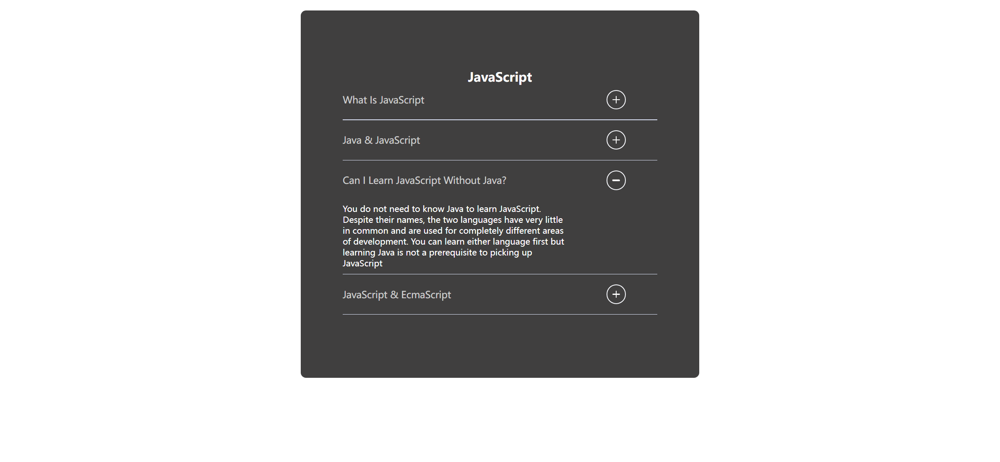
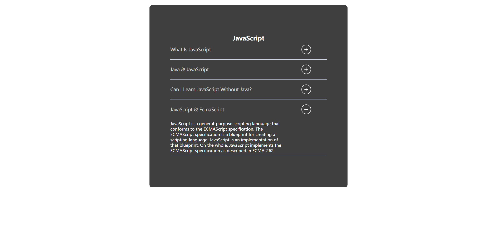

Your job is to design a webpage that features an accordion component. The accordion will have multiple items that can be expanded or collapsed when clicked. Below are the details and requirements for re-implementing the webpage.

The initial webpage should be 

### General Layout
- The webpage should be centered both horizontally and vertically.
- The main container should have a class name `content` and should be styled with a dark background, padding, and rounded corners.

### Title
- The title of the accordion should be "JavaScript" and should be styled with a class name `title`.

### Accordion Items
- Each accordion item should have a class name `accordion-item`.
- Each accordion item consists of a header and a body.
  - The header should have a class name `accordion-item-header`.
  - The body should have a class name `accordion-item-body` and should be initially collapsed.
  - The body content should have a class name `accordion-item-body-content`.

### Icons
- Each header should include an icon with a class name `icon`.
- The icon should change its appearance when the accordion item is expanded or collapsed.

### Divider
- A divider should be placed between each accordion item and should have a class name `divider`.

### Text Content
- The text content for each accordion item is as follows:

  1. **What Is JavaScript**
     - "JavaScript, often abbreviated JS, is a programming language that is one of the core technologies of the World Wide Web, alongside HTML and CSS. Over 97% of websites use JavaScript on the client side for web page behavior, often incorporating third-party libraries."

  2. **Java & JavaScript**
     - "Key differences between Java and JavaScript: Java is an OOP programming language while Java Script is an OOP scripting language. Java creates applications that run in a virtual machine or browser while JavaScript code is run on a browser only. Java code needs to be compiled while JavaScript code are all in text."

  3. **Can I Learn JavaScript Without Java?**
     - "You do not need to know Java to learn JavaScript. Despite their names, the two languages have very little in common and are used for completely different areas of development. You can learn either language first but learning Java is not a prerequisite to picking up JavaScript."

  4. **JavaScript & EcmaScript**
     - "JavaScript is a general-purpose scripting language that conforms to the ECMAScript specification. The ECMAScript specification is a blueprint for creating a scripting language. JavaScript is an implementation of that blueprint. On the whole, JavaScript implements the ECMAScript specification as described in ECMA-262."

### Interactions
- Clicking on an accordion header should expand or collapse the corresponding body.
- Only one accordion item should be expanded at a time.
- The icon should rotate when the accordion item is expanded.

### Screenshots
The provided screenshots are rendered under a resolution of (1920, 1080).

2. After clicking the second accordion item: 
3. After clicking the third accordion item: 
4. After clicking the fourth accordion item: 

### CSS Styling
- Ensure that the transitions and animations are smooth and visually appealing.

### JavaScript Functionality
- Ensure that the accordion items expand and collapse correctly, and only one item is expanded at a time.
