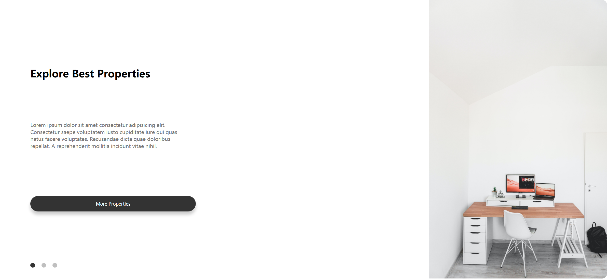
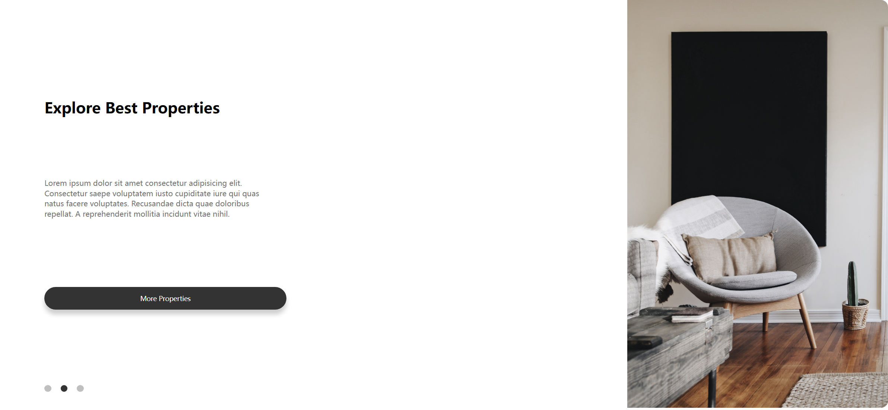
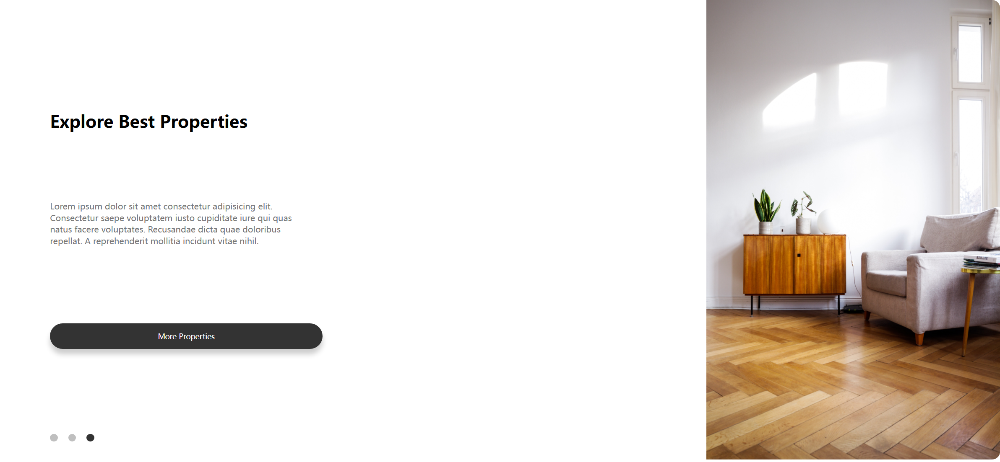

# Task Description: Re-implement the Animated Images Webpage

Your job is to design a webpage that showcases properties with an animated image slider. The webpage should look and function as described below. The provided screenshots are rendered under a resolution of 1920x1080.

## Initial Webpage

The initial webpage should look like this:



### Layout and Structure

1. **Container**: The main container should have a class `container`.
2. **Row**: Inside the container, there should be a `div` with class `row` to hold the content.
3. **Column 1**: 
   - Use class `col-1` for the first column.
   - It should contain:
     - An `h1` tag with the text "Explore Best Properties".
     - A `p` tag with the following text:
       ```
       Lorem ipsum dolor sit amet consectetur adipisicing elit. Consectetur
       saepe voluptatem iusto cupiditate iure qui quas natus facere
       voluptates. Recusandae dicta quae doloribus repellat. A
       reprehenderit mollitia incidunt vitae nihil.
       ```
     - A `button` with the text "More Properties".
     - An unordered list (`ul`) with three list items (`li`). Each `li` should have the class `btn`, and the first `li` should also have the class `active`.
4. **Column 2**: 
   - Use class `col-2` for the second column.
   - It should contain an `img` tag with the `id` `banner` and the initial `src` set to `images/0.jpg`.

### Styling

- **General**: 
  - Use a sans-serif font for the entire webpage.
  - Apply padding, margin, and box-sizing rules to all elements.
- **Button**: 
  - Style the button with a dark background, white text, and rounded corners.
  - Add a box-shadow for a 3D effect.
- **Row**: 
  - The row should be a flex container with space between the columns.
  - Apply a white background and rounded corners.
- **Column 1**: 
  - Use flexbox to arrange the content vertically.
  - Apply padding and position the unordered list at the bottom.
- **Column 2**: 
  - Ensure the image takes up the full height of the viewport and has a specific width.
- **Unordered List**: 
  - Position it absolutely at the bottom of the first column.
  - Style the list items as small circles with a gray background, except for the active one, which should have a dark background.

### Animation

- **Zoom Animation**: 
  - When an image changes, it should have a zoom-in effect.
  - Define a keyframe animation named `zoom` that scales the image from 1.2 to 1 over 1 second.

### JavaScript Functionality

- **Image Slider**: 
  - Add event listeners to the list items (`li` with class `btn`).
  - When a list item is clicked, change the `src` of the `img` with `id` `banner` to `images/{index}.jpg`, where `{index}` is the index of the clicked list item.
  - Apply the zoom animation to the image.
  - Remove the `active` class from all list items and add it to the clicked one.

## Interactions

3. **Click Second Dot**: 
   - Clicking the second dot should change the image to `images/1.jpg` and apply the zoom animation.
   - Screenshot after clicking the second dot:
     

4. **Click Third Dot**: 
   - Clicking the third dot should change the image to `images/2.jpg` and apply the zoom animation.
   - Screenshot after clicking the third dot:
     

### Resources

- **Images**: 
  - `images/0.jpg`
  - `images/1.jpg`
  - `images/2.jpg`

### IDs and Class Names

- Use ID `banner` for the image element.
- Use class name `container` for the main container.
- Use class name `row` for the row.
- Use class name `col-1` for the first column.
- Use class name `col-2` for the second column.
- Use class name `btn` for the list items in the unordered list.
- Use class name `active` for the currently active list item.

Follow the above instructions to re-implement the webpage. Good luck!
