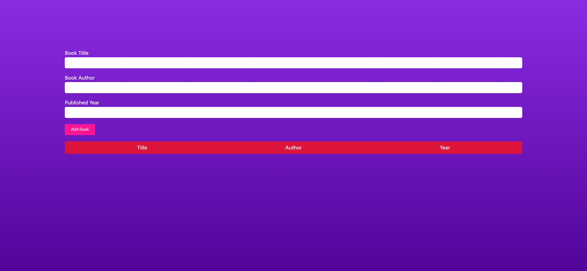
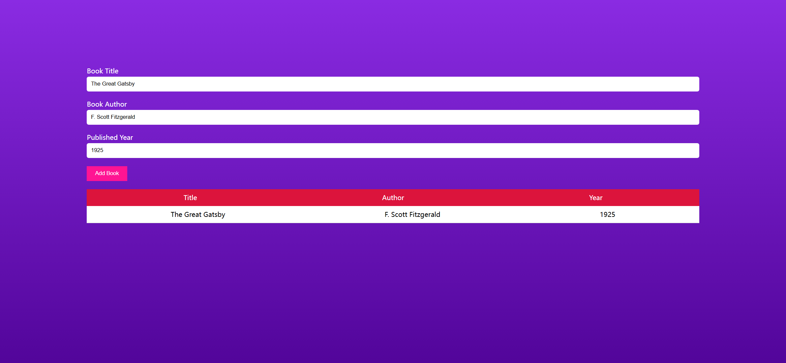

# Task Description for Re-implementing the BookList App Webpage

Your job is to design a webpage that allows users to add books to a list. The webpage should have a form to input the book's title, author, and published year. Upon submission, the book details should be displayed in a table format below the form. The initial webpage should look like this:

## Requirements

### HTML Structure

1. **Form Section**:
   - Use a `<form>` element with the ID `book-form`.
   - Inside the form, create three input fields:
     - A text input for the book title with the ID `title`.
     - A text input for the book author with the ID `author`.
     - A number input for the published year with the ID `year`.
   - Add a submit button with the class `btn` and text content "Add Book".

2. **Table Section**:
   - Create a section with the class `table`.
   - Inside this section, create another section with the class `table-section` to serve as the table header. This should contain three `
` elements with the text "Title", "Author", and "Year".
   - Below the header, create a section with the ID `book-list` where the book entries will be displayed.

### CSS Styling

- Apply the following styles:
  - **General Styles**:
    - Use a linear gradient background from blueviolet to rgb(82, 5, 154) for the body.
    - Center the content vertically and horizontally.
    - Use the `sans-serif` font family.
  - **Book List**:
    - Display as a flex column, remove list-style, and enable word-wrap.
    - Set the background to white and text color to black.
  - **Book Entries**:
    - Display as flex, align items center, and justify content around.

### JavaScript Functionality

- Implement the following functionality:
  - When the "Add Book" button is clicked, prevent the default form submission.
  - Check if any of the input fields are empty. If they are, display an alert with the message "Fill The Form".
  - If all fields are filled, create a new section element and append three div elements containing the book title, author, and year respectively.
  - Append the new section to the `book-list` section.

### Interaction and Screenshots

- The provided screenshots are rendered under a resolution of 1920x1080.
- The initial state of the webpage is shown in the screenshot above.
- After filling in the form with the following details:
  - Title: "The Great Gatsby"
  - Author: "F. Scott Fitzgerald"
  - Year: "1925"
- Clicking the "Add Book" button should update the webpage to look like this:

### Element Identifiers

- Use ID `title` for the book title input field.
- Use ID `author` for the book author input field.
- Use ID `year` for the published year input field.
- Use class name `btn` for the "Add Book" button.
- Use ID `book-list` for the section where book entries are displayed.

By following these instructions, you should be able to re-implement the BookList App webpage successfully.
