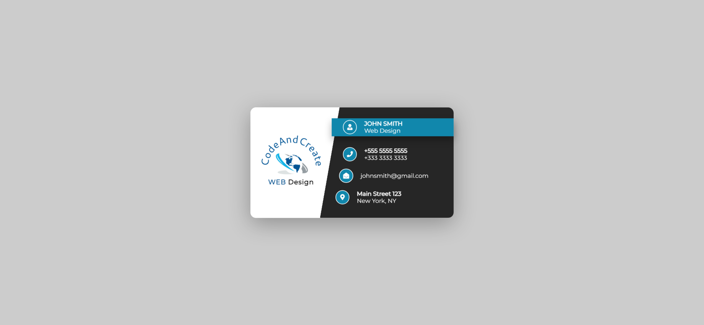
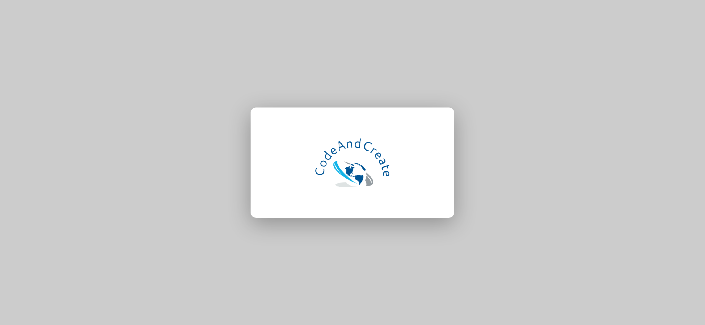

Your task is to design a webpage that displays a business card with a flip animation on hover. The webpage should look and behave as described below. The provided screenshots are rendered under a resolution of 1920x1080.

### Initial Webpage
The initial webpage should look like this:



### Resources
- **Font**: Use the Montserrat font from Google Fonts.
  ```html
  <link href="https://fonts.googleapis.com/css?family=Montserrat" rel="stylesheet" />
  ```
- **Icons**: Use Font Awesome icons.
  ```html
  <link rel="stylesheet" href="https://use.fontawesome.com/releases/v5.8.1/css/all.css" integrity="sha384-50oBUHEmvpQ+1lW4y57PTFmhCaXp0ML5d60M1M7uH2+nqUivzIebhndOJK28anvf" crossorigin="anonymous" />
  ```
- **Images**: 
  
  - `images/logo.png` is used for the logo on both the front and back of the card.

### Layout and Styling
- The card should be centered on the page using a wrapper with class `card-wrapper`.
- The card should have a 3D flip animation on hover. The card should rotate 180 degrees along the Y-axis when hovered over.
- The card should have a front and back side:
  - **Front Side**:
    - The front side should have a linear gradient background.
    - The left section should contain the logo and a heading with the text "Web Design".
    - The right section should contain the following information:
      - Person's name: "John Smith"
      - Job title: "Web Design"
      - Phone numbers: "+555 5555 5555" and "+333 3333 3333"
      - Email: "johnsmith@gmail.com"
      - Address: "Main Street 123, New York, NY"
  - **Back Side**:
    - The back side should display the logo centered.

### Interactions
- The card should flip when hovered over. Use the class name `card-wrapper` for the hover effect.

### Screenshot After Hover
When the card is hovered over, it should flip to show the back side. The webpage should look like this:



### Detailed Specifications
- Use class name `card-wrapper` for the wrapper element that contains the card.
- Use class name `card` for the card element.
- Use class name `card-front` for the front side of the card.
- Use class name `card-back` for the back side of the card.
- Use class name `left` for the left section of the front side.
- Use class name `right` for the right section of the front side.
- Use class name `right-content` for each content block in the right section.
- Use class name `person` for the block containing the person's name and job title.
- Use class name `phone` for the block containing the phone numbers.
- Use class name `email` for the block containing the email.
- Use class name `address` for the block containing the address.

### Animation
- The card should have a smooth transition effect when flipping. The transition duration should be 1 second.

By following the above description, you should be able to re-implement the webpage with the specified design and behavior.
