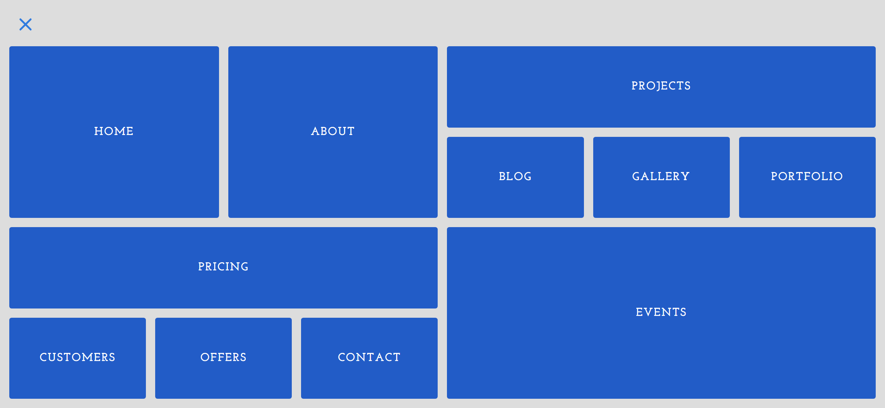

Your job is to design a webpage that features a landing page with a CSS Grid menu. The webpage should have a hamburger menu that, when clicked, reveals a navigation menu with various links. Below are the detailed instructions to re-implement the webpage.

### Initial Webpage
The initial webpage should look like this:

### Resources
- **Font**: Use the following Google Fonts:
  - `Dancing Script`
  - `Josefin Slab`
- **Background Image**: `images/bg.jpg` is used for the background of the header section.

### Layout and Elements
1. **Container**: 
   - Use a `div` with class `container` to wrap the entire content.

2. **Hamburger Menu**:
   - Use a `div` with class `hamburger-menu` for the hamburger icon.
   - Inside the `hamburger-menu`, create another `div` with class `lines` containing three `div` elements with class `line`, `line-1`, `line-2`, and `line-3`.
   - Also, create a `div` with class `x-btn` containing two `div` elements with class `x-line`, `x-line-1`, and `x-line-2`.

3. **Header**:
   - Use a `header` element with class `header`.
   - Inside the header, create a `div` with class `banner` containing:
     - An `h1` element with the text "This is a Landing Page".
     - A `p` element with the text "With a CSS Grid Menu", where "CSS Grid" is wrapped in a `span`.

4. **Navigation**:
   - Use a `nav` element with class `navigation`.
   - Inside the navigation, create a `ul` with class `nav-menu` containing 11 `li` elements with class `nav-menu-item`.
   - Each `li` should contain an `a` element with class `nav-menu-link` and the following text:
     - Home
     - About
     - Projects
     - Blog
     - Gallery
     - Portfolio
     - Pricing
     - Events
     - Customers
     - Offers
     - Contact

### Interactions
- When the hamburger menu is clicked, the class `change` should be toggled on the `container` element.
- Use the following IDs and class names for interactive elements:
  - Use class name `hamburger-menu` for the hamburger menu.
  - Use class name `container` for the container that toggles the `change` class.

### Animations
- The lines in the hamburger menu should translate out of view when the menu is clicked.
- The `x-btn` should become visible when the menu is clicked.
- The header should fade out when the menu is clicked.
- The navigation menu should fade in when the menu is clicked.
- The navigation links should slide in from the left when the menu is clicked.

### Screenshots
The provided screenshots are rendered under a resolution of 1920x1080.

- **Initial Webpage**: 
- **After Clicking Hamburger Menu**: 
