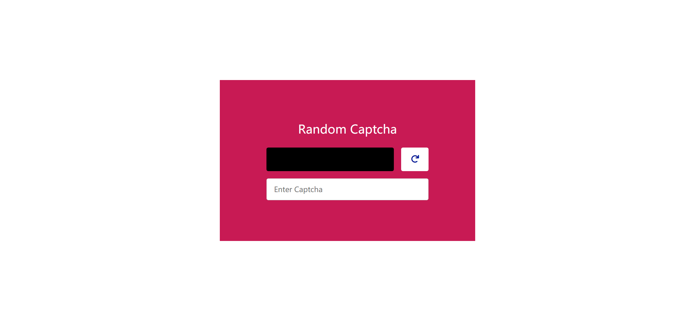
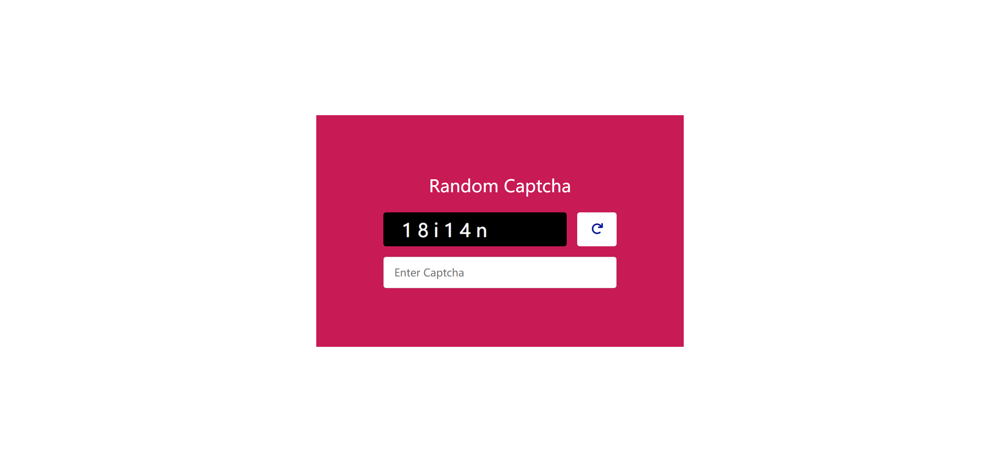
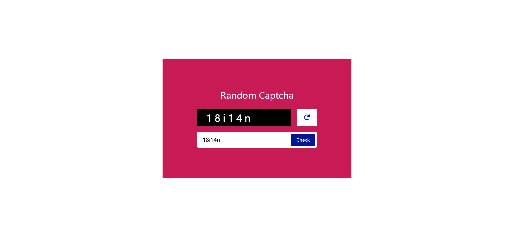
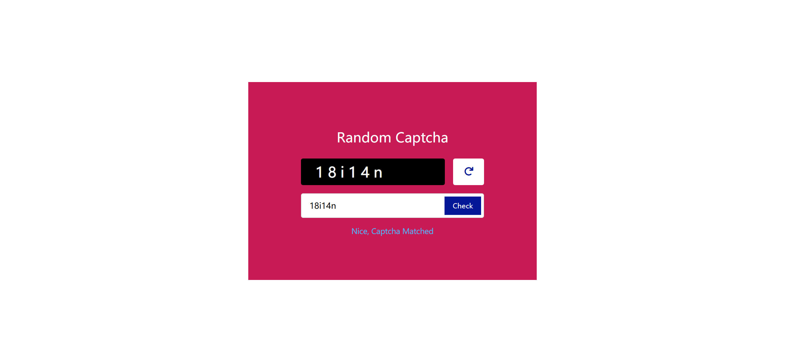

# Task Description: Implement a Random Captcha Webpage

Your job is to design a webpage that generates a random CAPTCHA for users to enter and verify. The webpage should have the following features and layout:

## Initial Webpage

The initial webpage should look like this:



### Layout and Elements

1. **Wrapper Container**:
    - Use class name `wrapper` for the main container.
    
2. **Heading**:
    - Use an `h1` tag with the text "Random Captcha".
    
3. **Captcha Area**:
    - Use class name `captcha-area` for the container.
    - Align items to the center and justify content to the center.
    
4. **Captcha Container**:
    - Use class name `captcha-container` for the container.
    - Make the text unselectable and position it relatively.
    
5. **Captcha Text**:
    - Use class name `captcha` for the text.
    
6. **Reload Button**:
    - Use class name `reload-btn` for the button.
    - Use the Font Awesome icon `fa-redo` inside the button.
    - Apply a hover effect to rotate the icon by `15deg`.
    
7. **Input Area**:
    - Use class name `input-area` for the form.
    
8. **Input Field**:
    - Use a `text` input field with a placeholder "Enter Captcha".
    
9. **Check Button**:
    - Use class name `check-btn` for the button.
    - Initially, set the opacity to `0` and disable pointer events.
    - When the input is valid, set the opacity to `1` and enable pointer events.
    
10. **Status Text**:
    - Use class name `status-text` for the text.
    - Initially, hide the text.

## Interactions

### Reload Captcha

When the reload button is clicked, the CAPTCHA should reload with a new random string. The webpage after reloading the CAPTCHA should look like this:



### Enter Captcha

When the user enters the CAPTCHA text in the input field, the webpage should look like this:



### Check Captcha

When the user clicks the check button, the status text should display whether the CAPTCHA matched or not. The webpage after checking the CAPTCHA should look like this:



## Resources

- **Font Awesome**: Used for the reload icon. Include it using the following link:
  ```html
  <link
    rel="stylesheet"
    href="https://cdnjs.cloudflare.com/ajax/libs/font-awesome/6.1.1/css/all.min.css"
    integrity="sha512-KfkfwYDsLkIlwQp6LFnl8zNdLGxu9YAA1QvwINks4PhcElQSvqcyVLLD9aMhXd13uQjoXtEKNosOWaZqXgel0g=="
    crossorigin="anonymous"
    referrerpolicy="no-referrer"
  />
  ```

## Notes

- The provided screenshots are rendered under a resolution of 1920x1080.
- Ensure to use the specified class names and IDs for elements to facilitate auto-testing.
