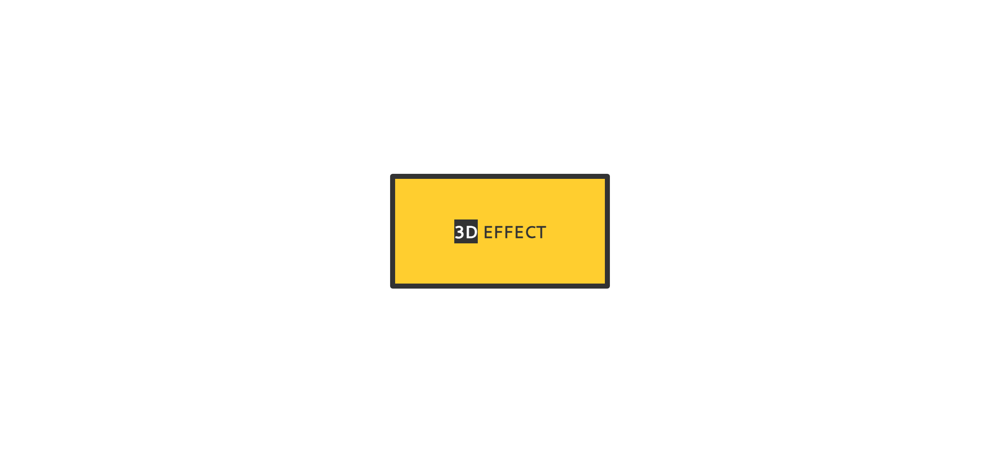

# Task Description: Re-implement a 3D Card Webpage

Your job is to design a webpage that features a 3D card effect. The webpage should have a card that rotates and transforms when hovered over. Below are the detailed instructions and resources needed to re-implement the webpage.

## Initial Webpage

The initial webpage should look like this:


## Resources

1. **Font**: The webpage uses the "Cantarell" font from Google Fonts. Include the following link in the `<head>` section of your HTML:
    ```html
    <link href="https://fonts.googleapis.com/css?family=Cantarell" rel="stylesheet" />
    ```


## HTML Structure

- The webpage should have a `<div>` with the class `card-wrapper` that contains another `<div>` with the class `card`.
- Inside the `card` div, there should be a `frame` div, which contains a `content` div.
- The `content` div should have an `h1` element with the class `heading`. The text inside the `h1` should be `<span>3D</span> Effect`.

## CSS Styling

- **Card Wrapper**:
  - Use class name `card-wrapper` for the outermost div.
  - Use flexbox to center the card both horizontally and vertically.
  
- **Card**:
  - Use class name `card` for the card div.
  
- **Frame**:
  - Use class name `frame` for the frame div.
  - Add a transition effect for all properties with a duration of 0.4s.
  
- **Content**:
  - Use class name `content` for the content div.
  - Center the content using flexbox.
  - Add a transition effect for all properties with a duration of 0.4s.
  
- **Heading**:
  - Use class name `heading` for the heading element.
  - Set the font-family to "Cantarell", sans-serif.
  
- **Heading Span**:
  - Use a span element inside the heading.

## Hover Effect

When the card is hovered over, the following transformations should occur:

- The `frame` div should rotate back to its original position.
- The `content` div should also rotate back to its original position and the border-radius should be set to 0.

The webpage after hovering over the card should look like this:



## Interaction

The provided screenshots are rendered under a resolution of 1920x1080.

To achieve the hover effect, use the following class names:
- Use class name `card` for the card div.
- Use class name `frame` for the frame div.
- Use class name `content` for the content div.

## Summary

By following the above instructions, you should be able to re-implement the 3D card effect webpage. Ensure that the hover effect works as described and that the webpage looks similar to the provided screenshots.
