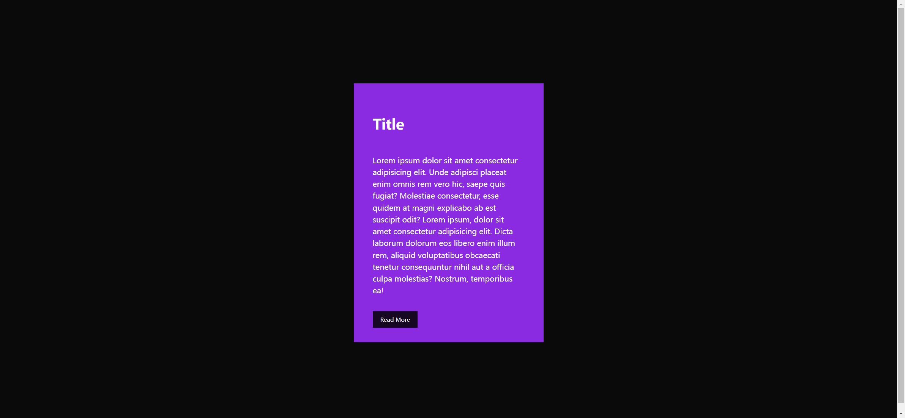

# Task Description: Creative Card Webpage

Your job is to design a webpage that features a creative card with hover effects. The webpage should look and behave as described below. The provided screenshots are rendered under a resolution of 1920x1080.

## Initial Webpage

The initial webpage should be as shown below:


### Layout and Styling

1. **Body**:
   - The body should use a flexbox layout to center its content both horizontally and vertically.
   - Use the font family `sans-serif`.
   
2. **Card Container**:
   - Use the class name `card-container` for the card container.
   - The card container should have an overflow of `hidden`.
   
3. **Card Background Animation**:
   - Before the card container, add a pseudo-element (`:before`) with the following properties:
     - Content should be empty.
   
4. **Card Hover Effect**:
   - When the card container is hovered over, the bottom position of the pseudo-element should change to `0`.

5. **Content**:
   - Use the class name `content` for the content inside the card.
   - The transition should be `1s`.
   
6. **Title**:
   - Use an `h2` element for the title.
   
7. **Paragraph**:
   - Use a `p` element for the paragraph.
   
8. **Read More Link**:
   - Use an `a` element for the "Read More" link.
   - The text decoration should be none.
   
9. **Content Hover Effect**:
   - When the card container is hovered over, the color of the content should change to `#fff`.

### Text Content

- The title text should be "Title".
- The paragraph text should be:
  ```
  Lorem ipsum dolor sit amet consectetur adipisicing elit. Unde adipisci placeat enim omnis rem vero hic, saepe quis fugiat? Molestiae consectetur, esse quidem at magni explicabo ab est suscipit odit? Lorem ipsum, dolor sit amet consectetur adipisicing elit. Dicta laborum dolorum eos libero enim illum rem, aliquid voluptatibus obcaecati tenetur consequuntur nihil aut a officia culpa molestias? Nostrum, temporibus ea!
  ```
- The "Read More" link should have the text "Read More".

## Hover Effect

When the card is hovered over, the background color of the card changes, and the text color changes to white. The webpage should look as shown below after hovering:



### Interaction

- Use the class name `card-container` for the card container.
- Use the class name `content` for the content inside the card.
