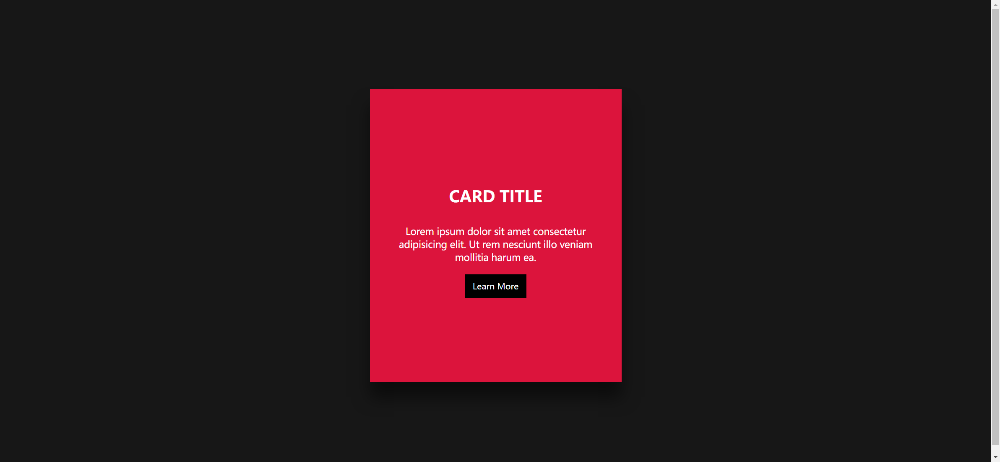

Your job is to design a webpage that features an interactive card with hover effects. The initial webpage should look like this:


When the user hovers over the card, the content inside the card expands and reveals additional information. The webpage after hovering over the card should look like this:



### Requirements:

1. **HTML Structure**:
    - Create a section with the class `card`.
    - Inside the `card` section, create a `div` with the class `img-container` that contains an `img` element. Use the image `milad-shams-AxqT51VT8mw-unsplash.jpg` for the `src` attribute.
    - Create another section inside the `card` with the class `content`.
    - Inside the `content` section, add an `h3` element with the text "Card Title".
    - Add a `p` element with the following text:
      ```
      Lorem ipsum dolor sit amet consectetur adipisicing elit. Ut rem nesciunt illo veniam mollitia harum ea.
      ```
    - Add an `a` element with the text "Learn More".

2. **CSS Styling**:

    - Style the `img-container` to cover the entire card area with a transition effect.
    - On hovering over the `card`, expand the `content` section to cover the entire card, and change the opacity of the `p` and `a` elements to `1`.

3. **Interactions**:
    
    - When the user hovers over the card (use class name `card`), the content section should expand to cover the entire card, and the image should fade out.

### Resources:
- Image: `milad-shams-AxqT51VT8mw-unsplash.jpg` is used for the card's background image.
- Text Content: 
  - Card Title: "Card Title"
  - Paragraph: "Lorem ipsum dolor sit amet consectetur adipisicing elit. Ut rem nesciunt illo veniam mollitia harum ea."
  - Link: "Learn More"

### Notes:
- The provided screenshots are rendered under a resolution of 1920x1080.
- Ensure to use the specified class names and IDs for elements to match the original webpage's structure and styling.
