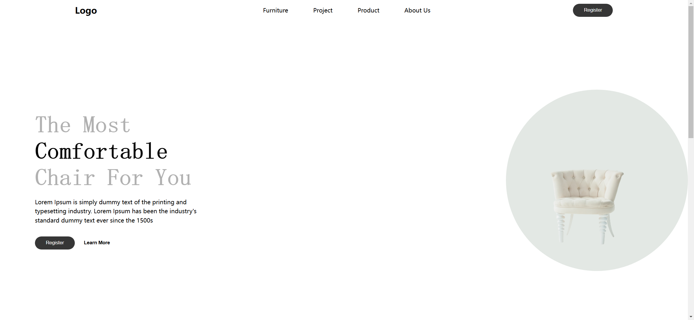
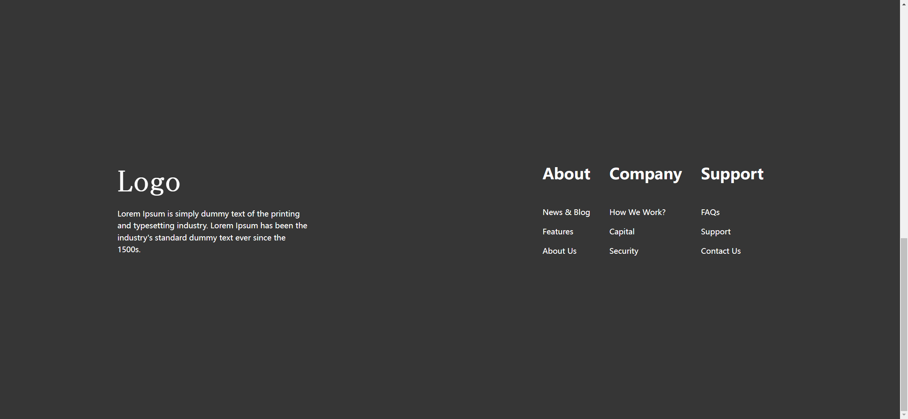

# Task Description: Re-implement the Webpage

Your job is to design a webpage that replicates the provided webpage. The webpage consists of a navigation bar, a header section, a popularity section, and a footer. The initial webpage should look like this:



The provided screenshots are rendered under a resolution of 1920x1080.

## Resources

### Images
- `Images/daniil-silantev-1P6AnKDw6S8-unsplash-removebg-preview.png` is used for the main chair image in the header and one of the product images.
- `Images/bruno-emmanuelle--MUoHL1XULM-unsplash-removebg-preview.png` is used for one of the product images.
- `Images/scott-webb-eD853mTbBA0-unsplash-removebg-preview.png` is used for one of the product images and the "Why Us" section image.

### Text Content
- **Primary Headings in Header:**
  ```
  Lorem Ipsum is simply dummy text of the printing and typesetting industry. Lorem Ipsum has been the industry's standard dummy text ever since the 1500s
  ```
- **Footer Text:**
  ```
  Lorem Ipsum is simply dummy text of the printing and typesetting industry. Lorem Ipsum has been the industry's standard dummy text ever since the 1500s.
  ```

## Layout and Styling

### Navigation Bar
- Use a `nav` element.
- Inside the `nav`, create a `div` with class `logo` containing an `h1` element with the text "Logo".
- Create an unordered list (`ul`) with list items (`li`) containing anchor tags (`a`) for "Furniture", "Project", "Product", and "About Us".
- Add a button with class `btn-fill` and text "Register".

### Header Section
- Use a `header` element.
- Inside the `header`, create a `div` with class `content-container` containing:
  - An `h1` element with class `main-headings` and text:
    ```
    The Most 
    Comfortable 
    Chair For You
    ```
  - A `p` element with class `primary-headings` containing the primary headings text.
  - A `div` with class `btns-container` containing:
    - A button with class `btn-fill` and text "Register".
    - A button with class `btn-outline` and text "Learn More".
- Create another `div` with class `img-container` containing an `img` element with the source `Images/daniil-silantev-1P6AnKDw6S8-unsplash-removebg-preview.png`.

### Popularity Section
- Use a `section` element with class `popularity`.
- Inside the `section`, create three `div` elements with classes `popularity-one`, `popularity-two`, and `popularity-three` respectively. Each `div` should contain:
  - An `h1` element with the respective numbers "12k+", "21k+", and "28k+".
  - A `p` element with the respective texts "Premium Product", "Happy Customers", and "Awards Winnings".

### Footer
- Use a `footer` element.
- Inside the `footer`, create a `div` with class `logo-container` containing:
  - An `h1` element with the text "Logo".
  - A `p` element containing the footer text.
- Create another `div` with class `about-company` containing three `div` elements with class `container`. Each `container` should contain:
  - An `h1` element with the respective texts "About", "Company", and "Support".
  - Three `p` elements with the respective texts:
    - "News & Blog", "Features", "About Us"
    - "How We Work?", "Capital", "Security"
    - "FAQs", "Support", "Contact Us"

## Interactions

### Scroll Page
- Scroll the page to the bottom.



### Hover Over Navigation Links
- Hover over each anchor tag (`a`) in the navigation bar.


## Additional Notes
- Use the Google Font "Playfair Display" for the main headings.
- Ensure the webpage is responsive and adjusts layout for different screen sizes as specified in the CSS.
