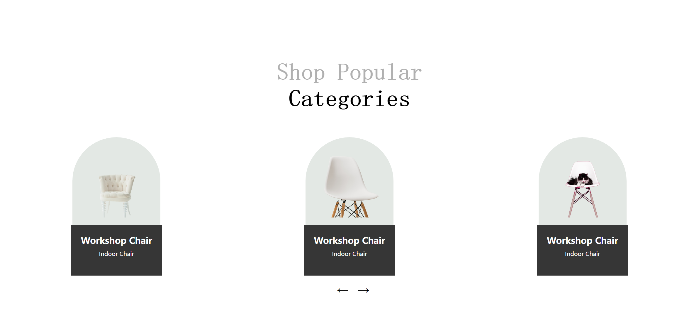

# Task Description for Re-implementing the Webpage

Your job is to design a webpage that showcases a collection of chairs. The webpage should include a section for popular categories, each with an image and description. The initial webpage should look like this:



The provided screenshots are rendered under a resolution of 1920x1080.

## Requirements

### HTML Structure

1. **Main Section**:
    - Use a `<section>` element with the class `products-container`.
    - Inside this section, include an `<h1>` element with the class `products-heading main-headings`. The text content should be:
      ```
      Shop Popular 
      Categories
      ```
      with "Categories" wrapped in a `<span>` element.

2. **Products**:
    - Use a `<div>` element with the class `products` to contain the product items.
    - Each product should be a `<div>` element with the class `product`.
    - Inside each product, include:
        - A `<div>` element with the class `product-img-layer` containing another `<div>` element with the class `img` and a specific class for each image (`img-one`, `img-two`, `img-three`).
        - A `<div>` element with the class `product-content` containing:
            - An `<h1>` element with the class `product-name` and text content "Workshop Chair".
            - A `<p>` element with the class `product-quality` and text content "Indoor Chair".

3. **Navigation Buttons**:
    
    - Use a `<div>` element with the class `b-container` containing two `<button>` elements for navigation. The left button should have the text `←` and the right button should have the text `→`.

### CSS Styling

1. **Fonts and Colors**:
    - Import the "Playfair Display" font from Google Fonts.
    - Define CSS variables for `--main-color`, `--primary-color`, and `--main-font`.

2. **General Styles**:
    - Apply padding, margin, and box-sizing to all elements.
    - Use flexbox for layout where necessary.

3. **Products Section**:
    - Style the `products` class to use flexbox for layout.
    - Style each `product` class to be a flex container with column direction.
    - Style the `product-img-layer` class with a background color of `var(--main-color)` and rounded top corners.
    - Style the `img` class with a width and height of 200px. Each specific image class (`img-one`, `img-two`, `img-three`) should have a background image:
        - `img-one`: `Images/daniil-silantev-1P6AnKDw6S8-unsplash-removebg-preview.png`
        - `img-two`: `Images/bruno-emmanuelle--MUoHL1XULM-unsplash-removebg-preview.png`
        - `img-three`: `Images/scott-webb-eD853mTbBA0-unsplash-removebg-preview.png`
    - Style the `product-content` class with a background color of `var(--primary-color)`, padding, and centered text.

4. **Navigation Buttons**:
    - Style the `b-container` class to center the buttons.

### JavaScript Interactions

1. **Button Clicks**:
    - Implement click interactions for the left and right buttons.
    - Use the IDs `left-button` and `right-button` for the left and right buttons respectively.

### Additional Notes

- Ensure that the webpage is responsive and adjusts well to different screen sizes.
- Describe any animations or transitions used in the webpage.
