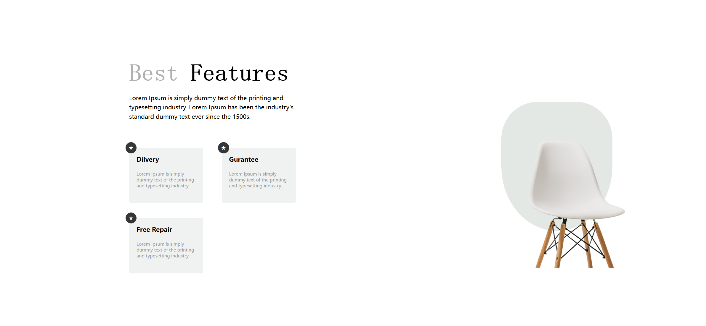

# Task Description for Re-implementing the Webpage

Your job is to design a webpage that showcases the best features of a product, specifically chairs. The webpage should be responsive and visually appealing. Below are the detailed instructions and resources you will need to re-implement the webpage.

## Initial Webpage

The initial webpage should look like this:



This screenshot is rendered under a resolution of 1920x1080.

## Layout and Structure

### HTML Structure

1. **Section: Features**
   - Use a `<section>` tag with the class `features`.
   - Inside this section, create a `div` with the class `content-container`.
     - Add an `<h1>` tag with the class `main-headings` and the text "Best Features". The word "Features" should be wrapped in a `<span>` tag.
     - Add a `<p>` tag with the class `primary-headings` containing the text:
       ```
       Lorem Ipsum is simply dummy text of the printing and typesetting industry. Lorem Ipsum has been the industry's standard dummy text ever since the 1500s.
       ```
     - Create a `div` with the class `cards` containing three `div` elements with the class `card card-fill`.
       - Each card should have a `div` with the class `star` containing the star symbol (★).
       - Each card should have an `<h1>` tag with the text "Delivery", "Guarantee", and "Free Repair" respectively.
       - Each card should have a `<p>` tag with the text:
         ```
         Lorem Ipsum is simply dummy text of the printing and typesetting industry.
         ```
   - Add another `div` with the class `img-container d-none`.
     
     - Inside this `div`, add an `` tag with the `src` attribute pointing to `Images/bruno-emmanuelle--MUoHL1XULM-unsplash-removebg-preview.png`.

### CSS Styling

1. **Fonts and Colors**
   - Import the font "Playfair Display" from Google Fonts.
   - Define CSS variables for `--main-color`, `--primary-color`, and `--main-font`.

2. **General Styles**
   - Apply padding, margin, and box-sizing to all elements.
   - Define styles for the `nav` element, `ul` and `li` elements, and links (`a`).

3. **Buttons**
   - Define styles for buttons with the class `btn-fill` and `btn-outline`.

4. **Header**
   - Define styles for the `header` element and its child elements.

5. **Content Container**
   - Define styles for the `content-container` class, including `main-headings` and `primary-headings`.

6. **Image Container**
   - Define styles for the `img-container` class and its child `img` elements.

7. **Popularity Section**
   - Define styles for the `popularity` class and its child elements.

8. **Products Section**
   - Define styles for the `products-heading` class and the `products` class.
   - Define styles for individual `product` elements and their child elements.

9. **Why Us Section**
   - Define styles for the `why-us` class and its child elements.

10. **Cards**
    - Define styles for the `cards` class and individual `card` elements.
    - Define styles for the `star` class inside the cards.

11. **Footer**
    - Define styles for the `footer` element and its child elements.

12. **Media Queries**
    - Define responsive styles for different screen sizes.

### JavaScript Interactions

1. **Click and Hover Interactions**
   - Implement click interactions for the first, second, and third cards.
   - Implement hover interactions for the first and second cards.

## Resources

- **Images**
  - `Images/bruno-emmanuelle--MUoHL1XULM-unsplash-removebg-preview.png`
  - `Images/daniil-silantev-1P6AnKDw6S8-unsplash-removebg-preview.png`
  - `Images/scott-webb-eD853mTbBA0-unsplash-removebg-preview.png`

## Element Identifiers

- Use class name `features` for the main section.
- Use class name `content-container` for the content container.
- Use class name `main-headings` for the main headings.
- Use class name `primary-headings` for the primary headings.
- Use class name `cards` for the cards container.
- Use class name `card card-fill` for individual cards.
- Use class name `star` for the star element inside cards.
- Use class name `img-container d-none` for the image container.

By following these instructions, you should be able to re-implement the webpage accurately.
