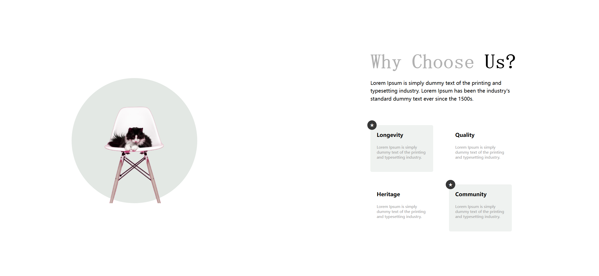

# Task Description: Re-implement the "Chairs" Webpage

Your job is to design a webpage that mimics the provided "Chairs" webpage. The webpage consists of a section that explains why users should choose the company, featuring images and cards with information. The initial webpage should be as shown below:

The provided screenshots are rendered under a resolution of 1920x1080.

## Resources

### Images
- `Images/scott-webb-eD853mTbBA0-unsplash-removebg-preview.png` is used for the background of the circular image in the "Why Us" section.
- `Images/daniil-silantev-1P6AnKDw6S8-unsplash-removebg-preview.png` is used for the first product image.
- `Images/bruno-emmanuelle--MUoHL1XULM-unsplash-removebg-preview.png` is used for the second product image.
- `Images/scott-webb-eD853mTbBA0-unsplash-removebg-preview.png` is used for the third product image.

### Text Content
- **Main Heading**: "Why Choose Us?"
- **Primary Heading**: "Lorem Ipsum is simply dummy text of the printing and typesetting industry. Lorem Ipsum has been the industry's standard dummy text ever since the 1500s."
- **Card Titles and Info**:
  - Longevity: "Lorem Ipsum is simply dummy text of the printing and typesetting industry."
  - Quality: "Lorem Ipsum is simply dummy text of the printing and typesetting industry."
  - Heritage: "Lorem Ipsum is simply dummy text of the printing and typesetting industry."
  - Community: "Lorem Ipsum is simply dummy text of the printing and typesetting industry."

## Layout and Styling

### General
- Use the font "Playfair Display SC" from Google Fonts.
- Use the following CSS variables:
  - `--main-font: "Playfair Display SC", serif`

### Section: Why Us
- The section should have a class name `why-us`.
- The section should be divided into two main parts: an image container and a content container.

#### Image Container
- Use a `div` with class `section-img-container`.
- Inside it, use another `div` with class `img-layer` which contains a `div` with class `img`.
- The `img` div should have a background image `Images/scott-webb-eD853mTbBA0-unsplash-removebg-preview.png`.

#### Content Container
- Use a `div` with class `content-container`.
- The main heading should have a class `main-headings` and contain a span element for the word "Us?".
- The primary heading should have a class `primary-headings`.
- Use a `div` with class `cards` to contain the four cards.

#### Cards
- Each card should be a `div` with class `card`.
- The first and fourth cards should also have an additional class `card-fill`.
- The first and fourth cards should have a star icon represented by the character `&#9733;` inside a `div` with class `star`.
- Each card should have a title with class `card-title` and a paragraph with class `card-info`.

### IDs and Classes
- Use class name `card` for all cards.
- Use class name `card-fill` for the first and fourth cards.
- Use class name `star` for the star icon in the first and fourth cards.

## Additional Notes
- Ensure the webpage is responsive and looks good on different screen sizes.
- Use media queries to adjust the layout for smaller screens as shown in the provided CSS file.

Recreate the webpage according to the above description and ensure all interactions and styles are implemented correctly.
