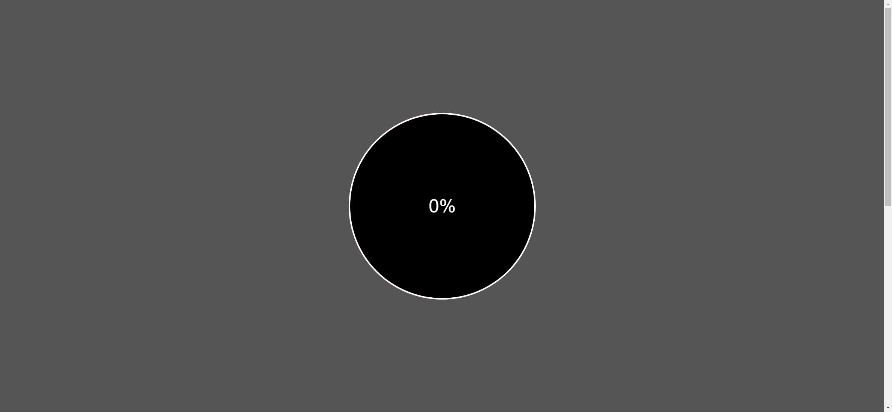
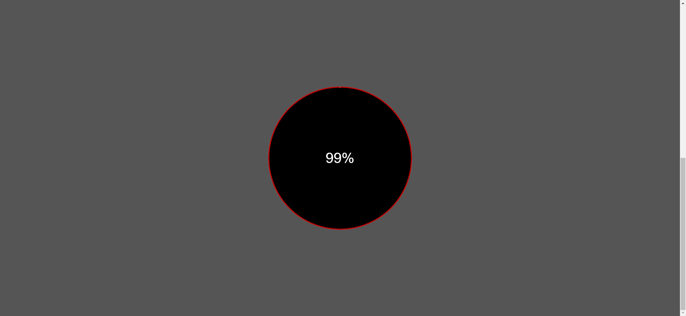

# Task Description: Circle Progress Bar Webpage

Your job is to design a webpage that features a circular progress bar which updates based on the user's scroll position. The progress bar should be centered on the screen and display the percentage of the page that has been scrolled. Below are the detailed instructions to re-implement the webpage.

## Initial Webpage

The initial webpage should look like this:

## Layout and Styling

1. **HTML Structure**:
    - The webpage should have a `div` with class `container` that contains the progress bar.
    - The progress bar should be composed of multiple `div` elements with specific classes to create the circular effect.

2. **CSS Styling**:
    - Use the following CSS properties for the elements:
        - `*` selector to reset margin, padding, and box-sizing.
        - `.container` class to set the dimensions and background color.
        - `.progressbar` class to style the circular progress bar.
        - `.half-circle` and `.half-circle-top` classes to create the rotating halves of the circle.
        - `.progressbar-circle` class to style the inner circle displaying the percentage.
    
3. **JavaScript Functionality**:
    - Use JavaScript to update the progress bar based on the scroll position.
    - The progress bar should rotate and the percentage should update as the user scrolls down the page.

## Resources

- **Text Content**:
    - The text content inside the `.progressbar-circle` should initially be `0%`.

## Interaction and Animation

- **Scroll Interaction**:
    - As the user scrolls, the progress bar should rotate and the percentage inside the circle should update accordingly.
    - The rotation and percentage update should be smooth and visually appealing.

## Element Identifiers

- Use class name `container` for the main container.
- Use class name `progressbar` for the progress bar.
- Use class name `half-circle` for the rotating halves of the circle.
- Use class name `half-circle-top` for the top half of the circle.
- Use class name `progressbar-circle` for the inner circle displaying the percentage.

## Final Webpage After Scrolling

After scrolling to the bottom of the page, the webpage should look like this:

## Notes

- The provided screenshots are rendered under a resolution of 1920x1080.
- Ensure that the progress bar updates smoothly as the user scrolls.
- The progress bar should be centered on the screen at all times.

