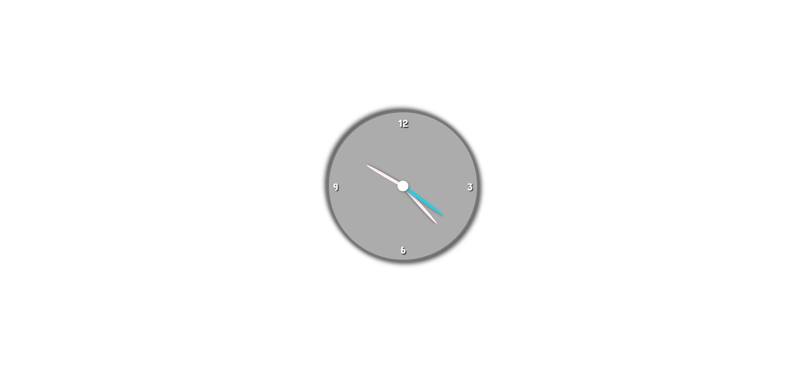

# Task Description: Implement a Clock Webpage

Your job is to design a webpage that displays an analog clock. The clock should have hour, minute, and second hands that move to reflect the current time. The initial webpage should look like this:

## Requirements

### HTML Structure
- Create a `div` with the class `container` to center the clock on the page.
- Inside the `container`, create another `div` with the class `clock`.
- Within the `clock` div, create a `div` with the class `numbers` to hold the clock numbers (12, 3, 6, 9).
  - Use individual `div` elements for each number and assign them the classes `twelve`, `three`, `six`, and `nine` respectively.
- Create another `div` inside the `clock` div with the class `arrows` to hold the clock hands.
  - Use individual `div` elements for each hand and assign them the classes `hour`, `minute`, and `second` respectively.

### CSS Styling
- Use the Google Font `Concert One` for the entire webpage.
- The `container` should take up the full viewport height and width, and center its content both vertically and horizontally.
- The `arrows` should be centered within the `clock` and contain the clock hands.

### JavaScript Functionality
- Use JavaScript to update the rotation of the clock hands every second.
- The `setDate` function should calculate the current time and set the rotation of the clock hands accordingly.
- Use `setInterval` to call the `setDate` function every second.

### Resources
- The Google Font `Concert One` is used for the entire webpage.
- The provided screenshots are rendered under a resolution of 1920x1080.

### Element Identifiers
- Use class name `container` for the container element.
- Use class name `clock` for the clock element.
- Use class name `numbers` for the numbers container.
- Use class names `twelve`, `three`, `six`, and `nine` for the respective clock numbers.
- Use class name `arrows` for the arrows container.
- Use class names `hour`, `minute`, and `second` for the respective clock hands.

### Animation
- The clock hands should rotate smoothly to reflect the current time.
