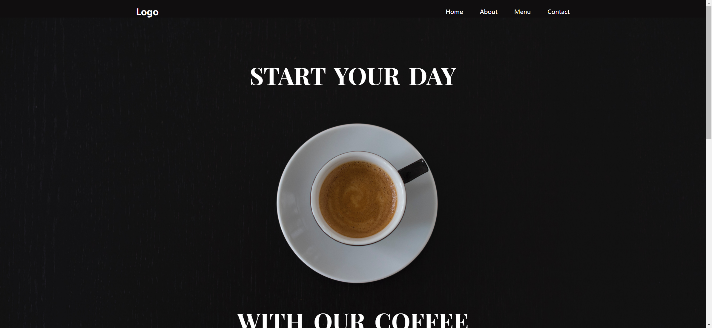
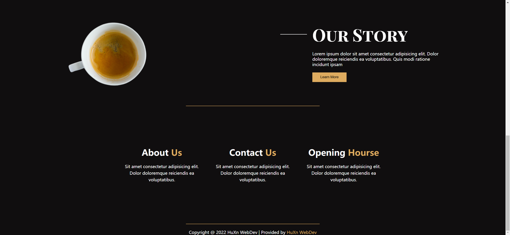
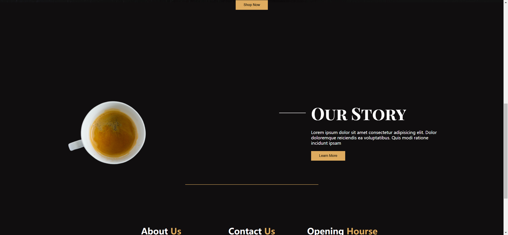
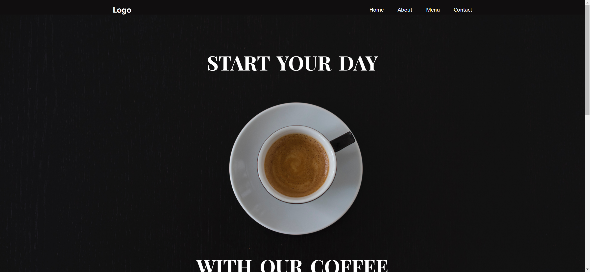

# Task Description for Re-implementing the Coffee Webpage

Your job is to design a webpage that showcases a coffee shop. The webpage should include a navigation bar, a header section, an "Our Story" section, and a footer. The provided screenshots are rendered under a resolution of 1920x1080.

## Initial Webpage
The initial webpage should look like this:


### Navigation Bar
- The navigation bar should have a logo with the text "Logo".
- It should contain four navigation links: Home, About, Menu, and Contact.
- The "Home" link should be active by default.
- Use class name `logo` for the logo element.
- Use class name `active` for the active navigation link.
- Use class name `nav` for the navigation bar.

### Header Section
- The header section should have a background image from `Images/pexels-nao-triponez-129207.jpg`.
- It should contain two main headings: "START YOUR DAY" and "WITH OUR COFFEE".
- There should be a button labeled "Shop Now".
- Use class name `header` for the header section.
- Use class name `main-headings` for the first heading.
- Use class name `primary-heading` for the second heading.
- Use class name `main-btn` for the button.

### Our Story Section
- The "Our Story" section should contain an image from `Images/pexels-chitokan-2183027-removebg-preview.png`.
- It should have a title "Our Story" with a line next to it.
- There should be a paragraph with the text:
  ```
  Lorem ipsum dolor sit amet consectetur adipisicing elit. Dolor doloremque reiciendis ea voluptatibus. Quis modi ratione incidunt ipsam
  ```
- There should be a button labeled "Learn More".
- Use ID `our-story` for the section.
- Use class name `img-container` for the image container.
- Use class name `img` for the image.
- Use class name `section-content` for the content section.
- Use class name `title-style` for the title style.
- Use class name `title` for the title.
- Use class name `line` for the line.

### Footer Section
- The footer should contain three containers with headings and paragraphs:
  - About Us: 
    ```
    Sit amet consectetur adipisicing elit. Dolor doloremque reiciendis ea voluptatibus.
    ```
  - Contact Us: 
    ```
    Sit amet consectetur adipisicing elit. Dolor doloremque reiciendis ea voluptatibus.
    ```
  - Opening Hours: 
    ```
    Sit amet consectetur adipisicing elit. Dolor doloremque reiciendis ea voluptatibus.
    ```
- There should be a copyright notice:
  ```
  Copyright @ 2022 HuXn WebDev | Provided by HuXn WebDev
  ```
- Use class name `container` for each container.
- Use class name `heading-info` for the headings.
- Use class name `para` for the copyright notice.

## Interactions
### Scroll Page
- The page should be scrollable.
- After scrolling, the webpage should look like this:
  

### Click "Shop Now" Button
- Clicking the "Shop Now" button should trigger an action.
- After clicking, the webpage should look like this:
  

### Hover Over Navigation Links
- Hovering over the navigation links should change their appearance.
- After hovering, the webpage should look like this:
  

## Resources
- Background image for the header: `Images/pexels-nao-triponez-129207.jpg`
- Image for the "Our Story" section: `Images/pexels-chitokan-2183027-removebg-preview.png`
- Font: `https://fonts.googleapis.com/css2?family=Playfair+Display+SC:wght@700&display=swap`
