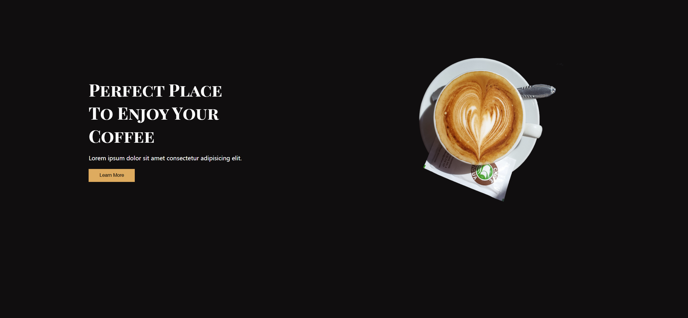

Your task is to design a webpage that showcases a perfect place to enjoy coffee. The webpage should have a visually appealing layout with a background image, a title, a paragraph, and a button. Below are the detailed instructions to re-implement the webpage.

### Initial Webpage Layout

The initial webpage should look like this:



### Resources

1. **Images**:
   - `Images/pexels-nao-triponez-129207.jpg` is used for the background of the header section.
   - `Images/2.png` is used for the image in the coffee container section.
   - `Images/pexels-chitokan-2183027-removebg-preview.png` is used for the image in the "Our Story" section.
   - `Images/1.png`, `Images/3.png`, and `Images/4.png` are used for the images in the product cards.

2. **Fonts**:
   - The webpage uses the "Playfair Display SC" font from Google Fonts. You can import it using the following URL:
     ```css
     @import url("https://fonts.googleapis.com/css2?family=Playfair+Display+SC:wght@700&display=swap");
     ```

3. **Text Content**:
   - The paragraph in the coffee container section: 
     ```text
     Lorem ipsum dolor sit amet consectetur adipisicing elit.
     ```

### Layout and Styling

2. **Header Section**:
   - The header section should have a background image (`Images/pexels-nao-triponez-129207.jpg`), centered, and cover the entire viewport height.
   - The font family for the header should be "Playfair Display SC", serif.
   - The main headings should be positioned absolutely at the top and bottom of the header section with specific font sizes and word spacing.

3. **Coffee Container Section**:
   - This section should be a flex container with space-around alignment and should wrap its content.
   - The title should be styled with the "Playfair Display SC" font, white color, and a specific font size.
   
4. **Image Container**:
   - The image container should have specific dimensions, and the image inside should be centered and cover the container.

### Element Identifiers

- Use class name `coffee-container` for the main container of the coffee section.
- Use class name `content-section` for the content section inside the coffee container.
- Use class name `title-two` for the title inside the coffee container.
- Use class name `img-container` for the image container inside the coffee container.
- Use class name `img-2` for the image inside the image container.
- Use class name `main-btn` for the button inside the header section.

### Additional Notes

- Ensure that the webpage is responsive and adjusts well to different screen sizes.
- Describe any animations or transitions if they are part of the design.
