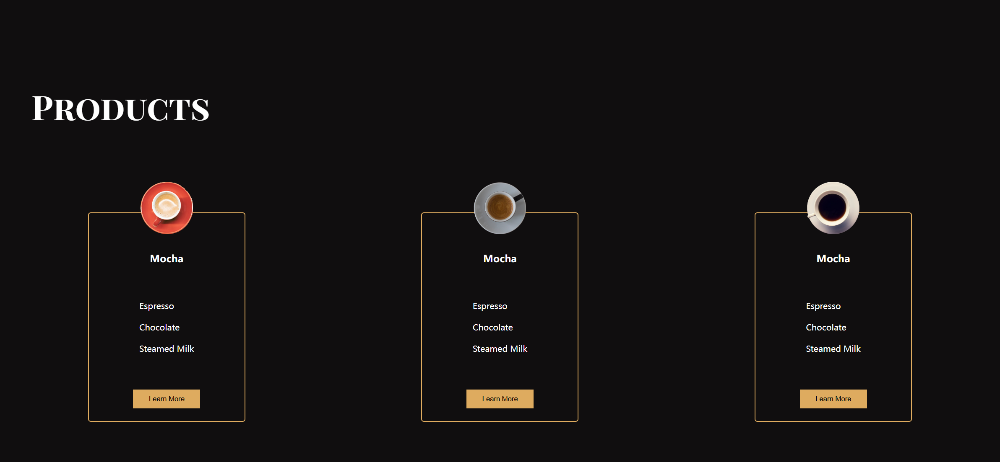

# Task Description for Re-implementing the Coffee Products Webpage

Your job is to design a webpage that showcases different coffee products. The webpage should have a section displaying three coffee products, each with an image, title, list of ingredients, and a "Learn More" button. The initial webpage should look like this:

The provided screenshots are rendered under a resolution of 1920x1080.

## Requirements

### HTML Structure

1. **Section: Products**
    - Use a `<section>` element with the class `products`.
    - Inside this section, include an `<h1>` element with the class `title title-three` and the text content "Products".

2. **Section: Cards**
    - Inside the `products` section, include another `<section>` element with the class `cards`.
    - This section should contain three product cards.

3. **Product Card Structure**
    - Each card should be a `
` element with the class `card`.
    - Inside each card:
        - A `
` element with the class `card-img` and a unique class for each image (`img-one`, `img-two`, `img-three`).
        - A `
` element with the class `card-title` containing an `<h1>` element with the text "Mocha".
        - A `
` element with the class `items` containing three `
` elements with the text "Espresso", "Chocolate", and "Steamed Milk".
        - A `<button>` element with the text "Learn More".

### CSS Styling

1. **Fonts and Colors**
    - Import the font "Playfair Display SC" from Google Fonts.
    
2. **General Styles**
    - Style buttons with padding, background color, and cursor properties.

3. **Product Section**
    - Style the `products` section with a top margin.
    - Style the `title-three` class with font size, margin, and color properties.

4. **Cards**
    - Style the `cards` section to display flex, wrap, and align items.
    - Style each `card` with border, padding, height, width, flex properties, and positioning.
    - Style the `card-img` class with width, height, and positioning.
    - Apply background images to `img-one`, `img-two`, and `img-three` classes using the following images:
        - `Images/1.png` for `img-one`
        - `Images/3.png` for `img-two`
        - `Images/4.png` for `img-three`
    - Style the `card-title` and `items` classes with font properties and color.

### Interactions

1. **Learn More Button**
    - Each card has a "Learn More" button. Clicking these buttons should trigger an interaction.
    - Use the following IDs for the buttons:
        - `learn-more-one` for the first card
        - `learn-more-two` for the second card
        - `learn-more-three` for the third card

### Resources

- **Images**:
  - `Images/pexels-nao-triponez-129207.jpg` for the header background.
  - `Images/pexels-chitokan-2183027-removebg-preview.png` for the story section.
  - `Images/1.png` for the first card image.
  - `Images/3.png` for the second card image.
  - `Images/4.png` for the third card image.

- **Text Content**:
  - The title for each card is "Mocha".
  - The ingredients listed in each card are "Espresso", "Chocolate", and "Steamed Milk".

### Notes

- Ensure that the webpage is responsive and looks good on different screen sizes.
- Describe any animations or transitions used in the interactions.
