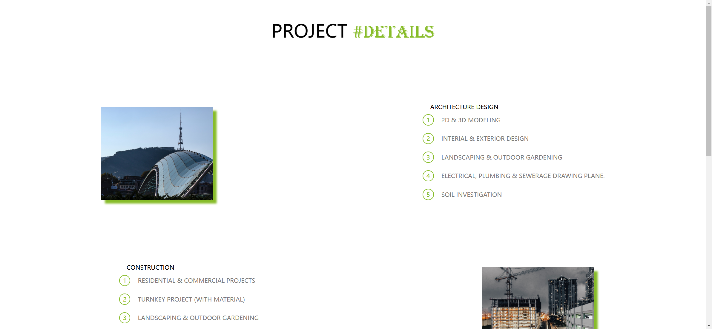
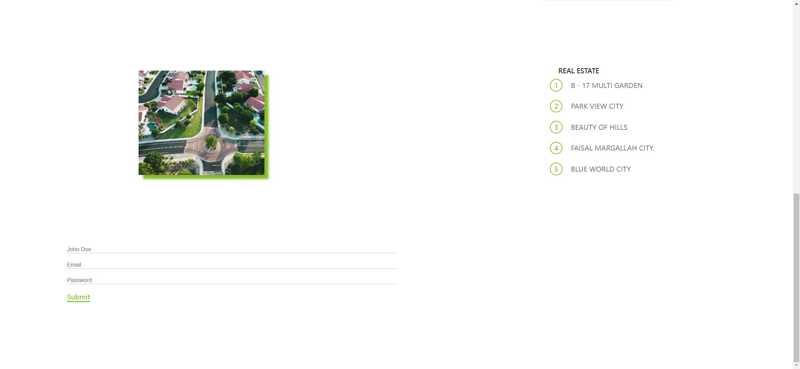
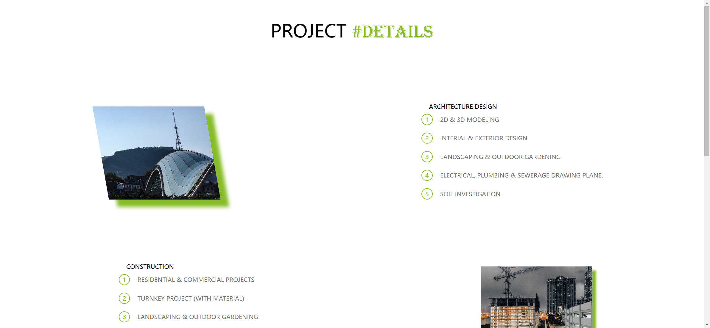
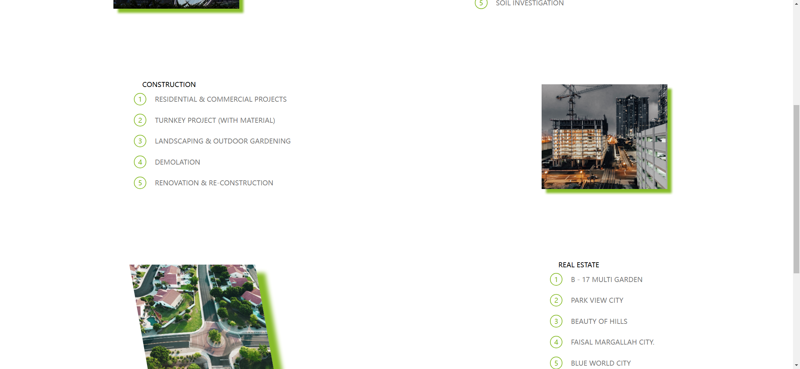
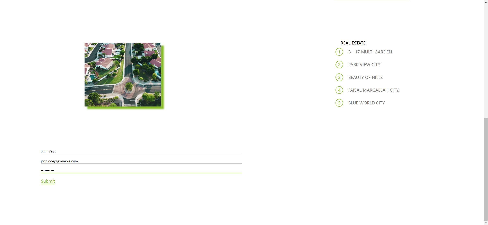

# Task Description for Re-implementing the "Dream Home" Webpage

Your job is to design a webpage that showcases the details of a project named "Dream Home". The webpage should include various sections such as project details, a form, and interactive images. Below are the detailed instructions to help you re-implement the webpage.

## Initial Webpage
The initial webpage should look like this:

## Project Details Section
The project details section is divided into three main categories: Architecture Design, Construction, and Real Estate. Each category has a list of services provided.

### Architecture Design
- Use class name `project-details__container-left` for the container.
- Use class name `img-one` for the image.
- The image should be sourced from `Images/one.jpg`.
- The list of services includes:
  1. 2D & 3D MODELING
  2. INTERIOR & EXTERIOR DESIGN
  3. LANDSCAPING & OUTDOOR GARDENING
  4. ELECTRICAL, PLUMBING & SEWERAGE DRAWING PLANE.
  5. SOIL INVESTIGATION

### Construction
- Use class name `project-details__container-right` for the container.
- Use class name `img-two` for the image.
- The image should be sourced from `Images/two.jpg`.
- The list of services includes:
  1. RESIDENTIAL & COMMERCIAL PROJECTS
  2. TURNKEY PROJECT (WITH MATERIAL)
  3. LANDSCAPING & OUTDOOR GARDENING
  4. DEMOLITION
  5. RENOVATION & RE-CONSTRUCTION

### Real Estate
- Use class name `project-details__container-left` for the container.
- Use class name `img-three` for the image.
- The image should be sourced from `Images/three.jpg`.
- The list of services includes:
  1. B - 17 MULTI GARDEN
  2. PARK VIEW CITY
  3. BEAUTY OF HILLS
  4. FAISAL MARGALLAH CITY.
  5. BLUE WORLD CITY

## Form Section
The form section should include three input fields: Name, Email, and Password, and a submit button.
- Use placeholder text "John Doe" for the name input.
- Use placeholder text "Email" for the email input.
- Use placeholder text "Password" for the password input.
- Use class name `form-btn` for the submit button.

## Interactions
### Scrolling
The page should be scrollable to reveal more content.

### Hover Effects
Hovering over the images should apply a transformation effect.
- Hover on the first image:
  
- Hover on the second image:
  
- Hover on the third image:
  

### Form Filling
The form should be filled with the following details:
- Name: John Doe
- Email: john.doe@example.com
- Password: password123

## Resources
- `Images/one.jpg` is used for the first image in the Architecture Design section.
- `Images/two.jpg` is used for the second image in the Construction section.
- `Images/three.jpg` is used for the third image in the Real Estate section.
- The background image for the header is `Images/scott-blake-x-ghf9LjrVg-unsplash.jpg`.

## Additional Notes
- The provided screenshots are rendered under a resolution of 1920x1080.
- The animations include hover effects on images and text transformations on hover.
- Ensure to use the specified class names and IDs for elements to match the original webpage's functionality and appearance.

By following these instructions, you should be able to re-implement the "Dream Home" webpage accurately.
