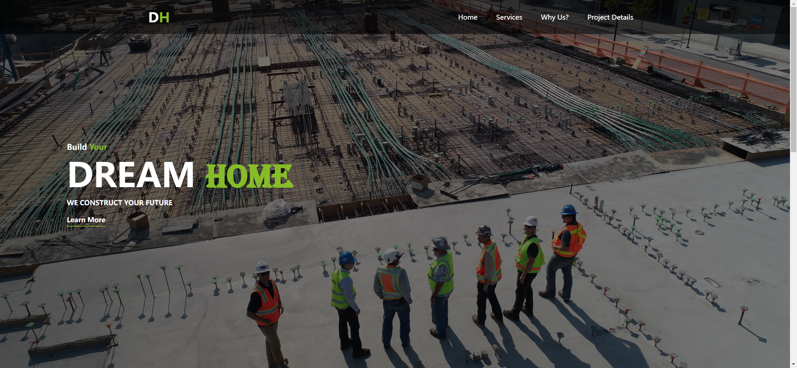
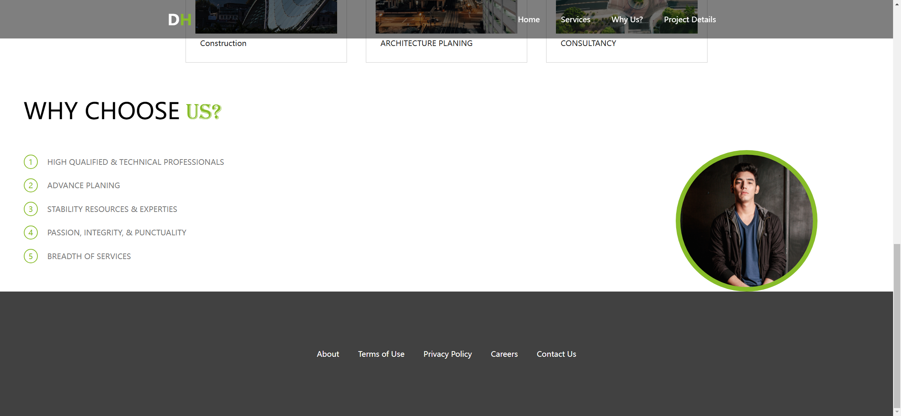
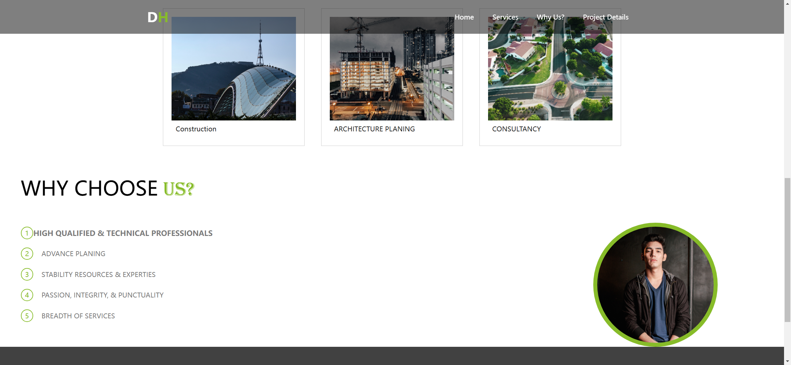
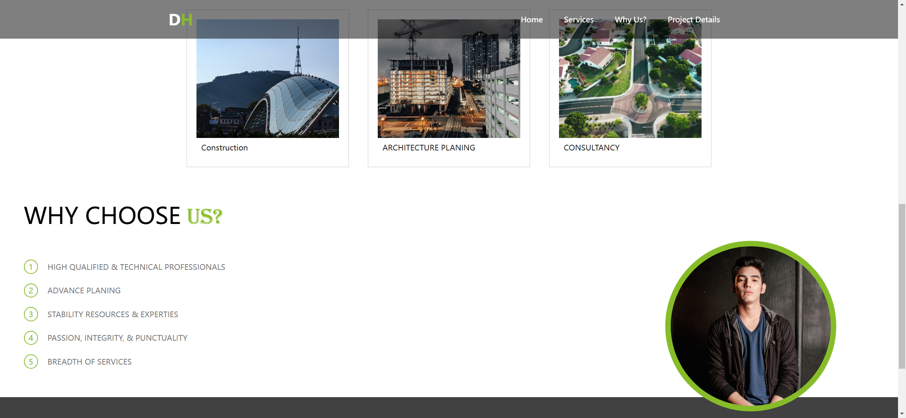

Your job is to design a webpage for a company called "Dream Home". The webpage should have a navigation bar, a hero section, a services section, a "Why Us?" section, and a footer. The provided screenshots are rendered under a resolution of 1920x1080.

### Initial Webpage
The initial webpage should be:


### Navigation Bar
- The navigation bar should be fixed at the top, with a semi-transparent black background.
- The logo should display "DH" with "H" in a different color.
- The navigation links should include "Home", "Services", "Why Us?", and "Project Details".
- Use class name `nav` for the navigation bar.
- Use class name `nav__logo` for the logo.
- Use class name `list-items` for the navigation links.

### Hero Section
- The hero section should have a background image (`Images/scott-blake-x-ghf9LjrVg-unsplash.jpg`) with a dark overlay.
- The hero section should contain headings "Build Your DREAM HOME" and a subheading "WE CONSTRUCT YOUR FUTURE".
- There should be a "Learn More" button.
- Use class name `hero` for the hero section.
- Use class name `hero__headings-container` for the container of the headings.
- Use class name `hero__main-headings` for the main heading.
- Use class name `main-btn` for the "Learn More" button.

### Services Section
- The services section should have a heading "OUR SERVICES".
- There should be three service cards: "Construction", "ARCHITECTURE PLANING", and "CONSULTANCY".
- Each card should have an image (`Images/one.jpg`, `Images/two.jpg`, `Images/three.jpg`) and a description.
- Use ID `services` for the services section.
- Use class name `cards` for the container of the cards.
- Use class name `card` for each card.
- Use class name `card-image` for the images in the cards.

### "Why Us?" Section
- The "Why Us?" section should have a heading "WHY CHOOSE US?".
- There should be a list of reasons with numbers and descriptions.
- There should be an image of the owner (`Images/Zayn.jpg`).
- Use ID `why-us` for the "Why Us?" section.
- Use class name `lists-container` for the container of the lists.
- Use class name `list` for each list item.
- Use class name `list-number` for the number in each list item.
- Use class name `list-info` for the description in each list item.
- Use class name `owner-image` for the owner's image.

### Footer
- The footer should contain links: "About", "Terms of Use", "Privacy Policy", "Careers", and "Contact Us".
- Use class name `footer` for the footer.

### Interactions
1. **Scroll the Page**:
   - The page should be scrollable.
   - Screenshot after scrolling: 

2. **Click on 'Services' in the Navigation**:
   - Clicking on "Services" should navigate to the services section.
   - Screenshot after clicking "Services": 

3. **Hover over the First Service Card**:
   - Hovering over the first service card should scale it up and add a shadow.
   - Screenshot after hovering over the first service card: 

4. **Hover over the First 'Why Us?' List Item**:
   - Hovering over the first list item should scale it up and make the text bold.
   - Screenshot after hovering over the first 'Why Us?' list item: 

5. **Hover over the Owner Image**:
   - Hovering over the owner image should scale it up.
   - Screenshot after hovering over the owner image: 

### Resources
- `Images/scott-blake-x-ghf9LjrVg-unsplash.jpg` is used for the background of the hero section.
- `Images/one.jpg` is used for the background of the first service card.
- `Images/two.jpg` is used for the background of the second service card.
- `Images/three.jpg` is used for the background of the third service card.
- `Images/Zayn.jpg` is used for the owner's image in the "Why Us?" section.
- The text content for the hero section is:
  ```
  Build Your DREAM HOME
  WE CONSTRUCT YOUR FUTURE
  ```
- The text content for the services section is:
  ```
  OUR SERVICES
  Construction
  ARCHITECTURE PLANING
  CONSULTANCY
  ```
- The text content for the "Why Us?" section is:
  ```
  WHY CHOOSE US?
  HIGH QUALIFIED & TECHNICAL PROFESSIONALS
  ADVANCE PLANING
  STABILITY RESOURCES & EXPERTIES
  PASSION, INTEGRITY, & PUNCTUALITY
  BREADTH OF SERVICES
  ```
- The text content for the footer is:
  ```
  About
  Terms of Use
  Privacy Policy
  Careers
  Contact Us
  ```

### Animations
- The main headings in the services section should skew when hovered.
- The service cards should scale up and add a shadow when hovered.
- The list items in the "Why Us?" section should scale up and make the text bold when hovered.
- The owner's image should scale up when hovered.
