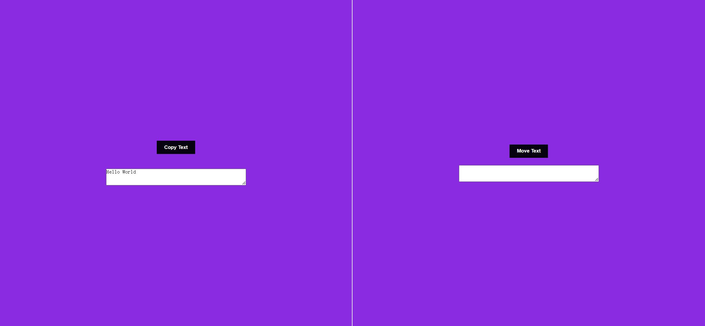
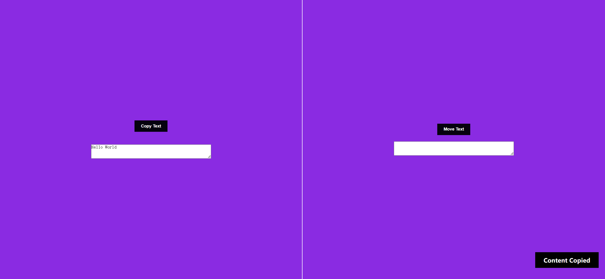
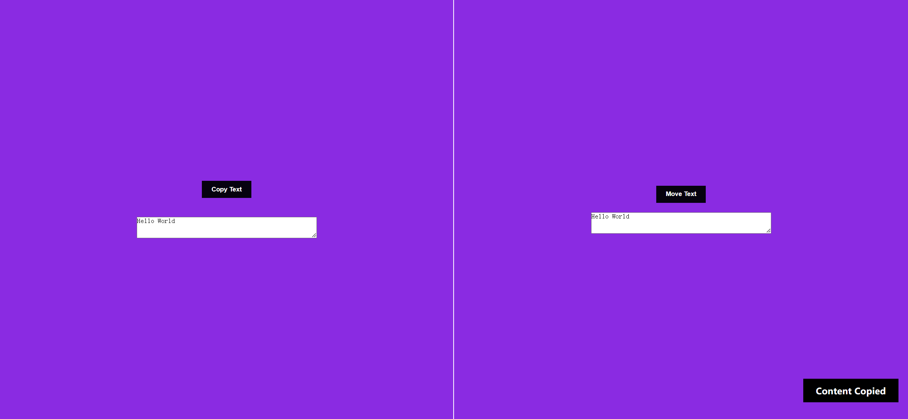

# Task Description: Copy and Move Webpage

Your job is to design a webpage that allows users to copy text from one textarea to another and then move the text to a final textarea. The webpage should have a visually appealing layout and interactive buttons. Below are the detailed requirements and resources needed to re-implement the webpage.

## Initial Webpage
The initial webpage should look like this:

### Layout and Styling
- The webpage should have a blueviolet background.
- Use a grid layout with two columns, each taking up equal space.
- The left column should have a border on the right side.
- Use the `sans-serif` font family for all text.

### Elements
1. **Container (Left Column)**
   - Use class name `container` for the left column.
   - This column should contain a button and a textarea.
   - The button should have the class name `copyBtn` and the text "Copy Text".
   - The textarea should have the name `copyTxt` and contain the text "Hello World".

2. **Output Container (Right Column)**
   - Use class name `output-container` for the right column.
   - This column should contain a div for output, a button, and another textarea.
   - The button should have the class name `moverBtn` and the text "Move Text".
   - The textarea should have the name `finalTxt`.

### Button Styling
- Use class name `btn` for both buttons.
- Buttons should have padding of `10px 20px`, margin of `10px`, and a cursor pointer.
- Buttons should have a background color of `rgb(6, 2, 15)`, no border, white text color, and bold font weight.

### Textarea Styling
- Textareas should have a margin of `10px` and no outline.

### Additional Styling
- Use class name `added` for any dynamically added elements.
- These elements should be positioned absolutely at the bottom right, with a black background, white text color, and centered text.

## Interactions
### Copy Text Button
- When the "Copy Text" button is clicked, the text from the first textarea should be copied to the div in the right column.
- Use class name `copyBtn` for this button.

### Move Text Button
- When the "Move Text" button is clicked, the text from the div should be moved to the second textarea.
- Use class name `moverBtn` for this button.

## Screenshots
The provided screenshots are rendered under a resolution of 1920x1080.

### After Copying Text
After clicking the "Copy Text" button, the webpage should look like this:

### After Moving Text
After clicking the "Move Text" button, the webpage should look like this:

## Resources
- The initial text content in the first textarea is "Hello World".

Follow these guidelines to re-implement the webpage. Good luck!
