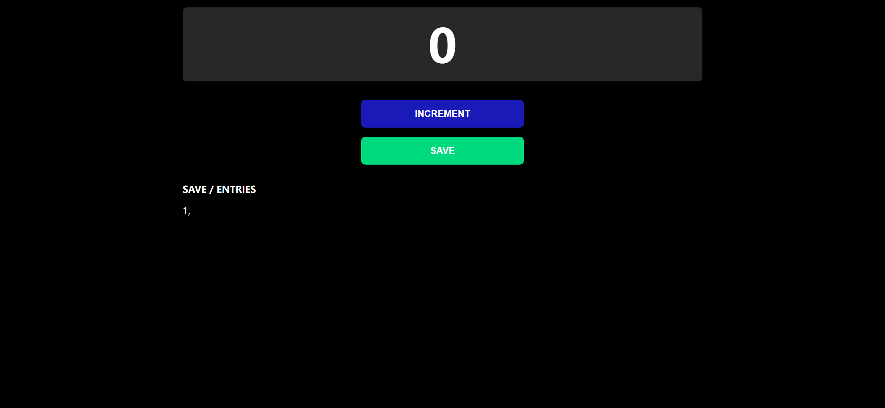

# Task Description: Counter Webpage

Your job is to design a webpage that functions as a simple counter with save functionality. The webpage should look and behave as described below. The provided screenshots are rendered under a resolution of 1920x1080.

## Initial Webpage

The initial webpage should look like this:

### Layout and Styling

1. **Body**
   - The background color should be black.
   - The font family should be sans-serif.

2. **Main Content Area**
   - Use a class name `content` for the main container.
   
3. **Counter Section**
   - Use a class name `counter` for the counter section.
   
4. **Counter Box**
   - Use an ID `count` for the counter display box.
   
5. **Buttons**
   - Use a class name `button` for both buttons.
   - Use a class name `save-btn` for the save button.

6. **Entries Section**
   - Use a class name `entries` for the entries section.
   - The section should contain a paragraph with the text "SAVE / ENTRIES" and a class name `entries-field` for the saved entries display.

### Functionality

1. **Increment Button**
   - Use the class name `increment-btn` for the increment button.
   - When clicked, the counter value should increase by 1.
   - The updated counter value should be displayed in the counter box.

2. **Save Button**
   - Use the class name `save-btn` for the save button.
   - When clicked, the current counter value should be appended to the entries field, followed by a comma.
   - The counter value should then reset to 0.

## Interactions

### After Increment

After clicking the increment button once, the webpage should look like this:

### After Save

After clicking the save button, the webpage should look like this:

### Resources

- The text content "SAVE / ENTRIES" should be used in the entries section.
- The initial counter value should be "0".

Ensure that the webpage matches the provided screenshots and functionality as described. Good luck!
