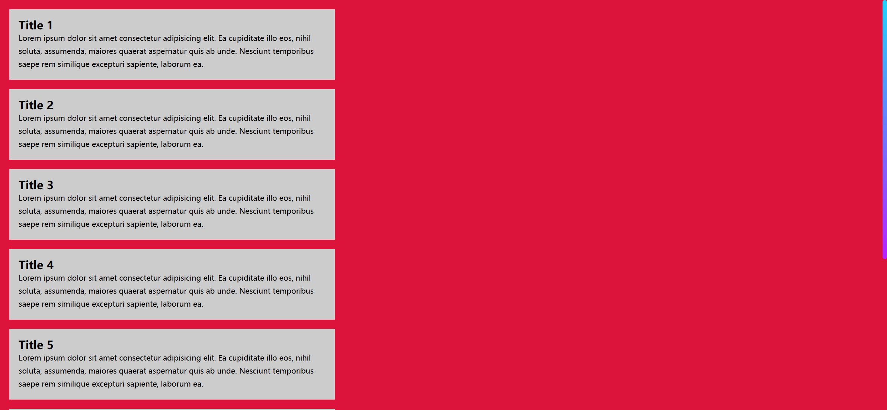
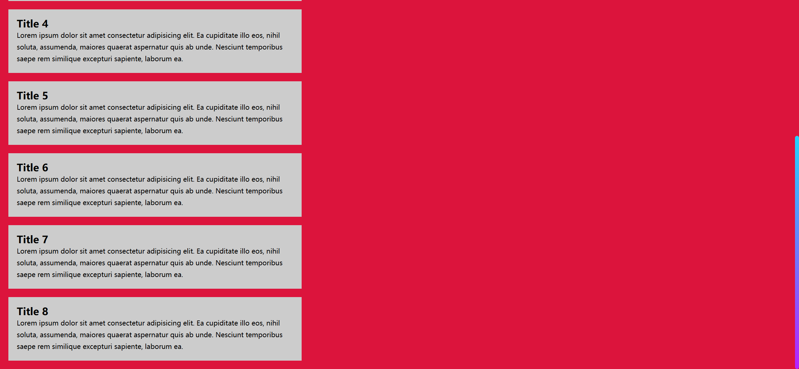

# Task Description: Custom Scrollbar Webpage

Your job is to design a webpage that features a custom scrollbar and several content cards. The webpage should look and behave as described below. The provided screenshots are rendered under a resolution of 1920x1080.

## Initial Webpage

The initial webpage should look like this:

### Layout and Styling

1. **Background**:
   
- The background color of the webpage should be `crimson`.
   
2. **Cards**:

   - The font family for the text inside the cards should be `sans-serif`.

     

3. **Scrollbar**:

   - The scrollbar track should be transparent.

### Content

The webpage should contain a section with multiple cards. Each card should have a title and a paragraph of text. The content for each card is as follows:

- **Card 1-8**:
  - Title: `Title 1`-8
  - Text: `Lorem ipsum dolor sit amet consectetur adipisicing elit. Ea cupiditate illo eos, nihil soluta, assumenda, maiores quaerat aspernatur quis ab unde. Nesciunt temporibus saepe rem similique excepturi sapiente, laborum ea.`

### Interaction

When the user scrolls down the page, the custom scrollbar should be visible. The webpage after scrolling should look like this:

### Element Identifiers

- Use class name `card` for the card elements.
- Use class name `card-title` for the card title elements.

By following this description, you should be able to re-implement the webpage with the custom scrollbar and content cards as shown in the screenshots.
