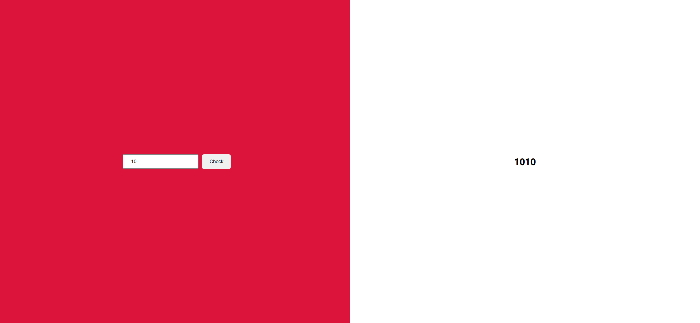

# Decimal to Binary Converter Webpage

Your task is to design a webpage that converts a decimal number to its binary equivalent. The webpage should have an input field for the user to enter a decimal number and a button to trigger the conversion. The binary result should be displayed on the webpage after the conversion.

## Initial Webpage

The initial webpage should look like this:

### Layout and Styling

1. **Body**:
   - The body should use flexbox to center its content.
   
2. **Container Section**:
   - Use a section with the class name `container`.
   - The container should be 50% of the width of the body and have a crimson background.
   
     
   
3. **Input Fields**:
   - There should be an input field for entering the decimal number.
   - Use the ID `number` for the input field.
   - The input field should have padding and margin for spacing.
   
4. **Button**:
   - There should be a button to trigger the conversion.
   - Use the class name `result-btn` for the button.
   - The button should have padding, no border, a border-radius, and a cursor pointer.
   
5. **Results Container**:
   - Use a section with the class name `results-container` to display the binary result.

### Functionality

1. **Input Field**:
   - The input field should accept only numbers.
   - Use the `type="number"` attribute for the input field.

2. **Button**:
   - The button should have the text "Check".
   - When the button is clicked, it should trigger the conversion of the decimal number to binary.

3. **Conversion Logic**:
   - The conversion logic should be implemented in JavaScript.
   - Use the following steps to convert the decimal number to binary:
     1. Get the value from the input field with ID `number`.
     2. Initialize variables for temporary decimal storage, remainder, binary result, and place value.
     3. Use a while loop to perform the conversion by repeatedly dividing the decimal number by 2 and storing the remainder.
     4. Construct the binary result by adding the remainder multiplied by the place value.
     5. Display the binary result in the `results-container` section.

### Interaction

1. **Enter Number**:
   - The user should enter a number in the input field.
   - The webpage after entering the number should look like this:

   

2. **Click Check Button**:
   - The user should click the "Check" button to trigger the conversion.
   - The webpage after clicking the button should look like this:

   

### Notes

- The provided screenshots are rendered under a resolution of 1920x1080.
- Ensure that the elements have the specified IDs and class names for proper functionality and testing.
