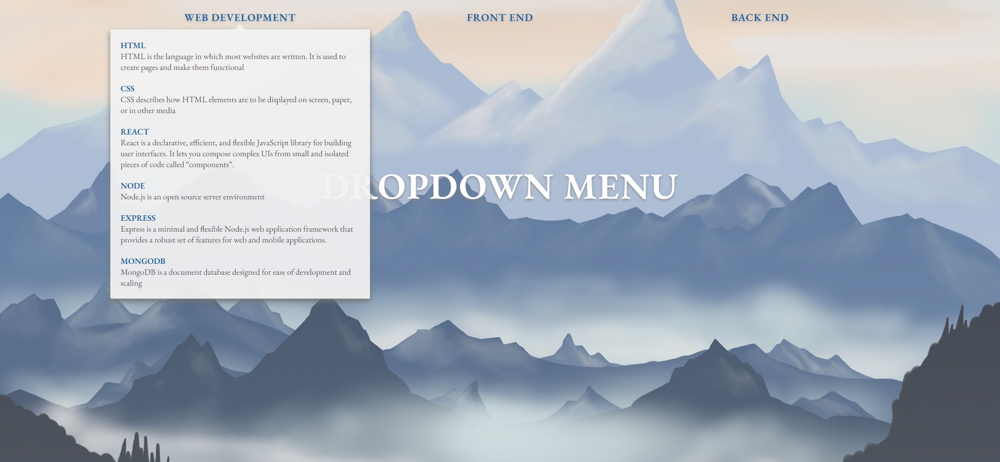
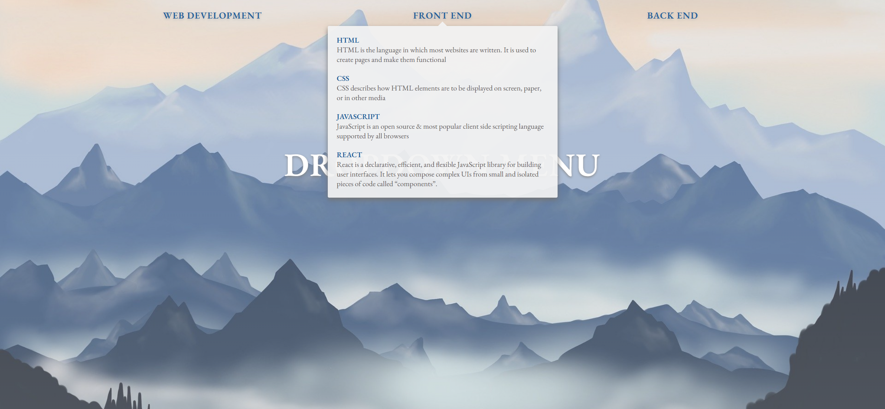
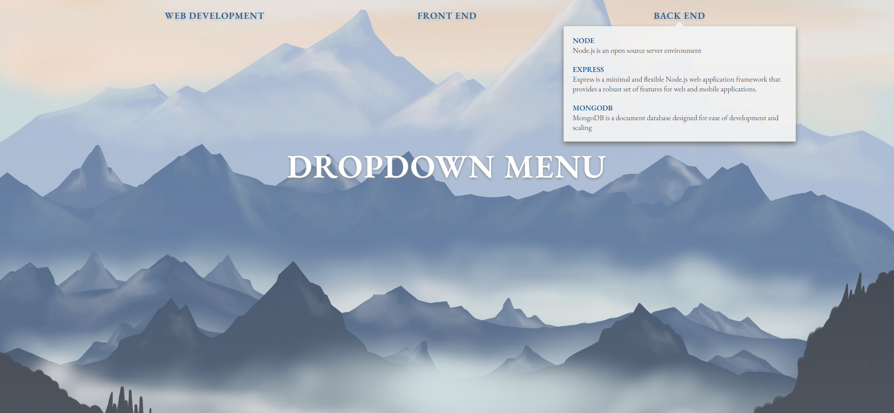

# Task Description: Implement a Dropdown Navigation Webpage

Your job is to design a webpage with a dropdown navigation menu. The webpage should have a banner, a navigation bar with dropdown menus, and a background image. The initial webpage should look like this:


The provided screenshots are rendered under a resolution of 1920x1080.

## Resources

### Fonts
- Use the font "EB Garamond" from Google Fonts. Include the following link in the `<head>` section of your HTML:
  ```html
  <link href="https://fonts.googleapis.com/css?family=EB+Garamond:400,400i,600,600i&display=swap" rel="stylesheet" />
  ```

### Background Image
- Use the image `images/bg.jpg` for the background of the `.wrapper` section.

### Text Content
- The banner text should be "Dropdown Menu".
- The dropdown items and their descriptions are as follows:

#### Web Development
- HTML: "HTML is the language in which most websites are written. It is used to create pages and make them functional."
- CSS: "CSS describes how HTML elements are to be displayed on screen, paper, or in other media."
- React: "React is a declarative, efficient, and flexible JavaScript library for building user interfaces. It lets you compose complex UIs from small and isolated pieces of code called 'components'."
- Node: "Node.js is an open source server environment."
- Express: "Express is a minimal and flexible Node.js web application framework that provides a robust set of features for web and mobile applications."
- MongoDB: "MongoDB is a document database designed for ease of development and scaling."

#### Front End
- HTML: "HTML is the language in which most websites are written. It is used to create pages and make them functional."
- CSS: "CSS describes how HTML elements are to be displayed on screen, paper, or in other media."
- JavaScript: "JavaScript is an open source & most popular client side scripting language supported by all browsers."
- React: "React is a declarative, efficient, and flexible JavaScript library for building user interfaces. It lets you compose complex UIs from small and isolated pieces of code called 'components'."

#### Back End
- Node: "Node.js is an open source server environment."
- Express: "Express is a minimal and flexible Node.js web application framework that provides a robust set of features for web and mobile applications."
- MongoDB: "MongoDB is a document database designed for ease of development and scaling."

## Structure and Styling

### HTML Structure
- Use a `<div>` with class `container` to wrap the entire content.
- Inside the container, use a `<section>` with class `wrapper`.
- Create a `<div>` with class `banner` containing an `<h1>` with class `banner-text` for the banner text.
- Create a `<nav>` with class `navbar` containing an unordered list `<ul>` with class `nav-list`.
- Each navigation item should be a list item `<li>` with class `nav-item` containing an anchor `<a>` with class `nav-link`.
- Each dropdown menu should be an unordered list `<ul>` with class `dropdown` inside the corresponding `nav-item`.
- Each dropdown item should be a list item `<li>` with class `dropdown-item` containing an anchor `<a>` with class `dropdown-link` and a paragraph `<p>` for the description.
- Include a `<div>` with class `dropdown-bg` inside the `navbar`.

### CSS Styling
- Ensure the background image covers the entire `.wrapper` section and is centered.
- Style the banner text to be centered, white, uppercase, with a text shadow.
- Style the navigation links to be uppercase, bold, and have a text shadow.
- The dropdown menus should be initially hidden and become visible on hover.
- The dropdown background should have a slight opacity and a box shadow.

### JavaScript Functionality
- On hovering over a `nav-item`, the dropdown background should become visible and adjust its size and position to match the dropdown menu.
- On mouse out, the dropdown background should become hidden.

## Interactions

### Hover Effects
- When hovering over "Web Development", the dropdown menu should appear as shown below:
  

- When hovering over "Front End", the dropdown menu should appear as shown below:
  

- When hovering over "Back End", the dropdown menu should appear as shown below:
  

### IDs and Classes
- Use class `container` for the main container.
- Use class `wrapper` for the main section.
- Use class `banner` for the banner div.
- Use class `banner-text` for the banner heading.
- Use class `navbar` for the navigation bar.
- Use class `nav-list` for the navigation list.
- Use class `nav-item` for each navigation item.
- Use class `nav-link` for each navigation link.
- Use class `dropdown` for each dropdown menu.
- Use class `dropdown-item` for each dropdown item.
- Use class `dropdown-link` for each dropdown link.
- Use class `dropdown-bg` for the dropdown background div.

Follow these instructions to re-implement the webpage. Good luck!
