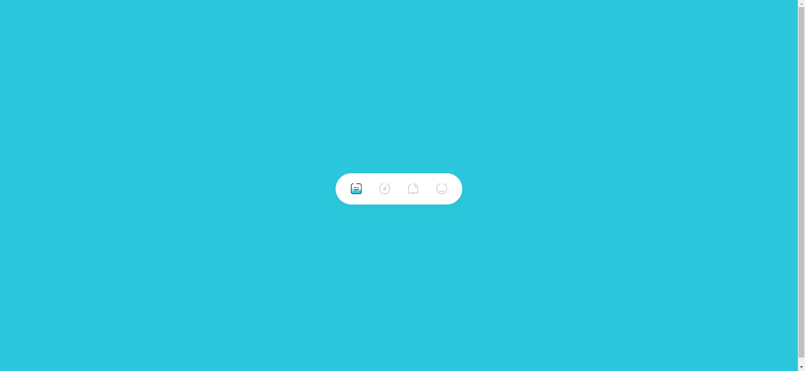
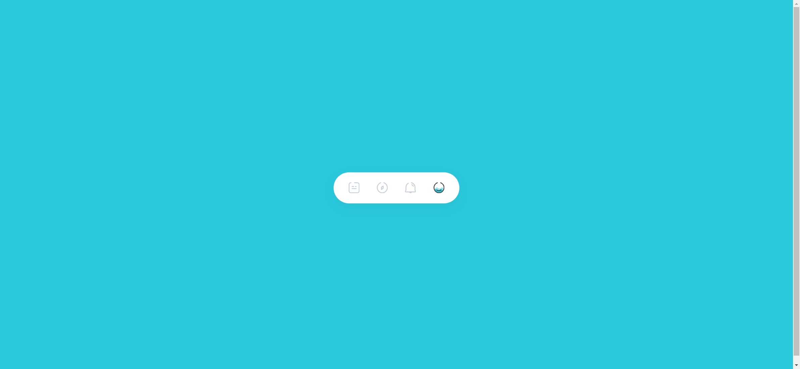

Your job is to design a webpage that features a tab bar menu with a fill-in animation effect. The webpage should have four tabs, each represented by an icon. When a tab is clicked, a wave animation fills the icon, and the icon color changes. The initial webpage should look like this:

### Requirements:

1. **HTML Structure**:
    - Create a `div` with the class `tabs` to contain the tab elements.
    - Each tab should be represented by an `input` of type `radio` and a corresponding `label`.
    - Use SVG icons for each tab. The SVG icons are defined within the HTML file.

2. **CSS Styling**:
    - The wave animation should be implemented using CSS keyframes and should be clipped to the shape of the icon using `clip-path`.

3. **Animations**:
    - When a tab is clicked, the icon should wiggle slightly.
    - A wave animation should fill the icon from the bottom.
    - The icon color should change to a darker shade when selected.

4. **Interactivity**:
    - Clicking on each tab should trigger the animations and change the icon color.
    - Use the following IDs for the input elements:
        - `tab-01` for the first tab
        - `tab-02` for the second tab
        - `tab-03` for the third tab
        - `tab-04` for the fourth tab

5. **Resources**:
    - The SVG icons are embedded within the HTML file.

### Screenshots:

The provided screenshots are rendered under a resolution of 1920x1080.

- After clicking on the second tab:
    

- After clicking on the third tab:
    

- After clicking on the fourth tab:
    

### Additional Notes:

- Ensure that the wave animation is smooth and continuous.
- The icons should be centered within their respective labels.
- The wave animation should be clipped to the shape of the icon using the provided `clip-path` definitions in the HTML.
- The `stroke` color of the icons should transition smoothly when a tab is selected.

By following these instructions, you should be able to recreate the tab bar menu with the fill-in animation effect as shown in the screenshots.
