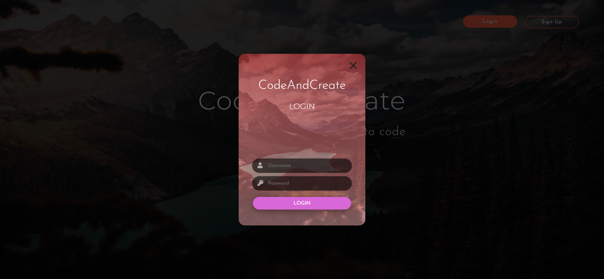

# Task Description for Re-implementing the Webpage

Your job is to design a webpage that includes a banner with text, two buttons for login and signup, and modal forms for both login and signup. The webpage should be responsive and visually appealing. Below are the detailed requirements and resources needed to re-implement the webpage.

## Initial Webpage

The initial webpage should look like this:


### Resources

1. **Background Image**: `images/bg.jpg` is used for the background of the entire webpage and the modal forms.
2. **Fonts**: 
   - `Josefin Sans` and `Montserrat` fonts are used for various text elements.
   - Include the following link in your HTML `<head>` to use these fonts:
     ```html
     <link href="https://fonts.googleapis.com/css?family=Josefin+Sans:300,400,600|Montserrat:300,400,600" rel="stylesheet">
     ```
3. **Icons**: Font Awesome icons are used in the input fields.
   - Include the following link in your HTML `<head>` to use Font Awesome icons:
     ```html
     <link rel="stylesheet" href="https://use.fontawesome.com/releases/v5.8.1/css/all.css" integrity="sha384-50oBUHEmvpQ+1lW4y57PTFmhCaXp0ML5d60M1M7uH2+nqUivzIebhndOJK28anvf" crossorigin="anonymous">
     ```

### Layout and Styling

- **Container**: 
  - Use class name `container` for the main container.
  - The container should cover the entire viewport and have a background image with a dark overlay.

- **Banner Text**:
  - Use class name `banner-text` for the banner text.
  - The banner should be centered and contain a heading and a paragraph.
  - The heading text is "CodeAndCreate".
  - The paragraph text is "Learn how to code".

- **Buttons**:
  - Use class name `btns` for the button container.
  - Use class name `btn` for both buttons.
  - Use class name `login-btn` for the login button and `signup-btn` for the signup button.
  - The login button should have a background color of tomato, and the signup button should be transparent with a tomato border.

### Modal Forms

- **Form Container**:
  - Use class name `form-container` for the container that holds the modals.
  - Initially, this container should be hidden.

- **Signup Form**:
  - Use class name `signup-form-wrapper` for the signup form wrapper.
  - The form should have a header with the text "CodeAndCreate" and "Join Us".
  - The form should include input fields for username, email, and password, each with an icon.
  - Use class name `signup-x` for the close button of the signup form.

- **Login Form**:
  - Use class name `login-form-wrapper` for the login form wrapper.
  - The form should have a header with the text "CodeAndCreate" and "Login".
  - The form should include input fields for username and password, each with an icon.
  - Use class name `login-x` for the close button of the login form.

### Interactions

- **Signup Button Click**:
  - When the signup button is clicked, the signup form should appear, and the background should become darker.
  - The webpage should look like this after clicking the signup button:

    

- **Close Signup Modal**:
  - When the close button on the signup form is clicked, the form should disappear, and the background should return to normal.
  - The webpage should look like this after closing the signup modal:

    

- **Login Button Click**:
  - When the login button is clicked, the login form should appear, and the background should become darker.
  - The webpage should look like this after clicking the login button:

    

  
  

### Additional Notes

- The provided screenshots are rendered under a resolution of 1920x1080.
- Ensure that the modals have smooth transitions for appearing and disappearing.
- The buttons should have hover and active states for better user experience.
