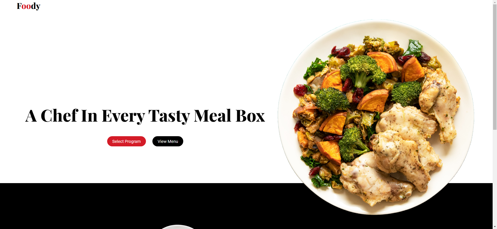

# Task Description for Re-implementing the "Foody" Webpage

Your job is to design a webpage that replicates the "Foody" webpage. The webpage consists of a header, a delivery section, and a footer. Below are the detailed instructions and resources needed to re-implement the webpage.

## Initial Webpage
The initial webpage should look like this:


## Resources
- **Fonts**: 
  - `Playfair Display` from Google Fonts
  - `Roboto` from Google Fonts
- **Images**:
  - `assets/Images/img-1.png` for the main image in the header
  - `assets/Images/img-2.png` for the delivery section image
  - `assets/Images/ian-dooley-d1UPkiFd04A-unsplash.jpg` for the testimonial section image

## Layout and Styling
### Header
- The header should have a class name `top-header`.
- The logo text should be "Foody" with "oo" highlighted in red. Use the class `logo` for the logo text and `highlight` for the highlighted part.
- The main heading in the header should be "A Chef In Every Tasty Meal Box" with the class `main-headings`.
- There should be two buttons in the header:
  - "Select Program" with class `main-btn-fill btn-animation`
  - "View Menu" with class `main-btn btn-animation`
- The main image in the header should use the class `main-img` and the image source should be `assets/Images/img-1.png`.

### Delivery Section
- The delivery section should have a class name `delivery`.
- The image in the delivery section should use the class `delivery__img` and the background image should be `assets/Images/img-2.png`.
- The heading in the delivery section should be "We Deliver Anywhere" with the class `delivery__headings`.
- The sub-heading text should be:
  ```
  Each fresh meal is perfectly sized for 1 person to enjoy at 1 sittings.
  Our fully-prepared meals are delivered fresh, & to eat in 3 minutes.
  ```
  Use the class `delivery__sub-headings` for this text.
- There should be two buttons in the delivery section:
  - "Select Program" with class `main-btn-fill btn-animation`
  - "View Menu" with class `main-btn btn-animation delivery-btn`

### Footer
- The footer should have a class name `footer`.
- The footer should contain three cards with the class `footer-card`:
  - **Location**:
    - Title: "Location" with class `footer-title`
    - Info: "Start With Our Fresh Shrimps" and "4213 Somewhere On Earth" with class `footer-info`
  - **Working Hours**:
    - Title: "Working Hours" with class `footer-title`
    - Info: "Monday Thursday Friday" and "Saturday Sunday" with class `footer-info`
  - **Contact Us**:
    - Title: "Contact Us" with class `footer-title`
    - Info: "webdevacademy6@gmail.com" with class `footer-info`

## Interactions
The webpage should support the following interactions:
1. **Scroll the page**: The page should scroll to the bottom.
   

## Notes
- The provided screenshots are rendered under a resolution of 1920x1080.
- Ensure that the buttons have hover animations as described in the CSS.
- Use the provided class names and IDs for elements to ensure proper functionality and styling.
