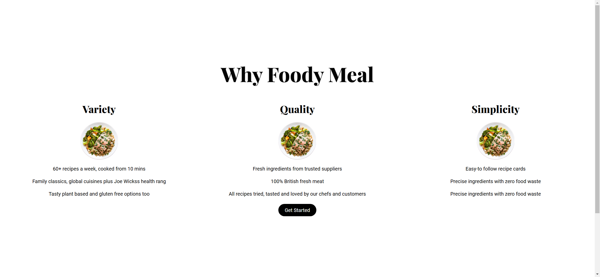
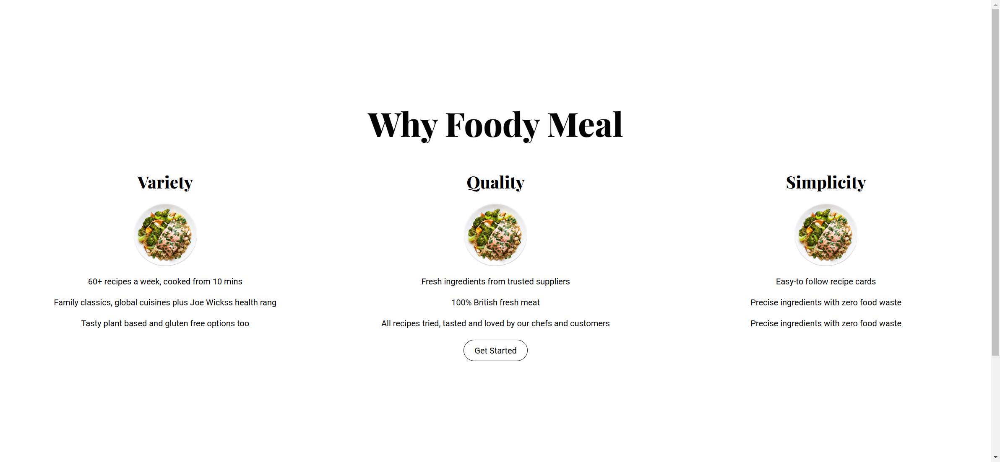

Your job is to design a webpage called "Foody". The webpage should have a section that explains why users should choose Foody Meal. The initial webpage should be .

### Section: Why Foody Meal

1. **Main Heading**
   - Text: "Why Foody Meal"
   - Use class name `main-headings` and `foody-headings` for the heading.

2. **Cards**
   - There are three cards, each with a title, image, and three pieces of information.
   - Use class name `why-foody__cards` for the container of the cards.
   - Each card should use class name `cards__card`.

   **Card 1: Variety**
   - Title: "Variety"
     - Use class name `card__title` for the title.
   - Image: Use class name `card__img` and `img-one` for the image.
   - Information:
     - "60+ recipes a week, cooked from 10 mins"
     - "Family classics, global cuisines plus Joe Wickss health rang"
     - "Tasty plant based and gluten free options too"
     - Use class name `card-info` for each piece of information.

   **Card 2: Quality**
   - Title: "Quality"
     - Use class name `card__title` for the title.
   - Image: Use class name `card__img` and `img-one` for the image.
   - Information:
     - "Fresh ingredients from trusted suppliers"
     - "100% British fresh meat"
     - "All recipes tried, tasted and loved by our chefs and customers"
     - Use class name `card-info` for each piece of information.

   **Card 3: Simplicity**
   - Title: "Simplicity"
     - Use class name `card__title` for the title.
   - Image: Use class name `card__img` and `img-one` for the image.
   - Information:
     - "Easy-to follow recipe cards"
     - "Precise ingredients with zero food waste"
     - "Precise ingredients with zero food waste"
     - Use class name `card-info` for each piece of information.

3. **Button**
   - Text: "Get Started"
   - Use class name `main-btn`, `btn-lg`, and `btn-animation` for the button.
   - The button should have a hover effect that changes the background to white, text color to black, and adds a black border with a transition effect of 0.5 seconds.
   - The button should be centered using class name `btn-container`.

### Interactions

1. **Click "Get Started" Button**
   - Clicking the "Get Started" button should be captured as shown in .

2. **Hover Over Card**
   - Hovering over the first card should be captured as shown in .

### Resources

- **Fonts**
  - Use "Playfair Display" for main headings.
  - Use "Roboto" for secondary text.
  - Import URL: `https://fonts.googleapis.com/css2?family=Playfair+Display:wght@800&family=Roboto&display=swap`

- **Images**
  - `assets/Images/img-2.png` is used for the card images.
  - `assets/Images/ian-dooley-d1UPkiFd04A-unsplash.jpg` is used for the user image in the testimonial section.

### Additional Notes

- The provided screenshots are rendered under a resolution of 1920x1080.
- Ensure that the webpage is responsive and adjusts appropriately for different screen sizes.
- For elements that can be interacted with (click, hover, etc.), use the specified class names as mentioned above.
