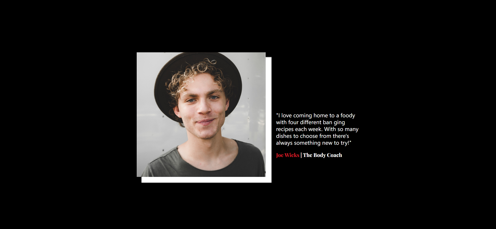

Your job is to design a webpage that displays a testimonial section for a food-related service called "Foody". The initial webpage should be as shown below:



The provided screenshots are rendered under a resolution of 1920x1080.

### Webpage Structure

1. **HTML Structure**:
    - The webpage should have a `section` element with the class `testimonial`.
    - Inside the `testimonial` section, there should be two main `div` elements:
        - A `div` with the class `user-img`.
        - A `div` with the class `user-rating-info`.

2. **CSS Styling**:
    - Import the following Google Fonts:
        - `Playfair Display`.
        - `Roboto`.

3. **Text Content**:
    - Inside the `user-rating-info` div, include the following text:
        ```html
        <p>
          "I love coming home to a foody with four different ban ging recipes
          each week. With so many dishes to choose from there's always something
          new to try!"
        </p>
        <h1 class="user-name">
          <span class="highlight">Joe Wicks</span> | The Body Coach
        </h1>
        ```

### Additional Notes:
- Ensure that the webpage is responsive. 
