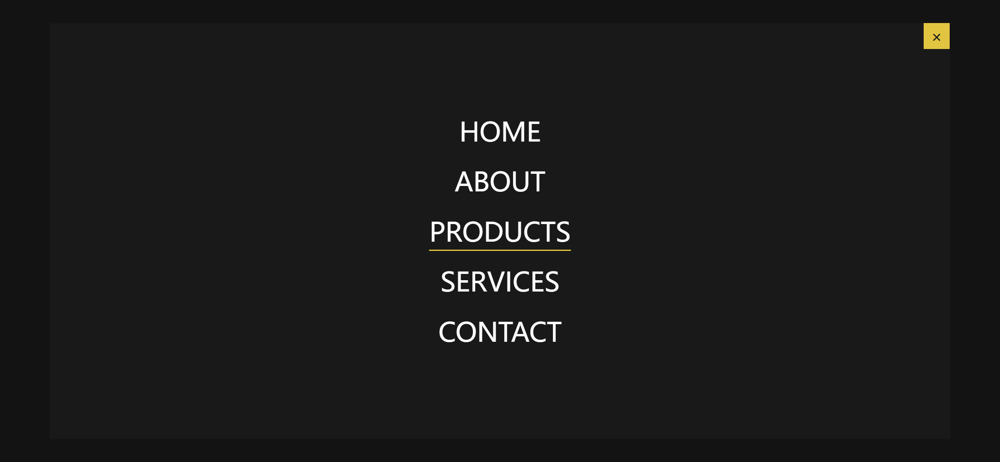
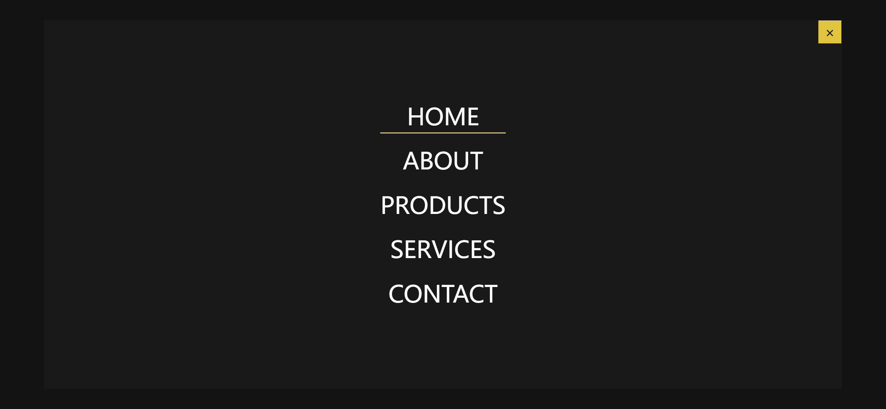

Your job is to design a webpage with a full-page navigation menu that appears when a link is clicked. The initial webpage should be as shown below:

### Requirements:

1. **HTML Structure**:
    - The main container should have a class `container`.
    - Inside the container, there should be an `h1` tag containing an `a` tag with the text "Click Me" and an `href` attribute pointing to `#menu`.
    - There should be a `div` with class `popover` and `id` `menu` containing another `div` with class `content`.
    - Inside the `content` div, there should be an `a` tag with class `close` and a `nav` element with class `nav`.
    - The `nav` element should contain an unordered list (`ul`) with class `nav_list`.
    - The `ul` should have five list items (`li`), each wrapped in a `div` with class `nav_list_item`. Each `li` should contain an `a` tag with the following text: "Home", "About", "Products", "Services", "Contact".

2. **CSS Styling**:
    - Use the following styles for the elements:
        - `.popover`: Initially hidden, with a box shadow.
        - `.popover:target`: Make the popover visible, position it absolutely, and center its content.
        - `.nav_list`: Remove list style.

3. **Animations**:
    - Define keyframes for `grow`, `fadeIn`, and `slideUp` animations.

4. **Interactions**:
    - Clicking the "Click Me" link should display the full-page navigation menu.
    - Hovering over each menu item should animate the bottom border.

### Screenshots:

- After clicking the "Click Me" link, the webpage should look like this:

- Hovering over the "Home" link should look like this:

### Additional Notes:
- The provided screenshots are rendered under a resolution of 1920x1080.
- Ensure that the `a` tag with `href="#menu"` is used to trigger the menu.
- Use the class names and IDs as specified to ensure proper functionality and styling.
- Do not close the menu after opening it, as there is a known bug.
