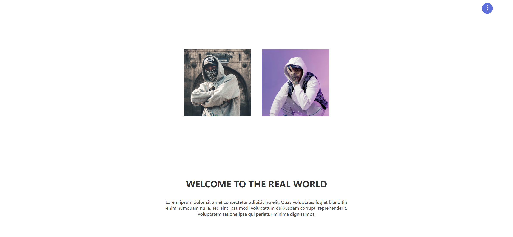

Your job is to design a webpage that features a full-screen navigation menu, an image container, and a welcome message. The webpage should be responsive and interactive. Below are the detailed instructions to re-implement the webpage.

### Initial Webpage
The initial webpage should look like this:


### Layout and Styling
1. **Body and Font**
   - Use a sans-serif font for the entire webpage.
   
2. **Full-Screen Navigation Menu**
   - The menu should cover the entire viewport and be positioned fixed.
   - Use class name `menu` for the `<ul>` element.
   - Use class name `btn` for the button that toggles the menu.
   - The button should be positioned at the top right corner and contain three small white dots.
   - Use class name `highlight` for the highlight effect on menu items.
   
3. **Menu Items**
   - The menu should contain five items: Home, Products, News, About, and Contact.
   - Each item should be a list item (`<li>`) containing an anchor (`<a>`).
   
4. **Image Container**
   - Use class name `image-container` for the container holding the images.
   - Use class name `img` for the images.
   - The first image should use class name `img-one` and the second image should use class name `img-two`.
   - The first image should use `images/atharva-tulsi-6ftd4RgUdnk-unsplash.jpg` as the background.
   - The second image should use `images/6536956.jpg` as the background.
   
5. **Welcome Message**
   - Use class name `container` for the container holding the welcome message.
   - Use an `<article>` element to hold the heading and paragraph.
   - The heading should be an `<h2>` element with the text "Welcome To The Real World".
   - The paragraph should use class name `para` and contain the following text:
     ```
     Lorem ipsum dolor sit amet consectetur adipisicing elit. Quas voluptates fugiat blanditiis enim numquam nulla, sed sint ipsa modi voluptatum quibusdam corrupti reprehenderit. Voluptatem ratione ipsa qui pariatur minima dignissimos.
     ```

### Interactions
1. **Menu Button Click**
   - Clicking the button with class name `btn` should toggle the menu open and close.
   - When the menu is open, it should expand to cover the entire viewport.
   - When the menu is closed, it should shrink back to a small circle at the top right corner.
   - The button may need to be clicked multiple times to open the menu due to a bug.

2. **Menu Item Hover**
   - Hovering over any menu item should trigger a highlight effect.
   - The highlight effect should be a white background that expands to cover the hovered item.

### Screenshots
The provided screenshots are rendered under a resolution of 1920x1080.

- After clicking the menu button:
  

- After hovering over the "Home" link:
  

- After hovering over the "Products" link:
  

- After hovering over the "News" link:
  

### Additional Notes
- Ensure that the menu button and highlight effect work as described.
- The images and text content should be used exactly as specified.
