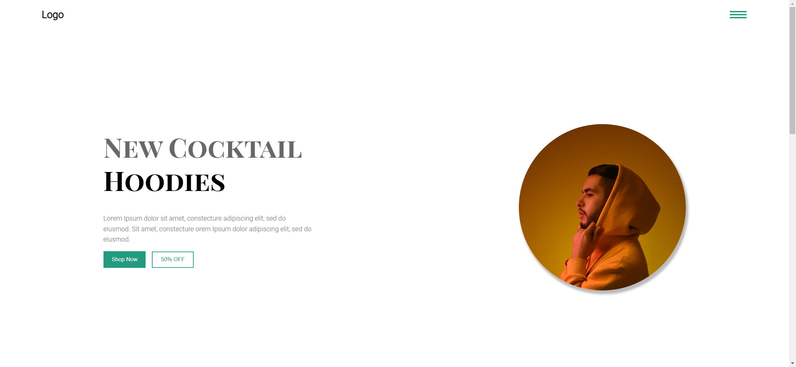
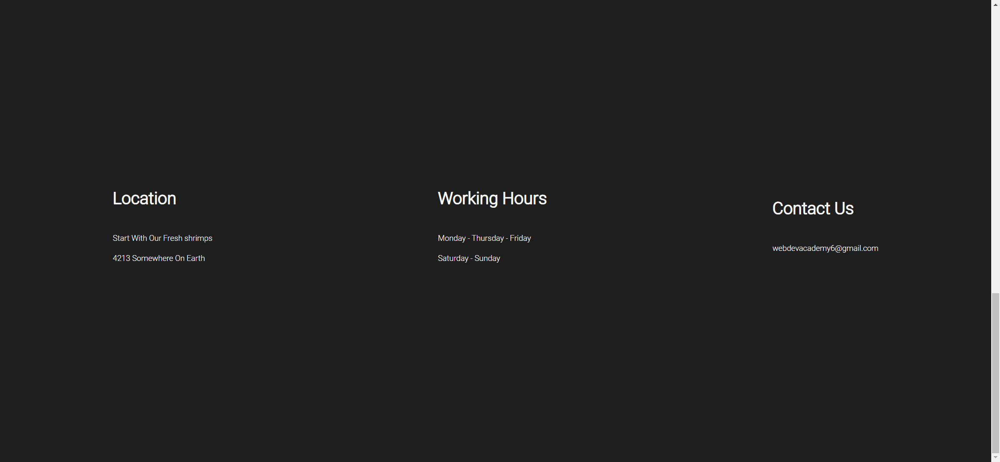
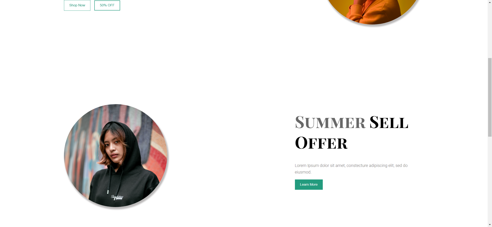
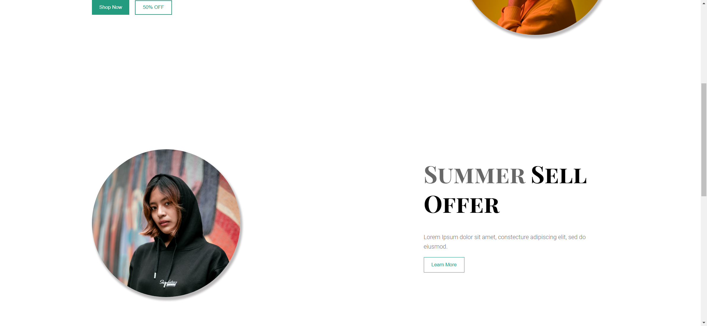

# Task Description for Re-implementing the Webpage

Your job is to design a webpage that replicates the provided webpage. The webpage consists of a navigation bar, a header section, a section with an offer, and a footer. The initial webpage should look like this:



The provided screenshots are rendered under a resolution of 1920x1080.

## Resources

### Images
- `images/oswaldo-ibanez-1NPUmTaiMeg-unsplash.jpg` is used for the header image.
- `images/gesphotoss-1i9K55ni5Dk-unsplash.jpg` is used for the section one image.
- `images/yogendra-singh-uWs_N5Dlyiw-unsplash.jpg` is used for the first customer review image.
- `images/joshua-rondeau-xazIYnxpS2Q-unsplash.jpg` is used for the second customer review image.
- `images/milan-popovic-kOnmHdLJTNI-unsplash.jpg` is used for the third customer review image.

### Fonts
- Use the "Playfair Display SC" font for main headings. Import it from Google Fonts: `https://fonts.googleapis.com/css2?family=Playfair+Display+SC:wght@700&display=swap`
- Use the "Roboto" font for primary headings and other text. Import it from Google Fonts: `https://fonts.googleapis.com/css2?family=Roboto:wght@100;300&display=swap`

### Text Content
- **Primary Heading in Header:**
  ```
  New Cocktail 
  Hoodies
  ```
- **Primary Paragraph in Header:**
  ```
  Lorem Ipsum dolor sit amet, constecture adipiscing elit, sed do eiusmod. Sit amet, constecture orem Ipsum dolor adipiscing elit, sed do eiusmod.
  ```
- **Primary Heading in Section One:**
  ```
  Summer 
  Sell 
  Offer
  ```
- **Primary Paragraph in Section One:**
  ```
  Lorem Ipsum dolor sit amet, constecture adipiscing elit, sed do eiusmod.
  ```
- **Footer Content:**
  - Location:
    ```
    Start With Our Fresh shrimps
    4213 Somewhere On Earth
    ```
  - Working Hours:
    ```
    Monday - Thursday - Friday
    Saturday - Sunday
    ```
  - Contact Us:
    ```
    webdevacademy6@gmail.com
    ```

## Layout and Styling

### Navigation Bar
- Use class name `logo` for the logo element.
- Use class name `burger` for the burger menu element.

### Header Section
- Use class name `header-content` for the content container.
- Use class name `main-headings` for the main heading.
- Use class name `primary-headings` for the primary paragraph.
- Use class name `btns-container` for the button container.
- Use class name `btn-fill` for the "Shop Now" button.
- Use class name `btn-outline active` for the "50% OFF" button.
- Use class name `img-container` for the image container.
- Use class name `header-img` for the header image.

### Section One
- Use class name `section-one` for the section container.
- Use class name `section-content` for the content container.
- Use class name `section-one-img` for the section one image.

### Footer
- Use class name `footer-heading` for the footer headings.
- Use class name `footer-primary-heading` for the footer primary headings.

## Interactions

### Scroll Page
- The page should be scrollable to see the full content. The scrolled page should look like this:
  

### Click "Shop Now" Button
- Use class name `btn-fill` for the "Shop Now" button. Clicking this button should navigate to another section or page. The page after clicking "Shop Now" should look like this:
  

### Hover on "Learn More" Button
- Use the text content "Learn More" to identify the button. Clicking this button should navigate to another section or page. The page after hover mouse on "Learn More" should look like this:
  


## Animations
- Buttons should have hover effects that change their background color and border.
- The burger menu should have a cursor pointer effect.

By following the above instructions, you should be able to re-implement the webpage accurately.
