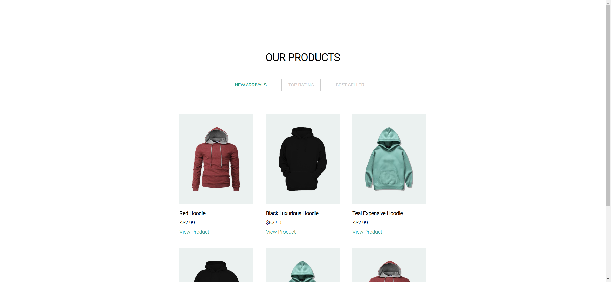
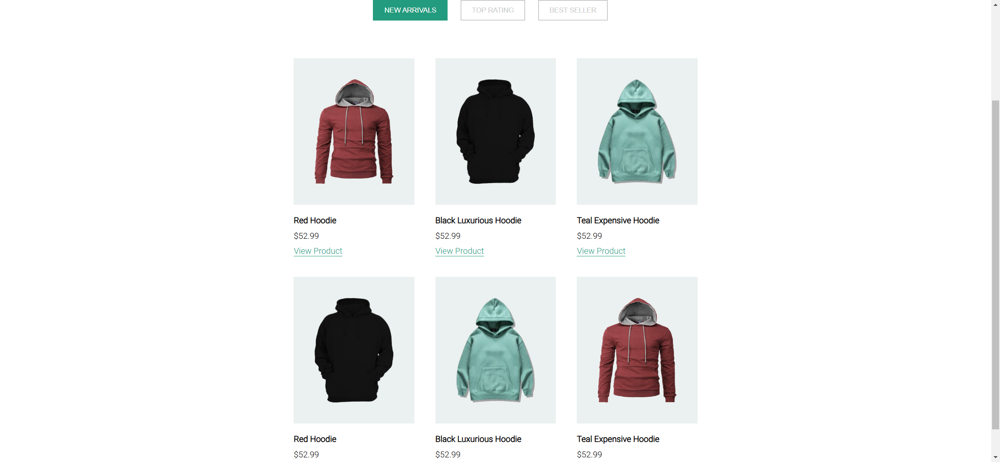

# Task Description for Re-implementing the Webpage

Your job is to design a webpage that showcases a collection of hoodies. The webpage should include sections for product categories, product items, and customer reviews. The initial webpage should look like this:

The provided screenshots are rendered under a resolution of 1920x1080.

## Requirements

### Fonts
- Use the "Playfair Display SC" font for main headings.
- Use the "Roboto" font for primary text and other headings.

### Layout
- The webpage should be responsive and adapt to different screen sizes.

### Sections

#### 1. Navigation Bar
- The navigation bar should be flexible and align items to the center.
- Use the primary font for the text in the navigation bar.

#### 2. Header
- The header should include a main heading with the main font and a subheading with the primary font.
- Include a circular image with a shadow effect.

#### 3. Product Categories
- Use buttons with the class `btn-outline` for product categories.
- The active category button should have the class `active`.

#### 4. Product Items
- Each product item should include an image, name, price, and a "View Product" link.
- Use the class `item` for each product item.
- Use the class `item-layer` for the background of each product item.
- Use the class `item-name` for the product name.
- Use the class `item-price` for the product price.
- Use the class `view-product` for the "View Product" link.

#### 5. Customer Reviews
- Each customer review should include an image, name, and description.
- Use the class `customer` for each customer review.
- Use the class `customer-img` for the customer image.
- Use the class `customer-description` for the customer description.

#### 6. Footer
- The footer should have a dark background and white text.
- Use the primary font for the text in the footer.

### Images
- Use the following images for the product items:
  - `images/Product/1.png` for the first product
  - `images/Product/2.png` for the second product
  - `images/Product/3.png` for the third product

- Use the following images for the customer reviews:
  - `images/yogendra-singh-uWs_N5Dlyiw-unsplash.jpg` for the first customer
  - `images/joshua-rondeau-xazIYnxpS2Q-unsplash.jpg` for the second customer
  - `images/milan-popovic-kOnmHdLJTNI-unsplash.jpg` for the third customer

### Interactions
- Clicking on the "NEW ARRIVALS" button should highlight it as active.
  

### Animations
- Buttons should have a hover effect that changes their background and text color.
- The "View Product" link should have an underline effect on hover.

### Responsive Design
- Ensure the webpage is responsive and looks good on screens with a width of 900px or less.
