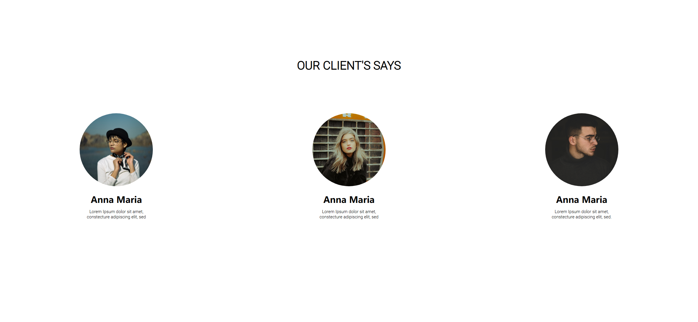

Your job is to design a webpage that displays customer reviews. The initial webpage should be as shown below:

The provided screenshots are rendered under a resolution of 1920x1080.

### Page Structure

1. **Title and Meta Tags**
   - The webpage should have the title "Hoodie".
   - Ensure the meta tags for character set, compatibility, and viewport settings are included.

2. **Fonts**
   - Import the "Playfair Display SC" font from Google Fonts.
   - Import the "Roboto" font from Google Fonts.

3. **CSS Variables**
   - Define the following CSS variables:
     - `--main-font`: "Playfair Display SC", serif
     - `--primary-font`: "Roboto", sans-serif

4. **Header**
   - The header should have a navigation bar with a logo and a burger menu.
   
6. **Buttons**
   - There should be two types of buttons: `btn-fill` and `btn-outline`.
   
7. **Customer Reviews Section**
   - The section should have a heading "OUR CLIENT'S SAYS" with the class `customers-heading`.
   - Each customer review should be contained in a `div` with the class `customer`.
   - Each customer should have:
     - An image with the class `customer-img` and a nested `div` with the class `img`.
     - A name with the class `customer-name`.
     - A description with the class `customer-description`.

8. **Images**
   - Use the following images for the customer reviews:
     - `images/yogendra-singh-uWs_N5Dlyiw-unsplash.jpg` for the first customer.
     - `images/joshua-rondeau-xazIYnxpS2Q-unsplash.jpg` for the second customer.
     - `images/milan-popovic-kOnmHdLJTNI-unsplash.jpg` for the third customer.

### Text Content

- The text content for the customer descriptions should be:
  - "Lorem Ipsum dolor sit amet, constecture adipiscing elit, sed" for the first and second customers.
  - "Lorem Ipsum dolor sit amet, constecture adipiscing elit, sed." for the third customer.

### Interactions

- There are no specific interactions required for this task.
