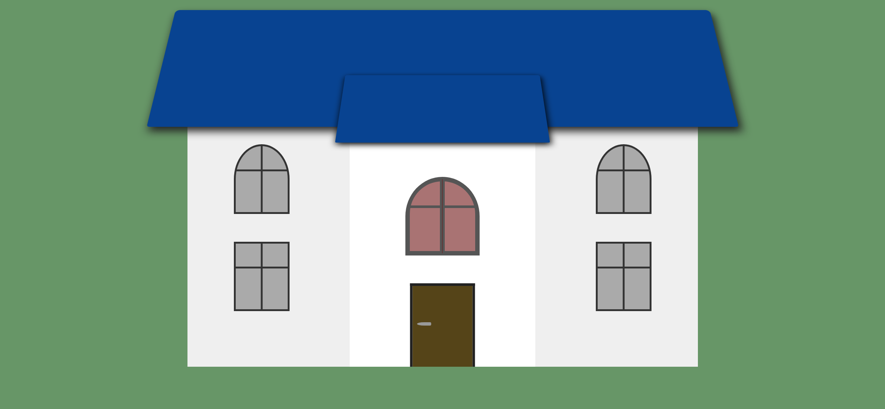
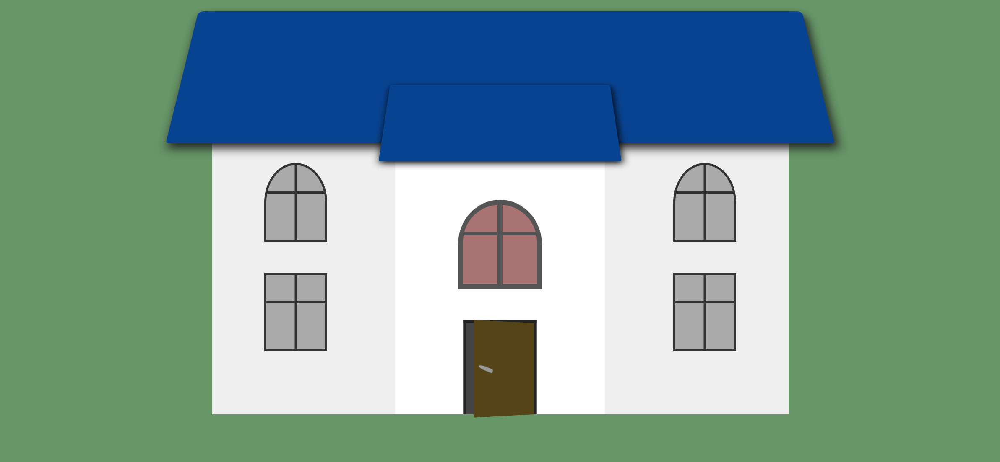
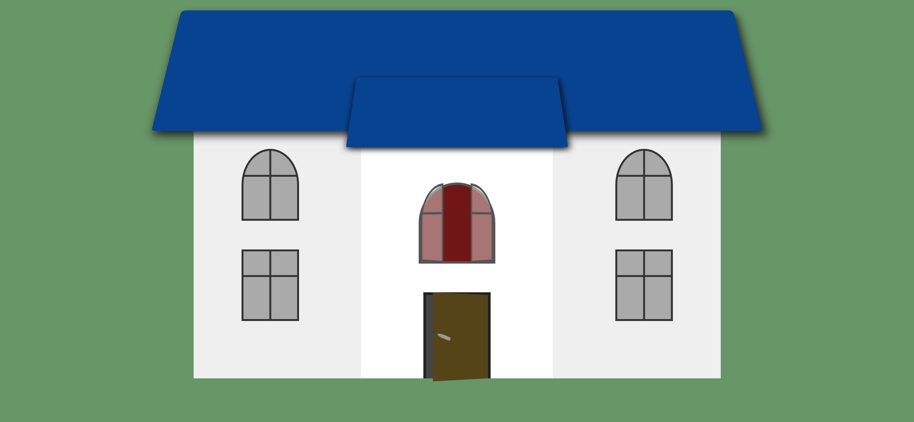

Your task is to design a webpage that visually represents a house with interactive elements. The webpage should be responsive and render correctly under a resolution of 1920x1080. Below are the detailed instructions and resources required to re-implement the webpage.

### Initial Webpage
The initial webpage should look like this:

### Layout and Elements
1. **Container**:
   - Use class name `container` for the main container.
   - The container should cover the entire viewport and center its content both horizontally and vertically.
   
2. **House**:
   - Use class name `house` for the house element.
   
3. **Main Roof**:
   - Use class name `main-roof` for the main roof.
   
4. **Windows**:
   - Use class name `window` for all windows.
   - Each window should have a horizontal and vertical divider.
   
   - **Top Left Window**:
     - Use class name `top-left-window`.
     
- **Top Right Window**:
     - Use class name `top-right-window`.
     
   - **Bottom Left Window**:
     - Use class name `bottom-left-window`.
  
   - **Bottom Right Window**:
     - Use class name `bottom-right-window`.
   
5. **Room**:
   - Use class name `room` for the room element.
   
6. **Room Roof**:
   - Use class name `room-roof` for the room roof.
   
7. **Top Window**:
   - Use class name `top-window` for the top window.
   
8. **Door Frame**:
   - Use class name `door-frame` for the door frame.
   
9. **Door**:
   - Use class name `door` for the door.
   - **Door Handle**:
     - Use class name `door-handle`.

### Interactions
1. **Door Click**:
   - When the door is clicked, it should open.
   - Use class name `change` to apply the transformation.
   - The door should rotate `30deg` along the Y-axis.
   - The door handle should rotate `20deg` along the Z-axis.
   - Screenshot after clicking the door:
     

2. **Top Window Hover**:
   - When the top window is hovered over, it should open.
   - The left part of the window should rotate `-50deg` along the Y-axis.
   - The right part of the window should rotate `50deg` along the Y-axis.
   - Screenshot after hovering over the top window:
     

### Resources
- The provided screenshots are rendered under a resolution of 1920x1080.

### Notes
- Ensure that all elements and interactions are implemented as described.
- Use the specified class names and IDs for elements to ensure proper functionality and testing.
