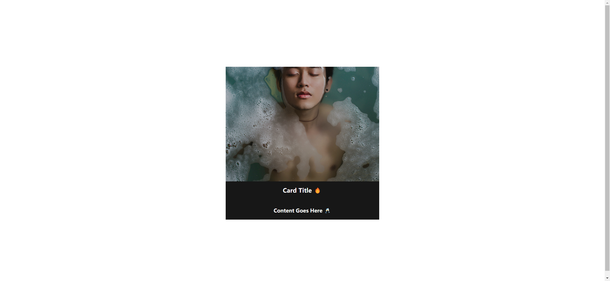

Your job is to design a webpage that displays an image with a hidden content section that slides up when the image is hovered over. The initial webpage should be as shown below:

When the user hovers over the image, the content section slides up, and the image moves up slightly. The webpage after hovering should look like this:

The provided screenshots are rendered under a resolution of 1920x1080.

### Detailed Instructions:

1. **HTML Structure**:
    - Create a `section` element with the class name `container`.
    - Inside the `container`, add an `img` element with the source `hisu-lee-2qvxIr_DXGo-unsplash.jpg`.
    - Add an `article` element with the class name `content` inside the `container`.
    - Inside the `article`, add an `h1` element with the text content `Card Title 🔥`.
    - Below the `h1`, add an `h4` element with the text content `Content Goes Here 🥂`.

2. **CSS Styling**:
    - Use the `sans-serif` font family.
    - Style the `container` to have a width and height of `30rem`, position it relatively, and hide any overflow.
    - Style the `img` inside the `container` to have a width of `100%` and apply a transition effect of `0.5s` to all properties.
    - Apply a transition effect of `0.5s` to all properties, set the background color to `rgb(23, 23, 23)`, and initially translate it vertically by `100%`.
    - On hovering over the `container`, the `content` should translate vertically to `0`, and the `img` should translate vertically by `-30%`.

3. **Resources**:
    - The image `hisu-lee-2qvxIr_DXGo-unsplash.jpg` is used for the main display image.
    - The text content for the `h1` element is `Card Title 🔥`.
    - The text content for the `h4` element is `Content Goes Here 🥂`.

4. **Interactions**:
    - Use the class name `container` for the main section that contains the image and content.
    - The hover effect should be applied to the `container` class.

By following these instructions, you should be able to recreate the webpage with the described hover effect.
