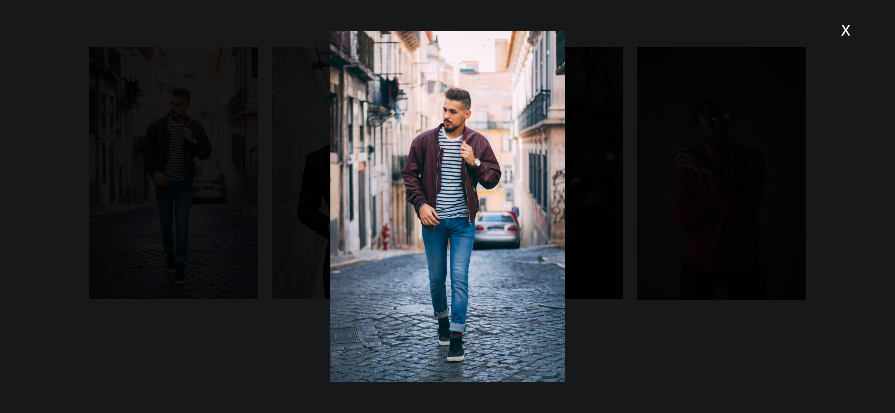
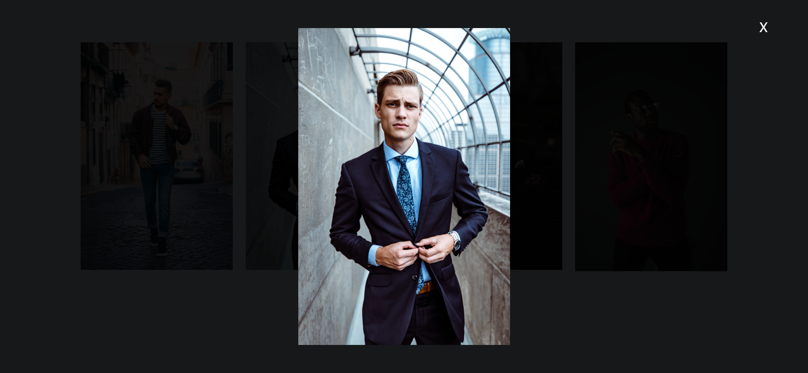

# Task Description: Image Gallery Webpage

Your job is to design a webpage that displays an image gallery. The gallery should allow users to click on images to view them in a larger modal view. The initial webpage should look like this:

## Requirements

### HTML Structure

1. **Wrapper for Modal View**:
   - Create a `div` with class `imageWrapper` and ID `wrapper`.
   - Inside this `div`, add an `img` element with ID `fullImg`.
   - Add a `span` element with the text content "X" for closing the modal.

2. **Image Gallery**:
   - Create a `div` with class `img-gallery`.
   - Inside this `div`, add four `img` elements with the following sources:
     - `images/Img1.jpg`
     - `images/Img2.jpg`
     - `images/Img3.jpg`
     - `images/Img4.jpg`

### JavaScript Functionality

1. **Image Click Event**:
   - Add click event listeners to all images in the gallery.
   - When an image is clicked, open the modal view and display the clicked image in the modal.

2. **Close Modal Event**:
   - Add a click event listener to the `span` element to close the modal view.

### Interaction Steps

1. **Initial State**:
   
- The initial state of the webpage should display the image gallery.
   
2. **Click First Image**:
   - Clicking the first image should open the modal view displaying the first image.
   - The webpage should look like this after clicking the first image:

   

3. **Close Modal**:
   - Clicking the close button (X) should close the modal view.
   - The webpage should look like this after closing the first modal:

   

4. **Click Second Image**:
   - Clicking the second image should open the modal view displaying the second image.
   - The webpage should look like this after clicking the second image:

   

### Additional Notes

- The provided screenshots are rendered under a resolution of 1920x1080.
- Use the following IDs and class names for elements:
  - Use ID `wrapper` for the modal wrapper.
  - Use ID `fullImg` for the image inside the modal.
  - Use class name `img-gallery` for the image gallery.
  - Use class name `imageWrapper` for the modal wrapper.
- The images used in the gallery are:
  - `images/Img1.jpg`
  - `images/Img2.jpg`
  - `images/Img3.jpg`
  - `images/Img4.jpg`
