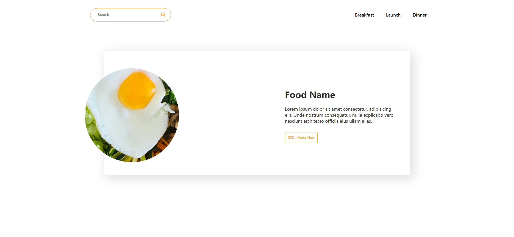
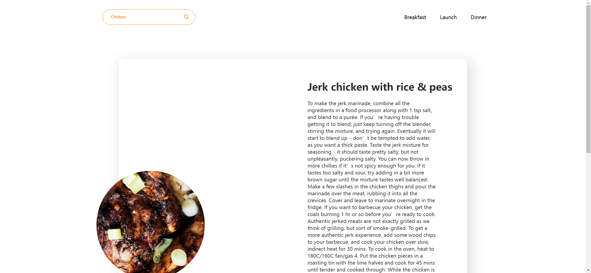

# Meal Finder Webpage Implementation Task

Your job is to design a webpage that allows users to search for meals and view meal details. The webpage should look and function as described below. The provided screenshots are rendered under a resolution of 1920x1080.

## Initial Webpage

The initial webpage should be as shown below:



### Layout and Elements

1. **Navigation Bar**:
    - Contains a search form and a list of meal categories.
    - The search form includes:
        - An input field with placeholder text "Search ...".
        - A magnifying glass icon for triggering the search.
    - The meal categories are listed as "Breakfast", "Launch", and "Dinner".

2. **Main Content**:
    - A container that displays meal details.
    - The container includes:
        - An image placeholder.
        - A content section with:
            - A title for the meal name.
            - A paragraph for meal information.
            - A button for ordering the meal.

3. **Ingredients Section**:
    - A section to display the ingredients of the meal.

### Styling

- Use the provided CSS file `style.css` for styling.
- Use the Font Awesome library for the magnifying glass icon:
    ```html
    <link
      rel="stylesheet"
      href="https://cdnjs.cloudflare.com/ajax/libs/font-awesome/6.4.0/css/all.min.css"
      integrity="sha512-iecdLmaskl7CVkqkXNQ/ZH/XLlvWZOJyj7Yy7tcenmpD1ypASozpmT/E0iPtmFIB46ZmdtAc9eNBvH0H/ZpiBw=="
      crossorigin="anonymous"
      referrerpolicy="no-referrer"
    />
    ```

### Resources

- **Background Image for Meal**:
    - URL: `bg.png`
    - Usage: Background image for the meal placeholder.

### Interactions

1. **Search Meal**:
    - When the user types a meal name in the input field and submits the form, the meal details should be fetched and displayed.
    - Use the class name `input` for the input field.
    - Use the class name `magnifier` for the magnifying glass icon.

2. **Meal Categories**:
    - Clicking on "Breakfast", "Launch", or "Dinner" should trigger a corresponding action.
    - Use the text content of the list items to identify them.

### JavaScript Functionality

- Fetch meal data from the API: `https://www.themealdb.com/api/json/v1/1/search.php?s=`
- Display meal details including the name, image, instructions, and ingredients.

### Screenshots of Interactions

1. **After Searching for a Meal**:
    - The webpage should display the meal details as shown below:
    


### Additional Notes

- Ensure that the input field and magnifying glass icon are styled and positioned correctly.
- The meal details should be dynamically updated based on the search results.
- Handle cases where no meal is found by displaying an alert message.

By following the above description, you should be able to re-implement the webpage with the same functionality and appearance.
