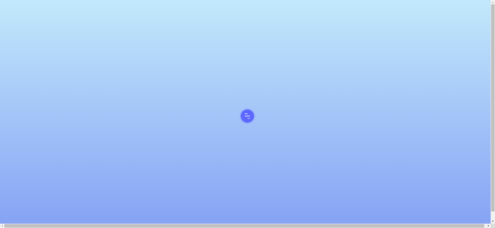
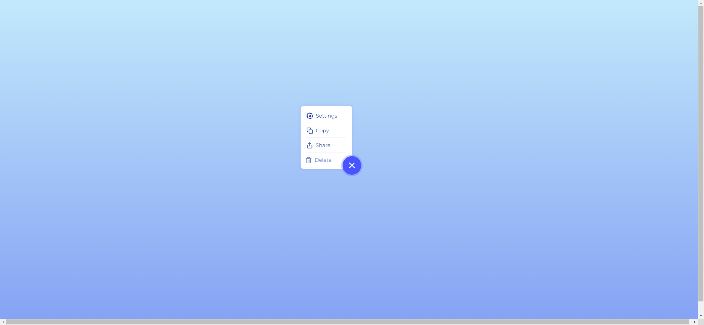

# Task Description: Menu Button On Click Interaction Webpage

Your job is to design a webpage that features a menu button with an interactive dropdown list. The webpage should have the following characteristics and functionalities:

## Initial Webpage

The initial webpage should look like this:

### Layout and Styling

2. **Font**:
   - Use the "Montserrat" font from Google Fonts.

2. **Menu Button**:
   - The button should contain three lines to represent the menu icon.

4. **Dropdown List**:
   - The dropdown list should be hidden initially.
   - The list should have a white background, rounded corners, and a shadow.
   - The list should contain four items: "Settings", "Copy", "Share", and "Delete".
   - Each item should have an icon and a label.

### Interactions

1. **Menu Button Click**:
   - Clicking the menu button should toggle the visibility of the dropdown list.
   - The menu icon should rotate and transform into a cross.

### Animations

- The dropdown list should scale up and fade in when it becomes visible.
- Each item in the list should have a staggered fade-in animation.

## Screenshots

The provided screenshots are rendered under a resolution of 1920x1080.

### After Clicking the Menu Button

### Hover Over Settings

## Resources

- **Font**: "Montserrat" from Google Fonts.
- **Icons**: SVG icons for "Settings", "Copy", "Share", and "Delete".

## Element Identifiers

- Use class name `menu-button` for the menu button.
- Use class name `list-container` for the container of the menu button and list.
- Use class name `menu-button-list` for the dropdown list.
- Use class name `menu-button-list-item` for each item in the dropdown list.

## Text Content

- "Settings"
- "Copy"
- "Share"
- "Delete"

Ensure that the webpage matches the provided screenshots and adheres to the described interactions and animations.
