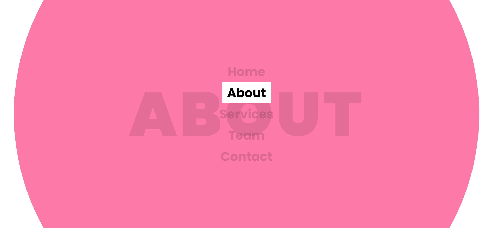
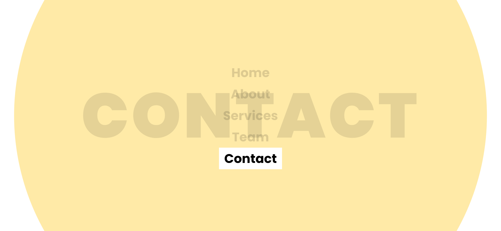

# Task Description: Menu Items Hover Effect Webpage

Your job is to design a webpage that features a navigation menu with hover effects. The webpage should look and behave as described below. The provided screenshots are rendered under a resolution of 1920x1080.

## Initial Webpage
The initial webpage should be centered both vertically and horizontally. The navigation menu should be displayed in the center of the page with five menu items: Home, About, Services, Team, and Contact. Each menu item should be styled with a large font size and a bold font weight.

## Resources
- **Font**: Use the "Poppins" font from Google Fonts. 
- **Text Content**: The text content for the menu items is as follows:
  - Home
  - About
  - Services
  - Team
  - Contact

## Styling
- **Body**: The body should use a grid layout to center the content. It should have a minimum height of 100vh and overflow should be hidden.
- **Menu List**: The menu list (`<ul>`) should be positioned relatively.
- **Menu Items**: Each menu item (`<li>`) should have no list style and should be center-aligned.

## Background Effects
Each menu link (`<a>`) should have a background effect that appears when hovered over. The background effect should be a large circle with a specific color for each menu item. The circle should have the following properties:
- Positioned absolutely
- Centered on the link
- Initially invisible and with a large letter-spacing
- When hovered over, the circle should become visible, move to the center, and reduce its letter-spacing.

## Screenshots of Hover Effects
Here are the screenshots of the hover effects for each menu item:

### Hover on Home

### Hover on About

### Hover on Services

### Hover on Team

### Hover on Contact

## Element IDs and Classes
- Use the `data-text` attribute for each menu link (`<a>`) to specify the text that will appear in the background effect.
- Use the following colors for the background effects based on the nth-child selector:
  - `ul li:nth-child(5n + 1) a::before` for Home
  - `ul li:nth-child(5n + 2) a::before` for About
  - `ul li:nth-child(5n + 3) a::before` for Services
  - `ul li:nth-child(5n + 4) a::before` for Team
  - `ul li:nth-child(5n + 5) a::before` for Contact

Ensure that the hover effects and background animations are implemented as described. Good luck!
