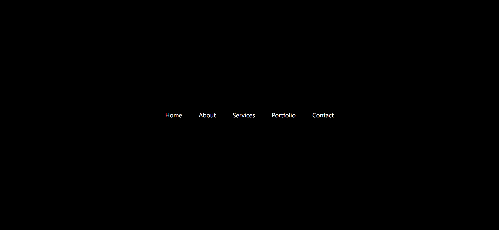
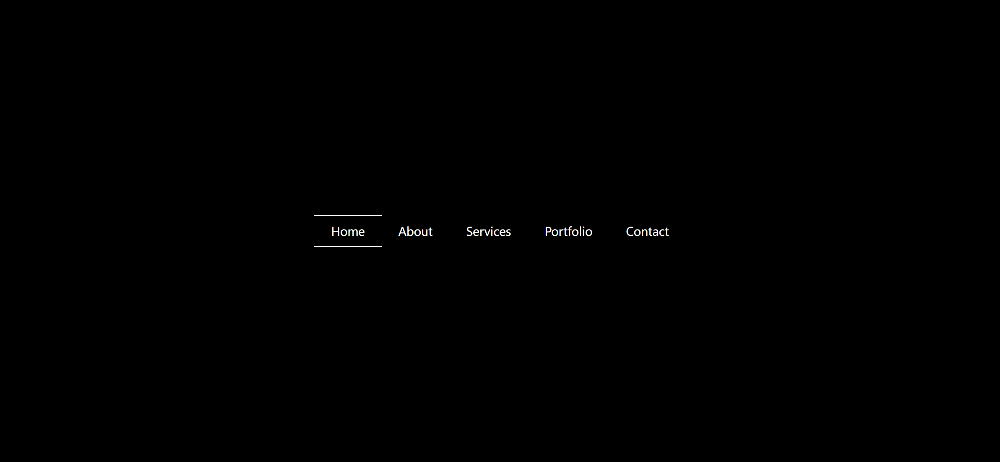
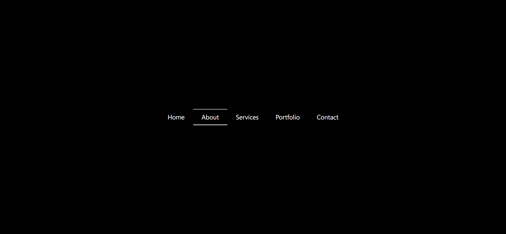

Your task is to design a webpage that features a creative menu effect. The webpage should have a navigation menu with five items: Home, About, Services, Portfolio, and Contact. The menu items should have a hover effect that animates lines above and below the text. Below are the detailed instructions to re-implement the webpage.

### Initial Webpage
The initial webpage should look like this:

### Layout and Styling
1. **Container**: 
   - Use a section element with the class `container`.
   - Use a sans-serif font for the text (`font-family: sans-serif`).
   
2. **Unordered List**:
   - Use an unordered list (`ul`) to contain the menu items.
   
3. **List Items**:
   - Remove the default list style (`list-style: none`).

4. **Links**:
   - Use anchor tags (`a`) for the menu items.

### Hover Effect
1. **Before and After Pseudo-elements**:
   - Use the `:before` and `:after` pseudo-elements to create lines above and below the text.
   - Set the content to an empty string (`content: ""`).
   - Position the pseudo-elements absolutely (`position: absolute`)
   
2. **Hover State**:
   - On hover, scale the lines to their full width (`transform: scaleX(1)`).
   - For the `:before` pseudo-element, set the transform origin to the left (`transform-origin: left`).
   - For the `:after` pseudo-element, set the transform origin to the right (`transform-origin: right`).

### Interaction
The provided screenshots are rendered under a resolution of 1920x1080. Below are the interactions and their corresponding screenshots:

1. **Hover over Home**:
   - 

2. **Hover over About**:
   - 

### Element Identifiers
- Use class name `container` for the main container.
- Use an unordered list (`ul`) to contain the menu items.
- Use list items (`li`) for each menu item.
- Use anchor tags (`a`) for the clickable menu links.

By following these instructions, you should be able to recreate the webpage with the described creative menu effect.
