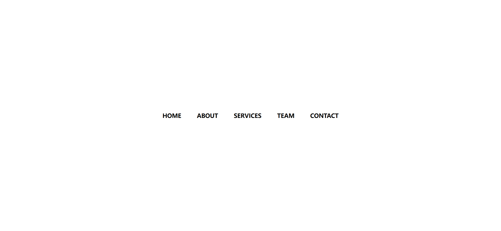
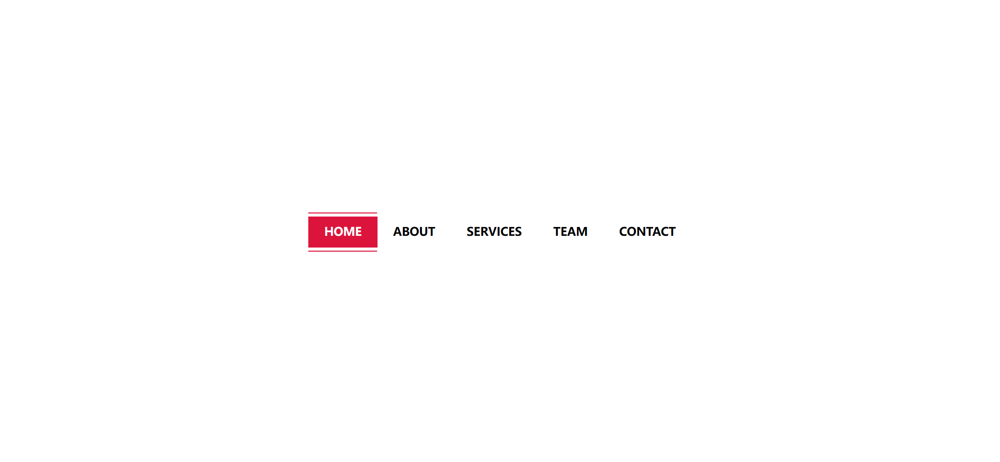
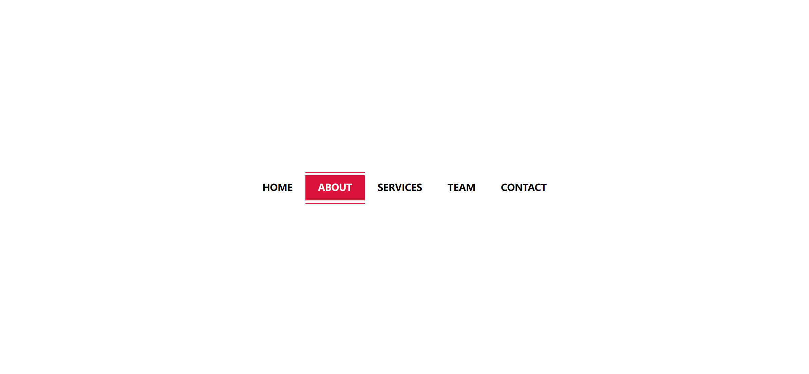

Your job is to design a webpage with a creative menu effect. The webpage should have a navigation menu with five items: Home, About, Services, Team, and Contact. The menu items should have a hover effect that changes their background color and text color. The initial webpage should look like this:

### Requirements:

1. **HTML Structure**:
    - Create a `div` with class `container`.
    - Inside the `container`, create an unordered list (`ul`).
    - The unordered list should contain five list items (`li`), each containing an anchor tag (`a`) with class `list-items`.
    - The text content of the anchor tags should be "Home", "About", "Services", "Team", and "Contact".

2. **CSS Styling**:
    - Apply the following styles to the elements:
        - Use `*` selector to reset padding, margin, and box-sizing.
        - Use class name `container` to center the content both vertically and horizontally and set the font family to sans-serif.
        - Use `ul` to remove default margin and padding and display the list items in a row.
        - Use `li` to remove the default list style.
        - Use class name `list-items` to style the anchor tags with padding, text transformation, color, font size, font weight, and transition effects.
        - Use pseudo-elements `:before` and `:after` to create the hover effects with transitions.
        - On hover, change the background color and text color of the anchor tags.

3. **Hover Effects**:
    - When hovering over the anchor tags with class `list-items`, the background color should change to crimson, and the text color should change to white.
    - The hover effect should have a smooth transition.

4. **Interactions**:
    - Hover over the "Home" and "About" menu items to see the hover effects.
    - The hover effect on "Home" should look like this:

    

    - The hover effect on "About" should look like this:

    

### Additional Information:
- The provided screenshots are rendered under a resolution of 1920x1080.
- Use the following class names and IDs for the elements:
    - Use class name `container` for the main container.
    - Use class name `list-items` for the anchor tags inside the list items.

By following these instructions, you should be able to recreate the webpage with the specified creative menu effect.
